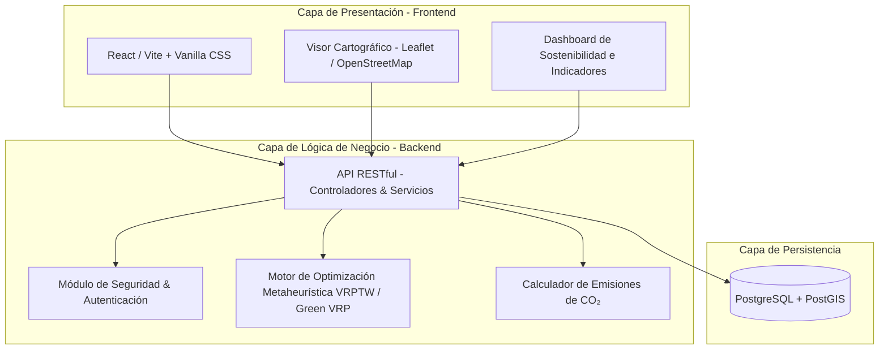
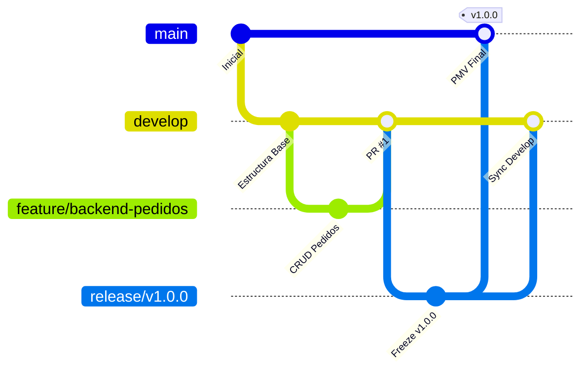

# EcoLogística Lima

> **Optimizador de Rutas Sostenibles para DistriRápido S.A.C.**  
> *Proyecto Académico – Taller de Proyectos 2 (Ingeniería de Sistemas e Informática)*

---

## Descripción
**EcoLogística Lima** es una plataforma web desarrollada como Producto Mínimo Viable (PMV) orientada a la planificación, optimización y seguimiento de rutas de distribución de última milla. El sistema integra modelos matemáticos de optimización con restricciones de capacidad y ventanas horarias (**VRPTW** - *Vehicle Routing Problem with Time Windows*) incorporando criterios ambientales (**Green VRP**) para la minimización del consumo de combustible y la reducción activa de emisiones contaminantes de dióxido de carbono ($CO_2$).

---

## Problemática
La empresa **DistriRápido S.A.C.** enfrenta retos operativos críticos en sus operaciones logísticas urbanas:
1. **Altos costos en combustible:** Generados por rutas ineficientes, traslapes de recorridos y congestión vehicular.
2. **Incumplimiento de ventanas de entrega:** Dificultad para coordinar horarios pactados con clientes debido a la variabilidad del tráfico.
3. **Impacto ambiental desmedido:** Falta de cuantificación, visibilidad y mitigación de la huella de carbono de la flota.
4. **Baja capacidad de respuesta dinámica:** Ausencia de herramientas para re-enrutar vehículos en tiempo real ante cancelaciones o nuevos pedidos urgentes.

---

## Objetivo
Desarrollar e implementar un Producto Mínimo Viable (PMV) de una plataforma web para optimizar las operaciones de última milla de DistriRápido S.A.C., reduciendo los tiempos de viaje, los costos operativos de combustible y las emisiones de $CO_2$, mediante algoritmos metaheurísticos, visualización cartográfica interactiva y tableros de control de sostenibilidad en un horizonte académico de 12 semanas.

---

## Funcionalidades principales
- 📦 **Gestión de Pedidos:** Registro, carga masiva, priorización y configuración de ventanas horarias y pesos/volúmenes de entrega.
- 🚚 **Gestión de Flota:** Catálogo de vehículos con capacidades de carga máxima, tipo de combustible y factor de rendimiento.
- 👨‍✈️ **Gestión de Conductores:** Asignación de turnos, jornadas y disponibilidad horaria.
- 🧬 **Optimización de Rutas (Metaheurística):** Resolución del problema VRPTW & Green VRP mediante algoritmos de optimización combinatoria multiobjetivo.
- 🗺️ **Visualización de Rutas en Mapa:** Representación geográfica interactiva de trayectorias, secuencia de paradas y asignaciones por vehículo.
- 📊 **Dashboard de Indicadores:** Panel en tiempo real con KPIs logísticos (distancia total, tasa de puntualidad, utilización de capacidad).
- 🌿 **Reportes de Sostenibilidad:** Cuantificación y reportabilidad gráfica de emisiones de $CO_2$ generadas y ahorradas.
- ⚡ **Re-optimización Dinámica:** Ajuste en caliente de secuencias de entrega ante imprevistos, incidencias de tráfico o pedidos cancelados.
- 📉 **Cálculo de Emisiones de $CO_2$:** Modelo de emisión estandarizado según factores de consumo por tipo de motor y kilometraje.

---

## Integrantes
- **Por completar**

---

## Arquitectura



---

## Estructura del repositorio

```text
EcoLogistica/
│
├── .github/                       # Configuración de GitHub (Templates de PR e Issues)
│   ├── ISSUE_TEMPLATE/
│   │   ├── bug_report.md
│   │   └── feature_request.md
│   └── pull_request_template.md
│
├── docs/                          # Documentación del proyecto (Estándar PMI / Ágil)
│   ├── 01 Inicio/                 # Documentos oficiales de inicio y gobernanza
│   │   ├── 01. Selección del enfoque del proyecto V_1_0_0.md
│   │   ├── 02. Acta de constitución V_1_0_0.md
│   │   ├── 03. Declaración de la visión V_1_0_0.md
│   │   ├── 04. Registro de supuestos y restricciones V_1_0_0.md
│   │   ├── 05. Registro de interesados V_1_0_0.md
│   │   └── 06. Estrategia de control de versiones V_1_0_0.md
│   ├── 02 Planificación/          # Planes de gestión, cronogramas y EDT/WBS
│   ├── 03 Ejecución/              # Diseños de arquitectura y especificaciones
│   ├── 04 Seguimiento y Control/  # Minutas, métricas de avance y control de calidad
│   ├── 05 Cierre/                 # Informes de entrega de PMV y lecciones aprendidas
│   └── otros/                     # Material complementario y referencias técnicas
│
├── frontend/                      # Aplicación Web (Interfaz de usuario)
│   ├── src/                       # Código fuente del cliente
│   ├── tests/                     # Pruebas de interfaz y componentes
│   └── public/                    # Archivos estáticos
│
├── backend/                       # Servidor API y Algoritmo de Optimización
│   ├── src/                       # Lógica de negocio, rutas y servicios
│   └── tests/                     # Pruebas unitarias e integración del optimizador
│
├── database/                      # Esquemas de Base de Datos y Datos Semilla
│   ├── migrations/                # Scripts de migración de esquema
│   └── seeds/                     # Datos iniciales para pruebas
│
├── assets/                        # Recursos gráficos y multimedia
│   ├── diagrams/                  # Diagramas de arquitectura y flujos
│   ├── mockups/                   # Diseños de interfaz y prototipos
│   └── images/                    # Capturas y recursos visuales
│
├── .gitignore                     # Exclusión de binarios, dependencias y secretos
├── .env.example                   # Plantilla de variables de entorno (sin secretos)
└── README.md                      # Documentación principal del repositorio
```

---

## Estrategia Git Flow
El proyecto adopta **Git Flow** como modelo oficial de control de versiones.



### Ramas Principales
- **`main`:** Código de producción, altamente estable y probado. Protegida contra escritura directa.
- **`develop`:** Rama troncal de integración continua. Punto de convergencia de todas las características.

### Ramas de Soporte
- **`feature/*`:** Desarrollo de funcionalidades específicas. Bifurcan desde `develop` y se integran mediante Pull Request a `develop`.
- **`release/*`:** Preparación y estabilización de versiones (`release/v1.0.0`). Se integran a `main` y `develop`.
- **`hotfix/*`:** Corrección urgente de bugs críticos en producción. Bifurcan desde `main` y se integran a `main` y `develop`.

---

## Convención de ramas
Los nombres de las ramas deben seguir el estándar en minúsculas y separado por guiones:

| Tipo | Formato / Ejemplos |
| :--- | :--- |
| **Funcionalidad** | `feature/frontend-login`, `feature/backend-pedidos`, `feature/optimizacion-rutas`, `feature/mapa-rutas`, `feature/reportes-sostenibilidad` |
| **Versión** | `release/v1.0.0` |
| **Corrección urgente** | `hotfix/fix-login`, `hotfix/fix-routing` |

*(Prohibido el uso de nombres genéricos como `feature/test`, `feature/cambio`, `feature/prueba`).*

---

## Convención de commits
Se utiliza la especificación **Conventional Commits v1.0.0**:

- `feat:` Nueva funcionalidad para el sistema (`feat(pedidos): agregar registro de pedidos`).
- `fix:` Corrección de un fallo (`fix(rutas): corregir cálculo de distancia`).
- `docs:` Modificaciones en documentación (`docs(inicio): actualizar acta de constitución`).
- `test:` Pruebas unitarias o de integración (`test(rutas): agregar pruebas del optimizador`).
- `refactor:` Reestructuración de código sin alterar comportamiento (`refactor(backend): separar servicios de optimización`).
- `style:` Ajustes de formato o estilos visuales (`style(dashboard): ajustar colores de accesibilidad`).
- `chore:` Mantenimiento, dependencias o configuración (`chore(git): actualizar gitignore`).

---

## Instalación

1. **Clonar el repositorio:**
   ```bash
   git clone https://github.com/alexito-dev/EcoLogistica.git
   cd EcoLogistica
   ```

2. **Configurar variables de entorno:**
   ```bash
   cp .env.example .env
   # Configurar valores locales en el archivo .env
   ```

3. **Instalación de dependencias:**
   - *Backend:*
     ```bash
     cd backend
     npm install # o pip install -r requirements.txt (según stack seleccionado)
     ```
   - *Frontend:*
     ```bash
     cd ../frontend
     npm install
     ```

---

## Ejecución

1. **Iniciar Base de Datos:**
   ```bash
   # Ejecutar migraciones y datos semilla
   # (Los scripts específicos se definirán en la Iteración 1)
   ```

2. **Iniciar Backend:**
   ```bash
   cd backend
   npm run dev
   ```

3. **Iniciar Frontend:**
   ```bash
   cd frontend
   npm run dev
   ```

---

## Pruebas
Las pruebas automatizadas se ejecutan de manera aislada por componente:
```bash
# Pruebas de Backend y Algoritmo de Optimización
cd backend
npm test

# Pruebas de Frontend
cd ../frontend
npm test
```

---

## Versionado
Se aplica **Semantic Versioning 2.0.0** (`vX.Y.Z`).
- El PMV final del curso será etiquetado formalmente como **`v1.0.0`** sobre la rama `main`.
- Versiones intermedias de iteración se manejarán con versiones preliminares en `develop` y ramas `release/`.

---

## Documentación
La documentación del proyecto se encuentra organizada bajo la carpeta [`docs/`](file:///d:/EcoLogistica/docs):
- [`docs/01 Inicio/`](file:///d:/EcoLogistica/docs/01%20Inicio)
  - [`01. Selección del enfoque del proyecto V_1_0_0.md`](file:///d:/EcoLogistica/docs/01%20Inicio/01.%20Selecci%C3%B3n%20del%20enfoque%20del%20proyecto%20V_1_0_0.md)
  - [`02. Acta de constitución V_1_0_0.md`](file:///d:/EcoLogistica/docs/01%20Inicio/02.%20Acta%20de%20constituci%C3%B3n%20V_1_0_0.md)
  - [`03. Declaración de la visión V_1_0_0.md`](file:///d:/EcoLogistica/docs/01%20Inicio/03.%20Declaraci%C3%B3n%20de%20la%20visi%C3%B3n%20V_1_0_0.md)
  - [`04. Registro de supuestos y restricciones V_1_0_0.md`](file:///d:/EcoLogistica/docs/01%20Inicio/04.%20Registro%20de%20supuestos%20y%20restricciones%20V_1_0_0.md)
  - [`05. Registro de interesados V_1_0_0.md`](file:///d:/EcoLogistica/docs/01%20Inicio/05.%20Registro%20de%20interesados%20V_1_0_0.md)
  - [`06. Estrategia de control de versiones V_1_0_0.md`](file:///d:/EcoLogistica/docs/01%20Inicio/06.%20Estrategia%20de%20control%20de%20versiones%20V_1_0_0.md)
- [`docs/02 Planificación/`](file:///d:/EcoLogistica/docs/02%20Planificaci%C3%B3n)
- [`docs/03 Ejecución/`](file:///d:/EcoLogistica/docs/03%20Ejecuci%C3%B3n)
- [`docs/04 Seguimiento y Control/`](file:///d:/EcoLogistica/docs/04%20Seguimiento%20y%20Control)
- [`docs/05 Cierre/`](file:///d:/EcoLogistica/docs/05%20Cierre)

---

## Estado del proyecto
- 🟡 **Fase Actual:** Configuración Inicial de Repositorio, Gobernanza y Gestión de Inicio (Semana 1 / Iteración 1).
- 🚀 **Próximo Paso:** Inicio formal de la **Iteración 1** (Requisitos detallados, diseño de arquitectura de datos y mockups de interfaz).
