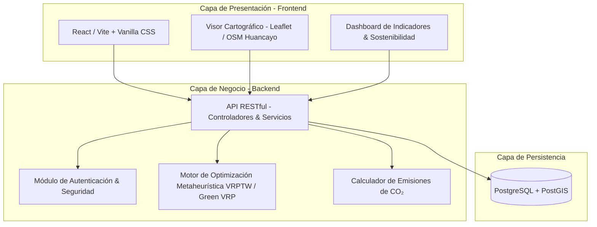
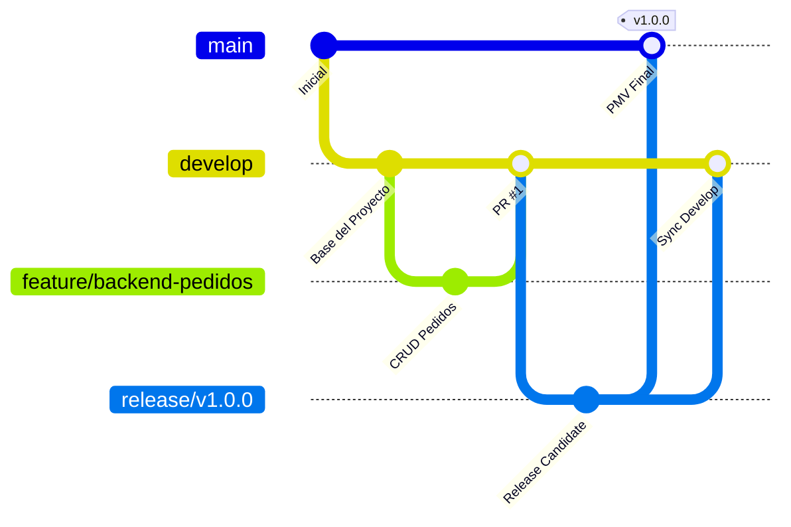

<div align="center">

# EcoLogística Huancayo
### Plataforma de Optimización de Rutas Sostenibles de Última Milla

[](file:///d:/EcoLogistica/docs/01%20Inicio)
[](file:///d:/EcoLogistica/README.md)
[](file:///d:/EcoLogistica/docs/01%20Inicio/01.%20Selecci%C3%B3n%20del%20enfoque%20del%20proyecto%20V_1_0_0.md)
[](file:///d:/EcoLogistica/README.md)
[](file:///d:/EcoLogistica/README.md)

<p align="center">
  <b>Solución tecnológica para la gestión eficiente, económica y ecológica de flotas de distribución urbana en DistriRápido S.A.C.</b>
</p>

</div>

---

## 1. Ficha Técnica del Proyecto

| Campo | Especificación |
| :--- | :--- |
| **Proyecto / Producto** | **EcoLogística Huancayo** (Optimizador VRPTW & Green VRP) |
| **Empresa Patrocinadora** | **DistriRápido S.A.C.** |
| **Asignatura Académica** | **Taller de Proyectos 2** (Ingeniería de Sistemas e Informática) |
| **Docente Asesor** | **Ing. Gamarra Moreno, Job Daniel** |
| **Periodo de Ejecución** | **17/08/2026 – 05/12/2026** (16 semanas / 4 Sprints) |
| **Ámbito Geográfico** | **Huancayo Metropolitano** (Huancayo, El Tambo, Chilca) |
| **Repositorio Oficial** | `https://github.com/alexito-dev/EcoLogistica.git` |

---

## 2. Descripción y Problemática

### 2.1. Descripción
**EcoLogística Huancayo** es una plataforma web desarrollada como Producto Mínimo Viable (PMV) enfocada en la planificación inteligente, secuenciación y seguimiento de rutas de distribución de última milla. 

El núcleo del sistema integra modelos matemáticos de optimización combinatoria multiobjetivo (**VRPTW** - *Vehicle Routing Problem with Time Windows*) incorporando variables de sostenibilidad ambiental (**Green VRP**) para minimizar distancias, tiempos de traslado, consumo de combustible y la emisión de dióxido de carbono ($CO_2$) generada por el transporte en altitud (3,250 msnm).

### 2.2. Problemática en DistriRápido S.A.C.
La operativa logística en el valle del Mantaro presenta retos críticos que impactan en la rentabilidad y sostenibilidad de la empresa:
1. **Sobrecostos de combustible:** Recorridos redundantes, cruces innecesarios de avenidas principales y desbalance de carga entre vehículos.
2. **Incumplimiento de ventanas horarias:** Dificultad para garantizar entregas en horarios concertados ante variaciones de tráfico urbano.
3. **Huella de carbono no mitigada:** Carencia de herramientas analíticas para cuantificar y reducir las emisiones de gases de efecto invernadero.
4. **Baja capacidad de respuesta:** Falta de re-optimización dinámica en tiempo real ante cancelaciones o nuevos pedidos urgentes durante la jornada.

### 2.3. Objetivo General
Desarrollar e implementar un PMV web que optimice las rutas de distribución urbana de DistriRápido S.A.C. en Huancayo, reduciendo la distancia total recorrida en al menos un **15%**, aumentando la puntualidad por encima del **90%** y calculando la reducción efectiva de emisiones de $CO_2$ en un periodo de 16 semanas.

---

## 3. Capacidades y Módulos Funcionales

```text
┌────────────────────────────────────────────────────────────────────────┐
│                      MÓDULOS DE ECOLogística HUANCAYO                  │
├────────────────────────────────────────────────────────────────────────┤
│  [1] Gestión de Pedidos     : Registro, geocodificación y ventanas.    │
│  [2] Flota y Conductores    : Capacidades, combustible y turnos.       │
│  [3] Motor Metaheurístico   : Resolución algorítmica VRPTW / Green VRP.│
│  [4] Visor Cartográfico     : Mapa interactivo (Leaflet/OSM Huancayo). │
│  [5] Dashboard Analítico    : KPIs logísticos y calculadora de CO₂.    │
│  [6] Re-enrutamiento        : Ajuste dinámico de secuencias en ruta.   │
└────────────────────────────────────────────────────────────────────────┘
```

---

## 4. Equipo de Trabajo y Responsabilidades

| Integrante | Rol en el Proyecto | Responsabilidad Principal |
| :--- | :--- | :--- |
| **Zorrilla Apumayta, Alex Jesus** | **Project Manager / Líder** | Planificación, gestión del alcance, coordinación metodológica, control de entregables y gobernanza del proyecto. |
| **Anco Porras Jhean, Pier Julio** | **Arquitecto / Backend** | Arquitectura del software, diseño y desarrollo de API RESTful, modelos de datos, persistencia en BD y servicios de negocio. |
| **Hilario Talavera, Alexander Daniel** | **Optimización** | Modelado matemático, formulación y calibración del motor metaheurístico multiobjetivo (VRPTW & Green VRP). |
| **Vera Zea, Jhoanna Hade** | **Frontend / UX** | Diseño de experiencia de usuario (UI/UX), desarrollo de vistas web responsivas, componentes de mapas interactivos y dashboards. |
| **Isidro Casio, Jose Luis** | **QA / DevOps** | Aseguramiento de la calidad, diseño y ejecución de pruebas unitarias/integración, pipelines de CI/CD y gestión de ramas. |
| **Gamarra Moreno, Job Daniel** | **Docente** | Asesoría técnica especializada, validación metodológica, evaluación de hitos académicos y supervisión general. |

---

## 5. Arquitectura del Sistema



---

## 6. Estructura del Repositorio

```text
EcoLogistica/
│
├── .github/                       # Plantillas de PRs e Issues
│   ├── ISSUE_TEMPLATE/
│   │   ├── bug_report.md
│   │   └── feature_request.md
│   └── pull_request_template.md
│
├── docs/                          # Documentación formal (Estándares PMI / Ágil)
│   ├── 01 Inicio/                 # Fase de inicio y gobernanza
│   │   ├── 01. Selección del enfoque del proyecto V_1_0_0.md
│   │   ├── 02. Acta de constitución V_1_0_0.md
│   │   ├── 03. Declaración de la visión V_1_0_0.md
│   │   ├── 04. Registro de supuestos y restricciones V_1_0_0.md
│   │   └── 05. Registro de interesados V_1_0_0.md
│   ├── 02 Planificación/          # Cronogramas, backlog y EDT/WBS
│   ├── 03 Ejecución/              # Diseños técnicos y especificaciones
│   ├── 04 Seguimiento y Control/  # Minutas de sprint y métricas QA
│   ├── 05 Cierre/                 # Informes de entrega de PMV
│   └── otros/                     # Material técnico de soporte
│
├── frontend/                      # Aplicación cliente (Web UI)
│   ├── src/                       # Componentes, vistas y servicios cliente
│   ├── tests/                     # Pruebas de interfaz
│   └── public/                    # Archivos estáticos
│
├── backend/                       # Servidor API y Algoritmo de Optimización
│   ├── src/                       # Controladores, servicios y motor metaheurístico
│   └── tests/                     # Pruebas unitarias e integración
│
├── database/                      # Esquemas de Base de Datos y Datos Semilla
│   ├── migrations/                # Scripts DDL y control de migraciones
│   └── seeds/                     # Datos iniciales para pruebas en Huancayo
│
├── assets/                        # Recursos gráficos y multimedia
│   ├── diagrams/                  # Diagramas de arquitectura y flujos
│   ├── mockups/                   # Diseños de interfaz UI/UX
│   └── images/                    # Capturas y recursos gráficos
│
├── .gitignore                     # Reglas de exclusión de Git
├── .env.example                   # Plantilla de variables de entorno
└── README.md                      # Documento principal del repositorio
```

---

## 7. Modelo de Ramas y Control de Versiones

Se utiliza **Git Flow** como estándar de desarrollo colaborativo:



### 7.1. Ramas Principales y de Soporte
- `main`: Código productivo, estable y auditado.
- `develop`: Rama troncal de integración continua.
- `feature/*`: Desarrollo de módulos específicos (ej. `feature/optimizacion-rutas`, `feature/mapa-leaflet`).
- `release/*`: Estabilización y congelamiento de versión previa a entrega.
- `hotfix/*`: Correcciones críticas sobre `main`.

### 7.2. Convención de Commits (Conventional Commits v1.0.0)
- `feat:` Nuevas funcionalidades (`feat(pedidos): agregar validacion de ventanas horarias`).
- `fix:` Corrección de errores (`fix(motor): ajustar calculo de penalizacion por demora`).
- `docs:` Actualización de documentación (`docs(inicio): actualizar acta de constitucion`).
- `test:` Pruebas unitarias o de integración (`test(backend): agregar pruebas del servicio de rutas`).
- `refactor:` Mejoras en código sin alterar comportamiento (`refactor(api): modularizar controladores`).
- `style:` Ajustes estéticos o de formato (`style(ui): optimizar paleta accesible en dashboard`).
- `chore:` Tareas de mantenimiento o configuración (`chore(deps): actualizar dependencias`).

---

## 8. Guía de Instalación y Ejecución Local

### 8.1. Clonar el Repositorio
```bash
git clone https://github.com/alexito-dev/EcoLogistica.git
cd EcoLogistica
```

### 8.2. Variables de Entorno
```bash
cp .env.example .env
# Configurar parámetros de base de datos y puertos en .env
```

### 8.3. Despliegue Local
```bash
# Iniciar Backend
cd backend
npm install
npm run dev

# Iniciar Frontend (en otra terminal)
cd ../frontend
npm install
npm run dev
```

### 8.4. Pruebas Automatizadas
```bash
# Ejecutar pruebas de backend y algoritmos
cd backend
npm test

# Ejecutar pruebas de interfaz frontend
cd ../frontend
npm test
```

---

## 9. Navegación de Documentación

Acceso directo a la documentación oficial del repositorio:
- [01. Selección del enfoque del proyecto V_1_0_0](file:///d:/EcoLogistica/docs/01%20Inicio/01.%20Selecci%C3%B3n%20del%20enfoque%20del%20proyecto%20V_1_0_0.md)
- [02. Acta de constitución V_1_0_0](file:///d:/EcoLogistica/docs/01%20Inicio/02.%20Acta%20de%20constituci%C3%B3n%20V_1_0_0.md)
- [03. Declaración de la visión V_1_0_0](file:///d:/EcoLogistica/docs/01%20Inicio/03.%20Declaraci%C3%B3n%20de%20la%20visi%C3%B3n%20V_1_0_0.md)
- [04. Registro de supuestos y restricciones V_1_0_0](file:///d:/EcoLogistica/docs/01%20Inicio/04.%20Registro%20de%20supuestos%20y%20restricciones%20V_1_0_0.md)
- [05. Registro de interesados V_1_0_0](file:///d:/EcoLogistica/docs/01%20Inicio/05.%20Registro%20de%20interesados%20V_1_0_0.md)

---

<div align="center">
  <sub>Escuela Profesional de Ingeniería de Sistemas e Informática · Taller de Proyectos 2 · 2026</sub>
</div>
