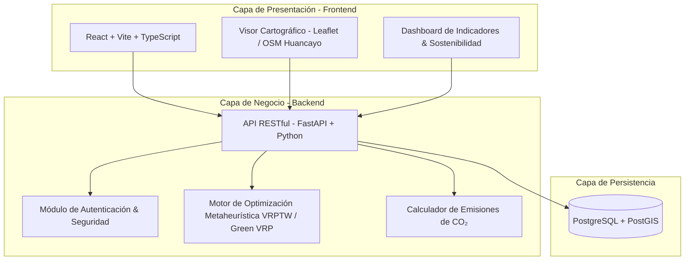
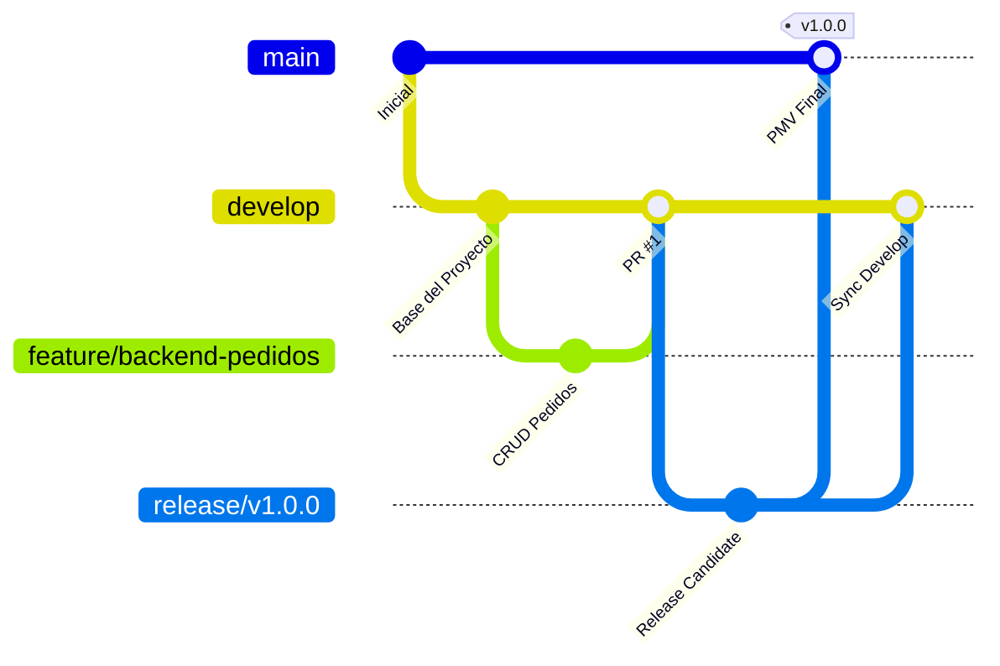

<div align="center">


# EcoLogística Huancayo
### Plataforma de Optimización de Rutas Sostenibles de Última Milla

[](docs/03%20Implementaci%C3%B3n)
[](README.md)
[](docs/01%20Inicio/10.%20Stack%20tecnol%C3%B3gico%20V_1_0_0.md)
[](docs/01%20Inicio/01.%20Selecci%C3%B3n%20del%20enfoque%20del%20proyecto%20V_1_0_0.md)
[](README.md)
[](README.md)

<p align="center">
  <b>Solución tecnológica para la gestión eficiente, económica y ecológica de flotas de distribución urbana en DistriRápido S.A.C.</b>
</p>

</div>

---

## 1. Ficha Técnica del Proyecto

| Campo | Especificación |
| :--- | :--- |
| **Proyecto / Producto** | **EcoLogística Huancayo** (Optimizador VRPTW & Green VRP) |
| **Empresa Patrocinadora** | **DistriRápido S.A.C.** |
| **Asignatura Académica** | **Taller de Proyectos 2** (Ingeniería de Sistemas e Informática) |
| **Docente Asesor** | **Ing. Gamarra Moreno, Job Daniel** |
| **Periodo de Ejecución** | **24/08/2026 – 05/12/2026** (14 semanas de desarrollo + 1 de cierre / 4 iteraciones) |
| **Ámbito Geográfico** | **Huancayo y Junín** (Huancayo Cercado, El Tambo, Chilca, Pilcomayo y San Agustín de Cajas) |
| **Repositorio Oficial** | `https://github.com/alexito-dev/EcoLogistica.git` |

---

## 2. Descripción y Problemática

### 2.1. Descripción
**EcoLogística Huancayo** es una plataforma web desarrollada como Producto Mínimo Viable (PMV) enfocada en la planificación inteligente, secuenciación y seguimiento de rutas de distribución de última milla. 

El núcleo del sistema integra modelos matemáticos de optimización combinatoria multiobjetivo (**VRPTW** - *Vehicle Routing Problem with Time Windows*) incorporando variables de sostenibilidad ambiental (**Green VRP**) para minimizar distancias, tiempos de traslado, consumo de combustible y la emisión de dióxido de carbono ($CO_2$) generada por el transporte en altitud (3,250 msnm).

### 2.2. Problemática en DistriRápido S.A.C.
La operativa logística en el valle del Mantaro presenta retos críticos que impactan en la rentabilidad y sostenibilidad de la empresa:
1. **Sobrecostos de combustible:** Recorridos redundantes, cruces innecesarios de avenidas principales y desbalance de carga entre vehículos.
2. **Incumplimiento de ventanas horarias:** Dificultad para garantizar entregas en horarios concertados ante variaciones de tráfico urbano.
3. **Huella de carbono no mitigada:** Carencia de herramientas analíticas para cuantificar y reducir las emisiones de gases de efecto invernadero.
4. **Baja capacidad de respuesta:** Falta de re-optimización dinámica en tiempo real ante cancelaciones o nuevos pedidos urgentes durante la jornada.

### 2.3. Objetivo General
Desarrollar e implementar un PMV web que optimice las rutas de distribución urbana de DistriRápido S.A.C. en Huancayo, reduciendo la distancia total recorrida en al menos un **15%**, elevando la puntualidad al menos al **92%** y calculando la reducción efectiva de emisiones de $CO_2$ en 14 semanas de desarrollo y una semana de cierre.

### 2.4. Estado verificado del proyecto al 09/10/2026

La línea base tecnológica vigente es **React + Vite + TypeScript** para la interfaz y **FastAPI + Python** para la API. El modelo objetivo incorpora PostgreSQL/PostGIS, Leaflet/OpenStreetMap y un motor Python de optimización; esos tres componentes todavía no están implementados en el repositorio. La matriz y el alcance están en [10. Stack tecnológico](docs/01%20Inicio/10.%20Stack%20tecnol%C3%B3gico%20V_1_0_0.md).

El código disponible entrega autenticación con verificación TOTP y roles, además del registro, consulta y listado de pedidos. La ejecución del 09/10/2026 registró **100 pruebas de backend aprobadas, 99 % de cobertura y 39 pruebas de frontend aprobadas**; la compilación de producción terminó correctamente, con avisos porque los archivos de la fuente Codec Pro no están incluidos. Este estado no implica persistencia PostgreSQL, optimización de rutas ni despliegue continuo.

| Sprint | Plan comprometido | Resultado documentado |
|---|---|---|
| Sprint 1 · 14/09–28/09 | ECO-9 / HU-001 y ECO-15 / HU-006 (10 puntos) | 0 de 2 historias cumplieron la Definición de Hecho al cierre. HU-001 se terminó después, durante el Sprint 2; HU-006 sigue sin implementación demostrable. |
| Sprint 2 · 29/09–12/10 | Replanificación: primer incremento demostrable de HU-001 con autenticación y autorización MFA | HU-001 (5 puntos) y la autenticación quedaron implementadas en `main` al corte del 02/10. El sprint sigue abierto hasta el 12/10; la revisión prevista para el 09/10 aún no se ha celebrado a la hora de esta actualización. |

El estado operativo de Jira no refleja este plan: el tablero tiene dos sprints llamados **ECO Sprint 1** (uno cerrado y otro activo con fecha de fin 28/09) y no tiene Sprint 2. Además, muestra ECO-15 como `Listo` aunque el repositorio no contiene una implementación de re-enrutamiento. El detalle y la evidencia de consulta están en [02. Artefactos Jira](docs/02%20Planificaci%C3%B3n/02%20Artefactos%20Jira%20V_1_0_0.md); no se trata el estado de Jira como prueba de código.

---

## 3. Capacidades y Módulos Funcionales

```text
┌────────────────────────────────────────────────────────────────────────┐
│                      MÓDULOS DE ECOLogística HUANCAYO                  │
├────────────────────────────────────────────────────────────────────────┤
│  [1] Gestión de Pedidos     : Registro, geocodificación y ventanas.    │
│  [2] Flota y Conductores    : Capacidades, combustible y turnos.       │
│  [3] Motor Metaheurístico   : Resolución algorítmica VRPTW / Green VRP.│
│  [4] Visor Cartográfico     : Mapa interactivo (Leaflet/OSM Huancayo). │
│  [5] Dashboard Analítico    : KPIs logísticos y calculadora de CO₂.    │
│  [6] Re-enrutamiento        : Ajuste dinámico de secuencias en ruta.   │
└────────────────────────────────────────────────────────────────────────┘
```

---

## 4. Equipo de Trabajo y Responsabilidades

| Integrante | Rol en el Proyecto | Responsabilidad Principal |
| :--- | :--- | :--- |
| **Zorrilla Apumayta, Alex Jesus** | **Project Manager / Líder** | Planificación, gestión del alcance, coordinación metodológica, control de entregables y gobernanza del proyecto. |
| **Anco Porras, Jhean Pier Julio** | **Arquitecto / Backend** | Arquitectura del software, diseño y desarrollo de API RESTful, modelos de datos, persistencia en BD y servicios de negocio. |
| **Hilario Talavera, Alexander Daniel** | **Optimización** | Modelado matemático, formulación y calibración del motor metaheurístico multiobjetivo (VRPTW & Green VRP). |
| **Vera Zea, Jhoanna Hade** | **Frontend / UX** | Diseño de experiencia de usuario (UI/UX), desarrollo de vistas web responsivas, componentes de mapas interactivos y dashboards. |
| **Isidro Casio, Jose Luis** | **QA / DevOps** | Aseguramiento de la calidad, diseño y ejecución de pruebas unitarias/integración, pipelines de CI/CD y gestión de ramas. |
| **Gamarra Moreno, Job Daniel** | **Docente** | Asesoría técnica especializada, validación metodológica, evaluación de hitos académicos y supervisión general. |

---

## 5. Arquitectura del Sistema

El diagrama siguiente representa la **arquitectura objetivo del PMV**, no el despliegue actual. Al corte del 09/10/2026 están implementados React/Vite, FastAPI, autenticación MFA y pedidos; la base de datos, mapas, dashboard y motor de optimización permanecen planificados.


```mermaid
graph TD
    subgraph Cliente [Capa de Presentación - Frontend]
        UI[React + Vite + TypeScript]
        Map[Visor Cartográfico - Leaflet / OSM Huancayo]
        Dash[Dashboard de Indicadores & Sostenibilidad]
    end

    subgraph Servidor [Capa de Negocio - Backend]
        API[API RESTful - FastAPI + Python]
        Auth[Módulo de Autenticación & Seguridad]
        Engine[Motor de Optimización Metaheurística VRPTW / Green VRP]
        CO2[Calculador de Emisiones de CO₂]
    end

    subgraph Datos [Capa de Persistencia]
        DB[(PostgreSQL + PostGIS)]
    end

    UI --> API
    Map --> API
    Dash --> API
    API --> Auth
    API --> Engine
    API --> CO2
    API --> DB
```

### 5.1. Herramientas y tecnologías objetivo

- **Frontend:** React con Vite y TypeScript.
- **Estilos e interfaz:** CSS (con diseño responsivo y enfoque de bajo consumo para 2G/3G).
- **Backend:** Python con FastAPI, Pydantic y SQLAlchemy/Alembic.
- **Base de datos:** PostgreSQL con PostGIS.
- **Cartografía:** Leaflet y OpenStreetMap.
- **Optimización:** motor metaheurístico para VRPTW y Green VRP.

---

## 6. Estructura del Repositorio

```text
EcoLogistica/
│
├── .github/                       # Plantillas de PRs e Issues
│   ├── ISSUE_TEMPLATE/
│   │   ├── bug_report.md
│   │   └── feature_request.md
│   └── pull_request_template.md
│
├── docs/                          # Documentación formal (Estándares PMI / Ágil)
│   ├── 01 Inicio/                 # Fase de inicio y gobernanza
│   │   ├── 01. Selección del enfoque del proyecto .md
│   │   ├── 02. Acta de constitución.md
│   │   ├── 03. Declaración de la visión.md
│   │   ├── 04. Registro de supuestos y restricciones.md
│   │   └── 05. Registro de interesados.md
│   ├── 02 Planificación/          # Cronogramas, backlog y EDT/WBS
│   ├── 03 Implementación/         # Informe de estado, impedimentos, revisión y retrospectiva por sprint
│   ├── 04 Seguimiento y Control/  # Minutas de sprint y métricas QA
│   ├── 05 Cierre/                 # Informes de entrega de PMV
│   └── otros/                     # Material técnico de soporte
│
├── frontend/                      # Aplicación cliente (Web UI)
│   ├── src/                       # Componentes, vistas y servicios cliente
│   ├── tests/                     # Pruebas de interfaz
│   └── public/                    # Archivos estáticos
│
├── backend/                       # Servidor API y Algoritmo de Optimización
│   ├── src/                       # Controladores, servicios y motor metaheurístico
│   └── tests/                     # Pruebas unitarias e integración
│
├── database/                      # Esquemas de Base de Datos y Datos Semilla
│   ├── migrations/                # Scripts DDL y control de migraciones
│   └── seeds/                     # Datos iniciales para pruebas en Huancayo
│
├── assets/                        # Recursos gráficos y multimedia
│   ├── diagrams/                  # Diagramas de arquitectura y flujos
│   ├── mockups/                   # Diseños de interfaz UI/UX
│   └── images/                    # Capturas y recursos gráficos
│
├── .gitignore                     # Reglas de exclusión de Git
├── .env.example                   # Plantilla de variables de entorno
└── README.md                      # Documento principal del repositorio
```

---

## 7. Modelo de Ramas y Control de Versiones

Se utiliza **Git Flow** como estándar de desarrollo colaborativo:


```mermaid
gitGraph
    commit id: "Inicial"
    branch develop
    checkout develop
    commit id: "Base del Proyecto"
    branch feature/backend-pedidos
    checkout feature/backend-pedidos
    commit id: "CRUD Pedidos"
    checkout develop
    merge feature/backend-pedidos id: "PR #1"
    branch release/v1.0.0
    checkout release/v1.0.0
    commit id: "Release Candidate"
    checkout main
    merge release/v1.0.0 id: "PMV Final" tag: "v1.0.0"
    checkout develop
    merge release/v1.0.0 id: "Sync Develop"
```

### 7.1. Ramas Principales y de Soporte
- `main`: Código productivo, estable y auditado.
- `develop`: Rama troncal de integración continua.
- `feature/*`: Desarrollo de módulos específicos (ej. `feature/optimizacion-rutas`, `feature/mapa-leaflet`).
- `release/*`: Estabilización y congelamiento de versión previa a entrega.
- `hotfix/*`: Correcciones críticas sobre `main`.

### 7.2. Convención de Commits (Conventional Commits v1.0.0)
- `feat:` Nuevas funcionalidades (`feat(pedidos): agregar validacion de ventanas horarias`).
- `fix:` Corrección de errores (`fix(motor): ajustar calculo de penalizacion por demora`).
- `docs:` Actualización de documentación (`docs(inicio): actualizar acta de constitucion`).
- `test:` Pruebas unitarias o de integración (`test(backend): agregar pruebas del servicio de rutas`).
- `refactor:` Mejoras en código sin alterar comportamiento (`refactor(api): modularizar controladores`).
- `style:` Ajustes estéticos o de formato (`style(ui): optimizar paleta accesible en dashboard`).
- `chore:` Tareas de mantenimiento o configuración (`chore(deps): actualizar dependencias`).

---

## 8. Guía de Instalación y Ejecución Local

### 8.1. Clonar el Repositorio
```bash
git clone https://github.com/alexito-dev/EcoLogistica.git
cd EcoLogistica
```

### 8.2. Variables de Entorno
```bash
cp .env.example .env
# Configurar parámetros de base de datos y puertos en .env
```

### 8.3. Despliegue Local

Requisitos: Python 3.10+ y Node.js 20+.

```bash
# Backend (FastAPI) — http://localhost:8000  ·  documentación: http://localhost:8000/docs
cd backend
python -m venv .venv
.venv/Scripts/activate        # Windows (Git Bash: source .venv/Scripts/activate · Linux/macOS: source .venv/bin/activate)
pip install -r requirements.txt
uvicorn app.main:app --app-dir src --reload --port 8000

# Frontend (React + Vite) — http://localhost:3000  (en otra terminal)
cd frontend
npm install
npm run dev
```

### 8.4. Pruebas Automatizadas
```bash
# Backend (pytest, con cobertura)
cd backend && pytest --cov=app

# Frontend (Vitest + Testing Library)
cd frontend && npm test
```

### 8.5. Acceso con verificación en dos pasos (RF-11.1)

Toda la aplicación exige **contraseña + código TOTP** de una app autenticadora (Google Authenticator, Microsoft Authenticator u otra).

1. Al iniciar el backend por primera vez se crean **cinco usuarios de demostración**, uno por rol: `admin@`, `planificador@`, `conductor@`, `gerente@` y `auditor@ecologistica.test`.
2. La contraseña de demostración se toma de `DEMO_CLAVE` en `.env`. Si está vacía, el backend genera una aleatoria y **la muestra una sola vez en su consola**. Para generar usuarios nuevos, borre la carpeta `backend/.data/` (ignorada por Git) y reinicie el backend.
3. En el primer ingreso de cada usuario, la app muestra un **código QR** (y la clave para ingreso manual): escanéelo con la app autenticadora y escriba el código de 6 dígitos.
4. Permisos actuales (matriz RBAC del documento 08): **Planificador** registra y consulta pedidos; **Administrador** solo consulta; los demás roles ven "Acceso no autorizado" hasta que existan sus vistas.

Seguridad: contraseñas con Argon2id, sesión en cookie `HttpOnly` y `SameSite=Strict` (15 min de inactividad, 8 h máximo), bloqueo de 15 min tras 5 intentos fallidos, códigos de un solo uso y eventos de acceso en la consola del backend sin secretos.

| Método | Ruta | Descripción |
| :--- | :--- | :--- |
| `POST` | `/api/v1/auth/login` | Paso 1: correo y contraseña (responde `MFA` o `ENROLAR`) |
| `POST` | `/api/v1/auth/mfa` | Paso 2: código TOTP; crea la sesión |
| `GET` | `/api/v1/auth/sesion` | Usuario de la sesión vigente |
| `POST` | `/api/v1/auth/logout` | Cierra la sesión e invalida los tokens emitidos |

### 8.6. API de pedidos (HU-001)

| Método | Ruta | Descripción |
| :--- | :--- | :--- |
| `POST` | `/api/v1/pedidos` | Registra un pedido (estado inicial `PENDIENTE`) |
| `GET` | `/api/v1/pedidos?estado&pagina&limite` | Lista pedidos, del más reciente al más antiguo (límite máx. 100) |
| `GET` | `/api/v1/pedidos/{id}` | Consulta un pedido por UUID |

Requiere sesión (`401`) y rol (`403`). Errores: `400` formato o tipo inválido, `422` regla de negocio (ventana, carga, ámbito), `404` inexistente, `409` código duplicado. Las ventanas horarias se envían en ISO 8601 **con desfase** (por ejemplo `2026-10-05T08:00:00-05:00`). Contrato completo en `/docs`.

### 8.7. Alcance y límites de los incrementos

Implementado con OpenSpec en los cambios `registro-pedidos` (registrar, consultar y listar pedidos) y `autenticacion-mfa` (acceso con verificación en dos pasos y permisos por rol; incluye la auditoría de su especificación en `openspec/changes/archive/2026-10-02-autenticacion-mfa/auditoria-especificacion.md`). Límites conocidos, pendientes de otros cambios:

- Persistencia **en memoria** (se pierde al reiniciar); el adaptador PostgreSQL/PostGIS llegará con EN-005.
- Usuarios en un archivo local (`backend/.data/`) y secretos TOTP sin cifrar en reposo hasta EN-005; sin recuperación del segundo factor ni consulta de la auditoría desde la interfaz.
- El ámbito geográfico es un rectángulo de aproximación configurable en `.env` (`AMBITO_*`), por validar con el negocio.
- La fuente **Codec Pro** es comercial: ver `frontend/public/fonts/LEEME.md`; sin ella se usa la fuente del sistema.

---

## 9. Navegación de Documentación

Acceso directo a la documentación oficial del repositorio, organizada por las cinco áreas del proyecto:

### 9.1. Fase 01: Inicio

- [01. Selección del enfoque del proyecto](docs/01%20Inicio/01.%20Selecci%C3%B3n%20del%20enfoque%20del%20proyecto%20V_1_0_0.md)
- [02. Acta de constitución](docs/01%20Inicio/02.%20Acta%20de%20constituci%C3%B3n%20V_1_0_0.md)
- [03. Declaración de la visión](docs/01%20Inicio/03.%20Declaraci%C3%B3n%20de%20la%20visi%C3%B3n%20V_1_0_0.md)
- [04. Registro de supuestos y restricciones](docs/01%20Inicio/04.%20Registro%20de%20supuestos%20y%20restricciones%20V_1_0_0.md)
- [05. Registro de interesados](docs/01%20Inicio/05.%20Registro%20de%20interesados%20V_1_0_0.md)
- [06. Requisitos funcionales](docs/01%20Inicio/06.%20Requisitos%20funcionales%20V_1_0_0.md)
- [07. Requisitos no funcionales](docs/01%20Inicio/07.%20Requisitos%20no%20funcionales%20V_1_0_0.md)
- [08. Usuarios](docs/01%20Inicio/08.%20Usuarios%20V_1_0_0.md)
- [09. Reglas de negocio](docs/01%20Inicio/09.%20Reglas%20de%20negocio%20V_1_0_0.md)
- [10. Stack tecnológico](docs/01%20Inicio/10.%20Stack%20tecnológico%20V_1_0_0.md)
- [11. Base de datos](docs/01%20Inicio/11.%20Base%20de%20datos%20V_1_0_0.md)
- [12. Modelo C4](docs/01%20Inicio/12.%20Modelo%20C4%20V_1_0_0.md)
- [13. Restricciones](docs/01%20Inicio/13.%20Restricciones%20V_1_0_0.md)

## Fase 02: Planificación del Proyecto

Artefactos de la semana 4: transformación ágil, configuración y evidencias Jira, registro cuantitativo de riesgos y presupuesto financiero.

- [01. Transformando a ágil](docs/02%20Planificaci%C3%B3n/01%20Transformando%20a%20%C3%A1gil%20V_1_0_0.md)
- [02. Artefactos Jira](docs/02%20Planificaci%C3%B3n/02%20Artefactos%20Jira%20V_1_0_0.md)
- [03. Registro de riesgos](docs/02%20Planificaci%C3%B3n/03%20Registro%20de%20riesgos%20V_1_0_0.md)
- [04. Presupuesto del proyecto](docs/02%20Planificaci%C3%B3n/04%20Presupuesto%20del%20proyecto%20V_1_0_0.md)

### 9.2. Fase 02: Planificación

- [Documentación de planificación](docs/02%20Planificaci%C3%B3n/)

### 9.3. Fase 03: Implementación

Entregables del **Sprint 1** (ECO Sprint 1, 14/09/2026 – 28/09/2026):

- [01. Informe de estado del proyecto](docs/03%20Implementaci%C3%B3n/01%20Informe%20de%20estado%20del%20proyecto%20V_1_0_0.md)
- [02. Registro de Impedimentos](docs/03%20Implementaci%C3%B3n/02%20Registro%20de%20Impedimentos%20V_1_0_0.md)
- [03. Revisión del Sprint](docs/03%20Implementaci%C3%B3n/03%20Revisi%C3%B3n%20del%20Sprint%20V_1_0_0.md)
- [04. Retrospectiva del Sprint](docs/03%20Implementaci%C3%B3n/04%20Retrospectiva%20del%20Sprint%20V_1_0_0.md)
- [05. Auditoría de coherencia al 09/10/2026](docs/03%20Implementaci%C3%B3n/05%20Auditor%C3%ADa%20de%20coherencia%20al%2009-10-2026.md)

Entregables del **Sprint 2** (ECO Sprint 2, desde el 29/09/2026; revisión el 09/10/2026):

- [01. Informe de estado del proyecto](docs/03%20Implementaci%C3%B3n/Sprint%202/01%20Informe%20de%20estado%20del%20proyecto%20V_1_0_0.md)
- [02. Registro de Impedimentos](docs/03%20Implementaci%C3%B3n/Sprint%202/02%20Registro%20de%20Impedimentos%20V_1_0_0.md)
- [03. Revisión del Sprint](docs/03%20Implementaci%C3%B3n/Sprint%202/03%20Revisi%C3%B3n%20del%20Sprint%20V_1_0_0.md)
- [04. Retrospectiva del Sprint](docs/03%20Implementaci%C3%B3n/Sprint%202/04%20Retrospectiva%20del%20Sprint%20V_1_0_0.md)

Carpeta completa: [docs/03 Implementación](docs/03%20Implementaci%C3%B3n/)

### 9.4. Fase 04: Seguimiento y Control

- [Documentación de seguimiento y control](docs/04%20Seguimiento%20y%20Control/)

### 9.5. Fase 05: Cierre

- [Documentación de cierre](docs/05%20Cierre/)

### 9.6. Material técnico adicional

- [Material técnico de soporte](docs/otros/)

---

<div align="center">
  <sub>Escuela Profesional de Ingeniería de Sistemas e Informática · Taller de Proyectos 2 · 2026</sub>
</div>
