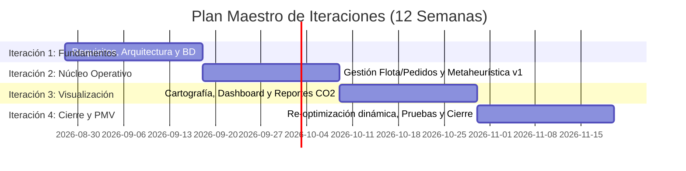

# 01. Selección del Enfoque del Proyecto

**Proyecto:** EcoLogística – Optimizador de Rutas Sostenibles para DistriRápido S.A.C.  
**Curso:** Taller de Proyectos 2 – Ingeniería de Sistemas e Informática  
**Versión:** 1.0.0  
**Fecha:** 2026-08-28  
**Estado:** Aprobado  

---

## 1. Contexto y Justificación
El proyecto **EcoLogística** tiene como finalidad desarrollar un Producto Mínimo Viable (PMV) para la optimización de rutas de última milla con enfoque en sostenibilidad ambiental y eficiencia operativa para la empresa **DistriRápido S.A.C.** en un horizonte temporal académico de 12 semanas.

Debido a la naturaleza del problema de optimización logística combinatoria (VRPTW y Green VRP), la necesidad de validaciones iterativas continuas y la integración progresiva de componentes tecnológicos (motor metaheurístico, microservicios backend, mapa interactivo y dashboard de indicadores), se requiere un marco de gestión y desarrollo ágil y adaptativo.

---

## 2. Evaluación de Enfoques de Gestión

| Criterio de Evaluación | Enfoque Predictivo (Cascada) | Enfoque Híbrido | Enfoque Ágil (Scrum / Kanban) |
| :--- | :--- | :--- | :--- |
| **Claridad inicial de requisitos** | Media - Alta | Media | Alta adaptabilidad ante cambios |
| **Complejidad del algoritmo** | Baja tolerancia a ajustes | Media tolerancia | Alta capacidad de refinamiento iterativo |
| **Entregas de valor tempranas** | Al final del ciclo (semana 12) | Por fases | Incrementales cada 2-3 semanas |
| **Gestión de riesgos técnicos** | Tardía | Moderada | Temprana y continua |
| **Tiempo de desarrollo** | Rígido | Rígido | Flexible y time-boxed (12 semanas) |

---

## 3. Enfoque Seleccionado
Se selecciona un **Enfoque Ágil con marco de trabajo Scrum adaptado**, complementado con prácticas de ingeniería de software disciplinadas (**Git Flow**, Integración Continua y Desarrollo Guiado por Pruebas en módulos críticos de optimización).

### Justificación Técnica:
1. **Iteraciones Quincenales (Sprints de 2-3 semanas):** Permiten construir y validar de manera incremental los módulos de flota, pedidos, algoritmo genético/metaheurística, cartografía y re-optimización.
2. **Mitigación de Riesgos Algorítmicos:** Permite calibrar la función de aptitud multiobjetivo (distancia, tiempo de ventanas de entrega y emisiones de $CO_2$) progresivamente.
3. **Visibilidad Continua para los Interesados:** Facilita revisiones quincenales del PMV con el docente asesor y los representantes de DistriRápido S.A.C.

---

## 4. Distribución Temporal en 12 Semanas Académicas

---

## 5. Control de Cambios del Documento

| Versión | Fecha | Autor | Descripción del Cambio |
| :--- | :--- | :--- | :--- |
| 1.0.0 | 2026-08-28 | Equipo de Proyecto | Creación inicial del documento de enfoque del proyecto |
