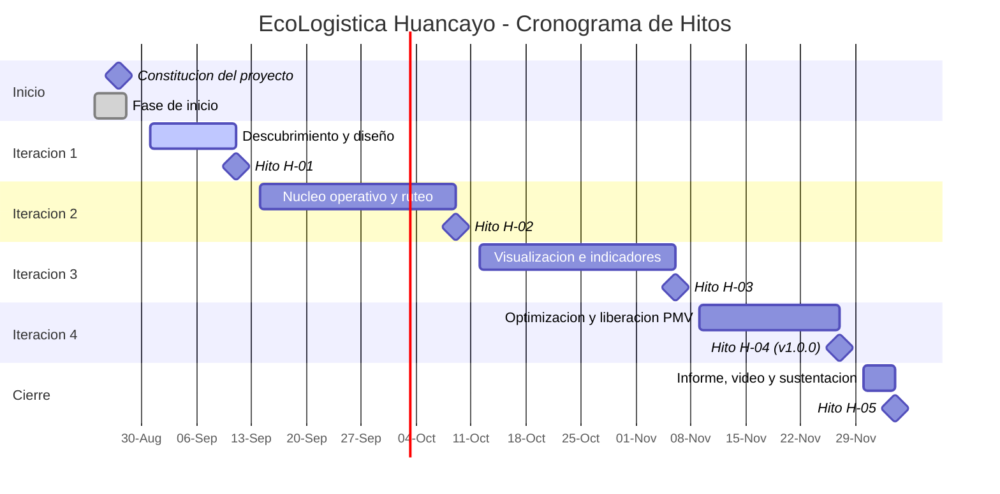

# 02. Acta de Constitución del Proyecto

*(Project Charter — PMBOK® Guide 7.ª Edición)*

## Metadatos del documento

| Campo | Detalle |
|---|---|
| **Nombre del proyecto** | EcoLogística Huancayo — Optimizador de Rutas Sostenibles para *DistriRápido S.A.C.* |
| **Código del proyecto** | PFA-TP2-ECOLOG-2026 |
| **Organización solicitante** | DistriRápido S.A.C. (Huancayo, Huancayo, Perú) |
| **Patrocinador (Sponsor)** | Gerencia General de DistriRápido S.A.C. / Gamarra Moreno Job Daniel (patrocinador académico) |
| **Director del Proyecto** | Zorrilla Apumayta, Alex Jesus |
| **Fecha de emisión** | 27 de agosto de 2026 |
| **Fecha de inicio** | 24 de agosto de 2026 |
| **Fecha de cierre planificada** | 04 de diciembre de 2026 |
| **Versión** | 1.0.0 |
| **Estado** | Emitida — autoriza formalmente el inicio del proyecto |

---

## 1. Propósito y justificación del proyecto

### 1.1. Descripción del problema de negocio

*DistriRápido S.A.C.* es un operador logístico ficticio de última milla con sede en Huancayo que ejecuta **más de 250 entregas diarias** en Huancayo Cercado, El Tambo, Chilca, Pilcomayo y San Agustín de Cajas, atendiendo a bodegas, pequeños comerciantes y mercados locales.

La planificación de rutas se realiza actualmente de forma **manual y secuencial**, basada en la experiencia del despachador y sin optimización matemática. Este método genera cuatro consecuencias medibles y concurrentes:

| # | Problema identificado | Magnitud actual (línea base) | Consecuencia directa |
|:---:|---|---|---|
| 1 | Alta congestión vehicular en corredores críticos (calle Real, avenida Ferrocarril y avenida Huancavelica) | Pérdida operativa concentrada en horas punta (07:00–09:00 y 17:00–20:00) | Incremento de tiempos de recorrido y de consumo en ralentí |
| 2 | Altos costos operativos | Combustible y mantenimiento = **35 %** del costo total | Erosión directa del margen operativo |
| 3 | Impacto ambiental de la flota | **3.5 t de CO₂ mensuales** (42 t anuales), flota de 15 unidades mayoritariamente diésel | Incumplimiento de compromisos de sostenibilidad y exposición reputacional |
| 4 | Incumplimiento de ventanas de tiempo | **22 %** de entregas fuera del horario acordado | Penalidades contractuales y pérdida de clientes |

### 1.2. Oportunidad de negocio

La formulación del problema corresponde a un **VRPTW (Vehicle Routing Problem with Time Windows)** con extensión **Green VRP**, resoluble mediante metaheurísticas. La evidencia académica y la práctica industrial sitúan las mejoras típicas de esta clase de optimización entre **10 % y 25 %** en distancia recorrida, con efecto proporcional sobre combustible y emisiones.

Aplicado a la línea base de DistriRápido, un ahorro conservador del 15 % en distancia y del 18 % en emisiones representa:

| Concepto | Estimación anual |
|---|---|
| Reducción de emisiones | ≈ **7.6 t de CO₂** evitadas |
| Equivalente en reforestación | ≈ **345 árboles** que dejarían de requerirse para compensación |
| Reducción de penalidades por incumplimiento | Del 22 % al ≤ 8 % de entregas tardías |

### 1.3. Alineación estratégica

| Marco de alineación | Contribución del proyecto |
|---|---|
| Contribuciones Determinadas a Nivel Nacional (NDC) del Perú | Reducción verificable de emisiones del transporte de carga urbana |
| ODS 11 — Ciudades y comunidades sostenibles | Disminución de la congestión y del ruido en zonas residenciales de Huancayo |
| ODS 13 — Acción por el clima | Plan de compensación de carbono con proyectos locales de reforestación |
| Green Software Foundation | Diseño del propio sistema con criterios de eficiencia energética |
| ISO 14083 | Medición y reporte estandarizado de la huella de carbono logística |

### 1.4. Justificación de la inversión

| Criterio | Sustento |
|---|---|
| Costo de no actuar | Mantener el 22 % de incumplimiento y 42 t CO₂/año, con penalidades crecientes y pérdida de cartera. |
| Alternativa descartada 1 | Contratar más unidades: incrementa costos fijos y emisiones; ataca el síntoma, no la causa. |
| Alternativa descartada 2 | Adquirir software comercial de ruteo: no modela restricciones locales (D.S. 033-2012-MTC, direcciones sin nomenclatura, zonas de alta incidencia delictiva, vías no pavimentadas). |
| Alternativa seleccionada | Desarrollo de plataforma web propia con metaheurísticas parametrizadas al contexto de Huancayo. |

---

## 2. Objetivos medibles del proyecto (criterios SMART)

### 2.1. Objetivo general

> Desarrollar e implementar un **Producto Mínimo Viable funcional** de la plataforma web *EcoLogística Huancayo* que optimice las rutas de reparto de última milla de DistriRápido S.A.C., reduciendo de forma verificable la distancia recorrida, el consumo de combustible, las emisiones de CO₂ y el incumplimiento de ventanas de tiempo, en un plazo de **14 semanas** y con un presupuesto máximo de **S/ 500,000**.

### 2.2. Objetivos específicos por dimensión

#### A. Objetivos de ALCANCE

| ID | Objetivo SMART | Métrica | Meta | Fecha límite |
|:---:|---|---|:---:|---|
| OA-01 | Implementar los requerimientos funcionales RF-01 a RF-07 en el PMV | % de RF mínimos implementados y aceptados | ≥ 70 % del total (100 % de RF-01 a RF-07) | 27/11/2026 |
| OA-02 | Entregar la documentación de gestión estructurada según las cinco áreas PMBOK en `docs/` | N.° de áreas documentadas | 5 de 5 | 05/12/2026 |
| OA-03 | Entregar la documentación técnica completa (manual de usuario, de administrador, API Swagger/OpenAPI y del código) | N.° de documentos entregados | 4 de 4 | 27/11/2026 |
| OA-04 | Etiquetar el PMV en el repositorio bajo versionado semántico | Tag publicado | `v1.0.0` | 27/11/2026 |

#### B. Objetivos de CRONOGRAMA

| ID | Objetivo SMART | Métrica | Meta | Fecha límite |
|:---:|---|---|:---:|---|
| OC-01 | Ejecutar las 4 iteraciones planificadas sin desviación del hito de cierre | Desviación del hito final | 0 días | 27/11/2026 |
| OC-02 | Cumplir los compromisos comprometidos por iteración | % de ítems del Sprint Backlog completados | ≥ 90 % por iteración | Cierre de cada iteración |
| OC-03 | Mantener el Índice de Desempeño del Cronograma dentro de tolerancia | SPI | ≥ 0.95 | Medición semanal |

#### C. Objetivos de COSTO

| ID | Objetivo SMART | Métrica | Meta | Fecha límite |
|:---:|---|---|:---:|---|
| OK-01 | Ejecutar el desarrollo del PMV dentro del presupuesto autorizado | Costo total ejecutado | ≤ S/ 500,000 | 05/12/2026 |
| OK-02 | Mantener la desviación presupuestal bajo control | Variación del costo (CV) | ≤ 5 % | Medición por iteración |
| OK-03 | Consumir la reserva de contingencia dentro del límite previsto | % de reserva utilizada | ≤ 100 % de S/ 35,000 | 05/12/2026 |

#### D. Objetivos de CALIDAD Y DESEMPEÑO DEL PRODUCTO

| ID | Objetivo SMART | Métrica | Línea base | Meta | Verificación |
|:---:|---|---|:---:|:---:|---|
| OQ-01 | Reducir la distancia total recorrida frente a la ruta secuencial actual | % de reducción | 0 % | ≥ 15 % | Prueba comparativa sobre 30 días de datos históricos |
| OQ-02 | Reducir las emisiones de CO₂ de la flota | t CO₂/mes | 3.5 | ≤ 2.87 (−18 %) | Cálculo conforme a ISO 14083 |
| OQ-03 | Elevar el cumplimiento de ventanas de tiempo | % de entregas a tiempo | 78 % | ≥ 92 % | Reporte del módulo RF-05 |
| OQ-04 | Garantizar el desempeño del motor de optimización | Tiempo de cómputo (150 pedidos / 15 vehículos) | — | ≤ 45 s | Prueba de rendimiento (RNF-01) |
| OQ-05 | Garantizar la re-optimización dinámica | Tiempo de re-cálculo | — | ≤ 30 s | Prueba de rendimiento (RNF-01) |
| OQ-06 | Cumplir el estándar de seguridad web | Vulnerabilidades críticas OWASP Top 10 | — | 0 | Análisis SAST/DAST previo al cierre |
| OQ-07 | Cumplir el estándar de accesibilidad | Conformidad WCAG 2.1 nivel AA | — | ≥ 90 % de criterios | Auditoría con axe-core + revisión manual |
| OQ-08 | Cumplir el estándar de calidad de producto | Características ISO/IEC 25010 evaluadas | — | 8 de 8 documentadas | Informe de evaluación de calidad |
| OQ-09 | Validar la usabilidad para el perfil conductor | Tasa de éxito en tareas críticas | — | ≥ 85 % | Prueba con ≥ 5 usuarios reales |
| OQ-10 | Garantizar la disponibilidad en horario operativo (05:00–22:00) | % de disponibilidad | — | ≥ 99.5 % | Monitoreo durante la iteración 4 |

---

## 3. Requisitos de alto nivel

### 3.1. Requisitos funcionales clave

| Código | Requisito | Prioridad | Iteración |
|:---:|---|:---:|:---:|
| RF-01 | Gestión de flota (placa, tipo, capacidad, consumo, factor de emisión, antigüedad) | Alta | 2 |
| RF-02 | Gestión de pedidos con coordenadas GPS, ventana de tiempo, prioridad y puntos de referencia | Alta | 2 |
| RF-03 | Generación de rutas optimizadas mediante metaheurística (GA / Tabú / ACO / SA) | **Crítica** | 2 – 4 |
| RF-04 | Visualización de rutas en mapa interactivo con nivel de congestión | Alta | 3 |
| RF-05 | Dashboard de indicadores de sostenibilidad en lenguaje accesible | Alta | 3 |
| RF-06 | Reportes descargables en PDF con huella de carbono y costo del ciclo de vida | Media | 3 |
| RF-07 | Re-optimización dinámica ante nuevos pedidos, incidentes o averías | Alta | 4 |
| RF-08 | Gestión de conductores con restricciones de jornada (Ley N.° 30224) | Media | 2 |
| RF-09 | Módulo de preferencias de entrega del cliente | Baja | Post-PMV |
| RF-10 | Plan de compensación de carbono con proyectos locales de reforestación | Media | 3 |

### 3.2. Requisitos no funcionales clave

| Código | Requisito | Umbral de aceptación |
|:---:|---|---|
| RNF-01 | Rendimiento | Solución válida ≤ 45 s (150 pedidos / 15 vehículos); re-optimización ≤ 30 s |
| RNF-02 | Seguridad | OWASP Top 10 mitigado + cumplimiento de la Ley N.° 29733 |
| RNF-03 | Accesibilidad | WCAG 2.1 nivel AA |
| RNF-04 | Escalabilidad | Hasta 1,000 pedidos diarios y 50 vehículos |
| RNF-05 | Usabilidad | "Modo conductor" simplificado, operable por usuarios con formación básica |
| RNF-06 | Disponibilidad | 99.5 % en horario 05:00–22:00, con respaldo local en dispositivo móvil |
| RNF-07 | Documentación | Proceso, arquitectura, manuales y API documentados |

### 3.3. Limitaciones técnicas iniciales

1. **Stack tecnológico obligatorio (RES-06):** Python (FastAPI/Django) en el backend, React.js o Vue.js en el frontend, PostgreSQL como base de datos y Leaflet/OpenStreetMap para cartografía.
2. **Arquitectura obligatoria:** separación estricta frontend/backend, organizada por capas o por características.
3. **Operación en redes de baja velocidad:** el sistema debe ser funcional bajo conexiones 2G/3G, dada la cobertura limitada de fibra óptica en Huancayo.
4. **Precisión variable de datos de tráfico:** los datos de Waze/Google Maps en Huancayo presentan cobertura irregular; se requiere carga manual complementaria.
5. **Sin datos productivos reales:** el proyecto opera sobre un escenario empresarial ficticio, con datos sintéticos y georreferenciación real de Huancayo.

### 3.4. Exclusiones del alcance (fuera de alcance del PMV)

- Aplicación móvil nativa (Android/iOS); el "modo conductor" será web responsive.
- Integración con ERP o sistema contable de la empresa.
- Módulo de facturación electrónica y pasarela de pagos.
- Compra o conversión física de vehículos a GNV o eléctricos (solo se modela el análisis de ROI).
- Contratación efectiva de créditos de carbono ante entidades certificadoras.
- Telemetría embarcada mediante hardware IoT en las unidades.

---

## 4. Riesgos macro iniciales

**Escala:** Probabilidad (P) e Impacto (I) de 1 a 5. **Exposición = P × I.** Umbral de escalamiento: exposición ≥ 15.

| ID | Riesgo | Categoría | P | I | Exp. | Impacto probable | Respuesta planificada |
|:---:|---|---|:---:|:---:|:---:|---|---|
| RM-01 | La metaheurística no converge en el umbral de 45 s con 150 pedidos | Técnico | 4 | 5 | **20** | Incumplimiento del RNF-01 y del objetivo OQ-04 | **Mitigar:** *spike* técnico en Iteración 2; heurística constructiva (Clarke-Wright) como semilla; paralelización y límite de generaciones |
| RM-02 | Cambios o límites de cuota en las APIs de tráfico (Waze CCP / Google Maps) | Externo | 4 | 4 | **16** | Pérdida de la variable de congestión en tiempo real | **Mitigar:** capa de abstracción de proveedores + caché local + carga manual de reportes (RES-09) |
| RM-03 | Datos georreferenciados incompletos o imprecisos en Huancayo (direcciones sin nomenclatura) | Datos | 5 | 3 | **15** | Errores de asignación de puntos de entrega | **Mitigar:** geocodificación asistida con puntos de referencia y validación manual del despachador |
| RM-04 | Disponibilidad limitada del equipo por carga académica concurrente | Recursos | 4 | 3 | 12 | Retraso en el cierre de iteraciones | **Mitigar:** capacidad conservadora por sprint (≤ 80 %) y polivalencia de roles |
| RM-05 | Incumplimiento de la Ley N.° 29733 en el tratamiento de datos de conductores | Normativo | 2 | 5 | 10 | Sanción legal y rechazo de la solución | **Evitar:** minimización de datos, cifrado en reposo, consentimiento informado y control de acceso por rol |
| RM-06 | Vulnerabilidad crítica OWASP detectada tardíamente | Seguridad | 3 | 4 | 12 | Retrabajo en fase final y riesgo de exposición de datos | **Mitigar:** SAST en el pipeline de CI desde la Iteración 2 |
| RM-07 | Rechazo de la interfaz por parte de conductores con baja alfabetización digital | Social / UX | 3 | 4 | 12 | Baja adopción y fracaso del objetivo de negocio | **Mitigar:** pruebas de usabilidad tempranas, iconografía universal y "modo conductor" |
| RM-08 | Sobrecosto en infraestructura cloud facturada en dólares | Financiero | 3 | 3 | 9 | Consumo anticipado de la reserva de contingencia | **Mitigar:** entornos de bajo costo en desarrollo, autoescalado con techo y alertas de gasto |
| RM-09 | Deuda técnica acumulada por presión de entrega | Calidad | 4 | 3 | 12 | Deterioro de la mantenibilidad (ISO/IEC 25010) | **Mitigar:** revisión obligatoria por pares en cada *pull request* y 10 % de capacidad reservada a refactorización |
| RM-10 | Cambio normativo en la restricción vehicular municipal durante el proyecto | Externo | 2 | 3 | 6 | Reglas de ruteo desactualizadas | **Aceptar / Monitorear:** parametrizar las reglas de restricción como configuración, no como código |
| RM-11 | Pérdida de trabajo por gestión deficiente del repositorio (conflictos, ramas huérfanas) | Metodológico | 2 | 4 | 8 | Pérdida de evidencia de trabajo colaborativo | **Evitar:** Feature Branch Workflow, protección de la rama principal y PR obligatorios |
| RM-12 | Baja visibilidad en invierno (neblina, junio–setiembre) no modelada | Operativo | 3 | 2 | 6 | Rutas subóptimas en condiciones adversas | **Mitigar:** factor de ajuste estacional configurable (RES-11) |

**Riesgos con exposición ≥ 15 (escalamiento obligatorio al patrocinador):** RM-01, RM-02, RM-03.

---

## 5. Resumen de hitos

### 5.1. Tabla de hitos

| ID | Hito | Entregable verificable | Fecha estimada | Criterio de aceptación |
|:---:|---|---|---|---|
| H-00 | **Constitución del proyecto** | Repositorio creado, estructura `docs/01 Inicio/` y 5 artefactos de inicio | 17/08/2026 | Los 5 archivos `.md` publicados con nomenclatura exacta y URL registrada |
| H-01 | **Cierre Iteración 1 — Descubrimiento** | Análisis de requerimientos, investigación de campo en Huancayo, diseño de base de datos y mockups | 11/09/2026 | Modelo de datos aprobado y mockups validados |
| H-02 | **Cierre Iteración 2 — Núcleo operativo** | Gestión de flota, pedidos y conductores + motor de ruteo con Algoritmo Genético básico | 09/10/2026 | Ruta válida generada sobre un caso de 50 pedidos |
| H-03 | **Cierre Iteración 3 — Visualización e impacto** | Mapa interactivo, dashboard de indicadores, reportes PDF e integración con API de tráfico | 06/11/2026 | Dashboard operativo con métricas de CO₂ y ahorro |
| H-04 | **Cierre Iteración 4 — PMV liberado** | Metaheurística optimizada, re-optimización dinámica, pruebas de aceptación y documentación final | 27/11/2026 | RNF-01 verificado; tag `v1.0.0` publicado |
| H-05 | **Cierre del proyecto** | Informe final, video explicativo (≤ 5 min) y exposición ante el docente | 05/12/2026 | Sustentación realizada y acta de cierre firmada |

### 5.2. Cronograma de hitos (Gantt)

---

## 6. Presupuesto estimado inicial

**Presupuesto autorizado: S/ 500,000** (aproximadamente USD 135,000), conforme a la restricción RES-05.

### 6.1. Asignación por categoría de gasto

| ID | Categoría | Detalle | Monto (S/) | % |
|:---:|---|---|---:|:---:|
| P-01 | **Recursos humanos de desarrollo** | 5 roles × 14 semanas, tarifa referencial S/ 25–50/hora (RES-05) | 300,000 | 60.0 % |
| P-02 | **Aseguramiento de la calidad** | Pruebas de rendimiento, auditoría OWASP y auditoría de accesibilidad WCAG 2.1 AA | 40,000 | 8.0 % |
| P-03 | **Infraestructura y servicios cloud** | Servidores (≈ USD 500/mes), base de datos gestionada, almacenamiento y CDN | 45,000 | 9.0 % |
| P-04 | **Investigación de campo y datos** | Entrevistas a conductores y bodegueros, adquisición y limpieza de datos georreferenciados | 25,000 | 5.0 % |
| P-05 | **Licencias y herramientas** | APIs de tráfico y geocodificación, herramientas de diseño y CI/CD | 20,000 | 4.0 % |
| P-06 | **Capacitación y gestión del cambio** | Material didáctico y sesiones para conductores y personal administrativo | 20,000 | 4.0 % |
| P-07 | **Piloto de compensación de carbono** | Aporte inicial al programa de reforestación local (RF-10 / RES-02) | 15,000 | 3.0 % |
| P-08 | **Reserva de contingencia** | Cobertura de riesgos identificados (7 % de la línea base) | 35,000 | 7.0 % |
| | **TOTAL AUTORIZADO** | | **500,000** | **100 %** |

### 6.2. Distribución por iteración

| Periodo | Monto estimado (S/) | % acumulado |
|---|---:|:---:|
| Fase de inicio | 15,000 | 3 % |
| Iteración 1 (sem. 1–3) | 85,000 | 20 % |
| Iteración 2 (sem. 4–7) | 140,000 | 48 % |
| Iteración 3 (sem. 8–11) | 130,000 | 74 % |
| Iteración 4 (sem. 12–14) | 80,000 | 90 % |
| Cierre (sem. 15) | 15,000 | 93 % |
| Reserva de contingencia | 35,000 | 100 % |

### 6.3. Costo operativo posterior a la implantación

**S/ 120,000 anuales** destinados a mantenimiento correctivo y evolutivo, soporte, infraestructura cloud y renovación de licencias. Este monto **no forma parte** del presupuesto del PMV y se gestiona en el presupuesto operativo de la empresa.

---

## 7. Asignación del Director de Proyecto

### 7.1. Designación

| Campo | Detalle |
|---|---|
| **Nombre** | Zorrilla Apumayta, Alex Jesus |
| **Rol** | Director de Proyecto (Project Manager) / Líder de equipo |
| **Fecha de designación** | 24 de agosto de 2026 |
| **Reporta a** | Patrocinador (Gerencia General de DistriRápido S.A.C. / docente de la asignatura) |
| **Dedicación** | Compartida: gestión del proyecto y contribución técnica |

### 7.2. Responsabilidades

1. Planificar, ejecutar, monitorear y cerrar el proyecto conforme al enfoque híbrido aprobado en el artefacto 01.
2. Gestionar el repositorio institucional, garantizar la estabilidad de la URL y registrarla en el formulario oficial del curso.
3. Mantener actualizados y versionados los artefactos de gestión en `docs/`.
4. Facilitar las ceremonias del ciclo iterativo (planificación, sincronización, revisión y retrospectiva).
5. Gestionar el Registro de Riesgos y escalar al patrocinador todo riesgo con exposición ≥ 15.
6. Administrar el Registro de Interesados y ejecutar la estrategia de comunicación definida.
7. Controlar el presupuesto y reportar las variaciones de costo y cronograma.
8. Velar por la evidencia de trabajo colaborativo equilibrado (distribución de *commits* y *pull requests*).
9. Resolver conflictos internos y actuar como punto único de contacto con el patrocinador.

### 7.3. Nivel de autoridad otorgado

| Ámbito de decisión | Nivel de autoridad |
|---|---|
| Asignación de tareas y roles dentro del equipo | **Plena** |
| Priorización del Product Backlog | **Compartida** con el patrocinador (docente/PO) |
| Cambios en el alcance del PMV sin afectar los RF mínimos | **Plena**, con registro documental |
| Cambios que afecten los RF-01 a RF-07 o los hitos | **Requiere aprobación del patrocinador** |
| Ejecución presupuestal dentro de la línea base | **Plena** hasta S/ 25,000 por decisión |
| Uso de la reserva de contingencia | **Requiere aprobación del patrocinador** |
| Selección de tecnologías dentro de las restricciones RES-06 | **Plena**, previa consulta técnica al arquitecto |
| Aceptación de entregables por iteración | **Compartida** con el patrocinador |
| Escalamiento de riesgos y emisión de solicitudes de cambio | **Plena** |

### 7.4. Equipo del proyecto y responsabilidades asignadas

| Rol | Integrante | Responsabilidad principal |
|---|---|---|
| Director de Proyecto | Zorrilla Apumayta, Alex Jesus | Gestión integral, comunicación y documentación de gestión |
| Arquitecto de Software / Backend | Anco Porras Jhean, Pier Julio | Arquitectura, API REST, modelo de datos y seguridad (OWASP) |
| Especialista en Optimización | Hilario Talavera, Alexander Daniel | Modelado del VRPTW/Green VRP, metaheurísticas y cálculo de emisiones |
| Desarrollador Frontend / UX | Vera Zea, Jhoanna Hade | Interfaz, mapa interactivo, dashboard y accesibilidad WCAG 2.1 AA |
| QA / DevOps | Isidro Casio, Jose Luis | Plan de pruebas, CI/CD, despliegue, monitoreo y documentación técnica |

---

## 8. Criterios de éxito y de cierre del proyecto

El proyecto se considerará **exitoso** si al 04 de diciembre de 2026 se verifica de forma conjunta:

- [ ] PMV funcional desplegado y accesible, con RF-01 a RF-07 operativos.
- [ ] Reducción demostrada ≥ 15 % en distancia y ≥ 18 % en emisiones frente a la ruta secuencial.
- [ ] Tiempo de cómputo ≤ 45 s verificado en prueba de rendimiento documentada.
- [ ] Cero vulnerabilidades críticas OWASP Top 10 en el análisis final.
- [ ] Conformidad WCAG 2.1 nivel AA ≥ 90 % de los criterios aplicables.
- [ ] Repositorio con evidencia de trabajo colaborativo y tag `v1.0.0` publicado.
- [ ] Documentación completa en las cinco áreas PMBOK dentro de `docs/`.
- [ ] Video explicativo (≤ 5 min) y sustentación final realizados.
- [ ] Ejecución presupuestal ≤ S/ 500,000.

---

## 9. Aprobación del Acta

Con la firma del presente documento se **autoriza formalmente la existencia del proyecto** y se confiere al Director de Proyecto la autoridad para aplicar los recursos de la organización a las actividades del mismo.

| Rol | Nombre | Fecha | Aprobación |
|---|---|---|---|
| Patrocinador del Proyecto | Gamarra Moreno Job Daniel | [dd/mm/aaaa] | ☐ Pendiente |
| Director de Proyecto | Zorrilla Apumayta, Alex Jesus | 17/08/2026 | ☑ Aceptado |
| Equipo de Proyecto | Integrantes 2 a 5 | 17/08/2026 | ☑ Conforme |

---

## 10. Control de versiones del documento

| Versión | Fecha | Autor | Descripción del cambio |
|:---:|---|---|---|
| 1.0.0 | 17/08/2026 | Zorrilla Apumayta, Alex Jesus | Emisión inicial del Acta de Constitución. Línea base aprobada. |
