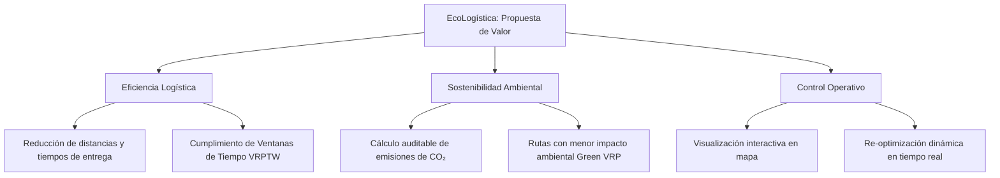

# 03. Declaración de la Visión del Producto

**Proyecto:** EcoLogística – Optimizador de Rutas Sostenibles para DistriRápido S.A.C.  
**Curso:** Taller de Proyectos 2 – Escuela Profesional de Ingeniería de Sistemas e Informática  
**Versión:** 1.0.0  
**Fecha:** 2026-08-28  
**Estado:** Aprobado  

---

## 1. Declaración de Visión del Producto

> **Para** los coordinadores logísticos y despachadores de DistriRápido S.A.C.  
> **Que** necesitan planificar y ejecutar despachos de última milla cumpliendo ventanas de tiempo estrictas y reduciendo costos operativos,  
> **El producto** EcoLogística  
> **Es una** plataforma web de optimización de rutas inteligentes y sostenibles (VRPTW & Green VRP)  
> **Que** automatiza la asignación de pedidos a flota vehicular mediante algoritmos metaheurísticos, visualiza rutas geoespaciales, calcula la huella de carbono y permite re-optimizaciones dinámicas ante contingencias viales,  
> **A diferencia de** la planificación manual en hojas de cálculo o herramientas de ruteo genéricas sin criterios ambientales,  
> **Nuestro producto** integra simultáneamente el cumplimiento de ventanas horarias, la capacidad vehicular y la minimización activa de emisiones de $CO_2$ con métricas e informes de sostenibilidad.

---

## 2. Propuesta de Valor

---

## 3. Factores Críticos de Éxito
1. **Rendimiento del Algoritmo:** Capacidad de generar soluciones viables en tiempos menores a 60 segundos para instancias representativas de pedidos.
2. **Usabilidad:** Interfaz intuitiva y accesible que permita al despachador visualizar de forma clara las secuencias de paradas y los vehículos asignados.
3. **Auditabilidad Ambiental:** Precisión en el modelo de cálculo de emisiones de $CO_2$ en función del tipo de combustible, carga y distancia.
4. **Resiliencia Operativa:** Mecanismo ágil para re-enrutar vehículos cuando ocurren contingencias (cancelación o nuevos pedidos).
