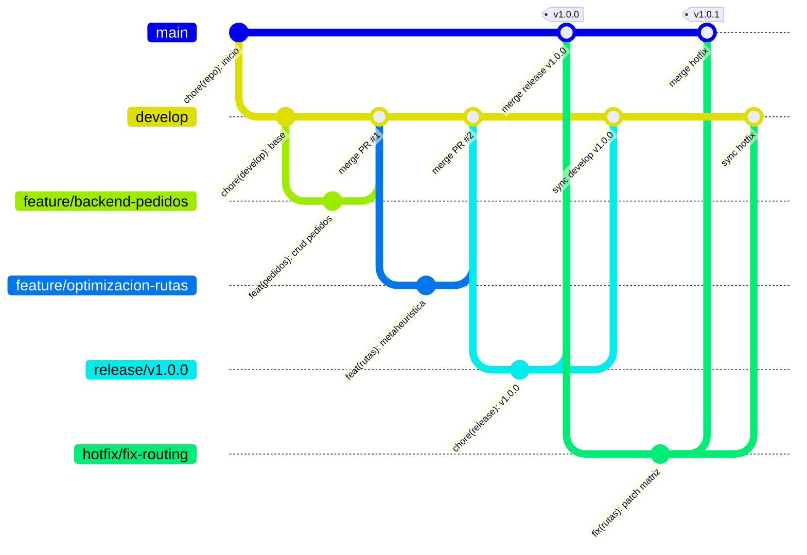
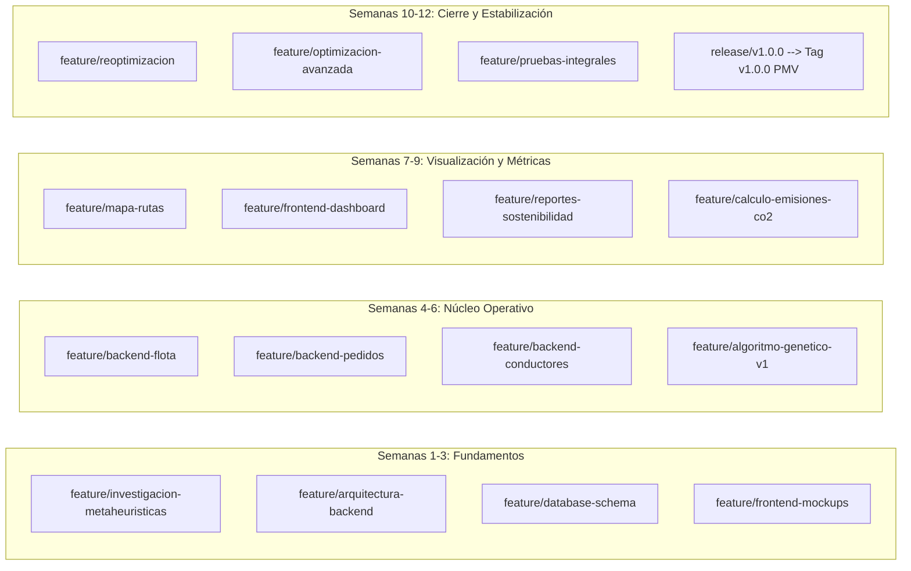

# 06. Estrategia de Control de Versiones y Git Flow

**Proyecto:** EcoLogística – Optimizador de Rutas Sostenibles para DistriRápido S.A.C.  
**Curso:** Taller de Proyectos 2 – Escuela Profesional de Ingeniería de Sistemas e Informática  
**Versión del Documento:** 1.0.0  
**Fecha:** 2026-08-28  
**Estado:** Aprobado  

---

## 1. Objetivo de la Estrategia
El objetivo de la presente estrategia de control de versiones es establecer un marco normativo, técnico y estandarizado para la gestión del código fuente, artefactos de configuración y documentación técnica del proyecto **EcoLogística**. Esta estrategia garantiza la trazabilidad completa de los cambios, la estabilidad del código en producción/demostración académica, la integración colaborativa sin conflictos y el cumplimiento del versionado semántico formal a lo largo de las 12 semanas de desarrollo del Producto Mínimo Viable (PMV).

---

## 2. Justificación de la Selección de Git Flow
El equipo de proyecto ha seleccionado el modelo **Git Flow** debido a las siguientes razones técnicas y metodológicas:
1. **Separación estricta de estados de madurez del software:** Permite aislar completamente las versiones estables y entregables a los interesados (`main`) del trabajo en curso y la integración continua (`develop`).
2. **Desarrollo en paralelo de módulos complejos:** Facilita que múltiples desarrolladores trabajen de manera simultánea en el motor metaheurístico, la interfaz gráfica, los servicios backend y la base de datos sin colisionar.
3. **Control riguroso de versiones académicas (Hitos / Releases):** Provee una fase explícita de estabilización (`release/*`) idónea para congelar el alcance antes de cada entrega quincenal de evaluación docente y validación con DistriRápido S.A.C.
4. **Respuesta ágil ante incidentes críticos:** Cuenta con un protocolo formal (`hotfix/*`) para corregir errores urgentes detectados durante las defensas de hitos o pruebas piloto sin alterar el desarrollo de nuevas funcionalidades.

---

## 3. Rama Principal de Producción: `main`
- **Propósito:** Aloja exclusivamente código estable, probado, documentado y listo para demostración oficial o despliegue en entorno productivo.
- **Políticas de Acceso y Protección:**
  - **Prohibido realizar commits directos.**
  - **Prohibido realizar `git push --force`.**
  - Solo recibe integraciones provenientes de ramas `release/*` o `hotfix/*` mediante Pull Requests (PR) aprobados.
  - Cada integración en `main` debe generar una etiqueta (Tag) de versionado semántico formal (por ejemplo, `v1.0.0` para el PMV final).

---

## 4. Rama Principal de Integración: `develop`
- **Propósito:** Actúa como el tronco central de integración continua donde convergen todas las nuevas funcionalidades terminadas y revisadas.
- **Políticas de Acceso y Protección:**
  - Sirve como punto de partida para todas las ramas `feature/*`.
  - No se debe desarrollar directamente sobre `develop` cuando la tarea corresponda a una funcionalidad independiente.
  - Recibe cambios mediante Pull Requests validados con pruebas unitarias y revisión por pares (*code review*).
  - Es el origen desde donde se bifurcan las ramas `release/*`.

---

## 5. Ramas de Funcionalidad: `feature/*`
- **Propósito:** Desarrollo aislado de requisitos funcionales, componentes de interfaz, servicios backend o algoritmos específicos.
- **Punto de partida:** Siempre desde la punta actualizada de `develop`.
- **Destino de integración:** Exclusivamente hacia `develop` mediante Pull Request.
- **Ciclo de vida:** Son ramas efímeras. Una vez completado y fusionado el PR, la rama `feature/*` se elimina tanto local como remotamente.

---

## 6. Ramas de Publicación / Preparación de Versión: `release/*`
- **Propósito:** Fase de congelamiento de código (*code freeze*), preparación de metadatos, documentación final, verificación de calidad y resolución de detalles menores antes de un hito o versión oficial.
- **Punto de partida:** Desde `develop` cuando reúne las funcionalidades comprometidas para la versión.
- **Nomenclatura:** `release/vX.Y.Z` (por ejemplo, `release/v1.0.0`).
- **Destino de integración:** Debe fusionarse de manera dual:
  1. Hacia `main` (para consolidar el lanzamiento oficial).
  2. Hacia `develop` (para propagar ajustes menores o correcciones realizadas durante el congelamiento).
- **Etiquetado:** Inmediatamente tras la fusión en `main`, se genera el tag correspondiente (`git tag -a v1.0.0 -m "..."`).

---

## 7. Ramas de Corrección Urgente: `hotfix/*`
- **Propósito:** Solución inmediata de incidencias críticas, fallos de seguridad o bugs bloqueantes detectados en `main` que no pueden esperar al ciclo regular de desarrollo.
- **Punto de partida:** Directamente desde la etiqueta o commit afectado en `main`.
- **Nomenclatura:** `hotfix/nombre-descriptivo` o `hotfix/vX.Y.Z+1`.
- **Destino de integración:** Fusión dual obligatoria hacia `main` y hacia `develop` para garantizar consistencia.

---

## 8. Flujo de Trabajo con Pull Requests (PR)
Todo cambio que pretenda ingresar a `develop` o `main` debe procesarse obligatoriamente mediante un Pull Request.

### Protocolo de Creación y Aprobación:
1. **Actualización previa:** El desarrollador debe sincronizar su rama local con la rama base (`git fetch origin && git rebase origin/develop`).
2. **Diligenciamiento del Template:** Completar la plantilla oficial `.github/pull_request_template.md` especificando descripción, tipo de cambio, requisitos (RF/RNF), evidencias de pruebas y checklist de calidad.
3. **Revisión por Pares (Code Review):** Al menos un integrante del equipo debe revisar el código, validar el cumplimiento de estándares, asegurar la ausencia de secretos o credenciales y aprobar formalmente el PR.
4. **Estrategia de Merge:**
   - Para ramas `feature/*` hacia `develop`: `Squash and merge` o `Rebase and merge` para preservar un historial limpio y atómico.
   - Para ramas `release/*` y `hotfix/*` hacia `main` y `develop`: `Create a merge commit` (`--no-ff`) para mantener el registro explícito del release en el grafo histórico.

---

## 9. Convención de Nombres de Ramas
Los nombres de las ramas deben ser en minúsculas, utilizar guiones medios (`-`) como separadores y reflejar con precisión el componente o tarea asociada.

### Estructura y Ejemplos Permitidos:
- **Funcionalidades:**
  - `feature/frontend-login`
  - `feature/frontend-dashboard`
  - `feature/backend-pedidos`
  - `feature/backend-flota`
  - `feature/backend-conductores`
  - `feature/algoritmo-genetico`
  - `feature/optimizacion-rutas`
  - `feature/mapa-rutas`
  - `feature/reportes-sostenibilidad`
  - `feature/reoptimizacion`
- **Versiones:**
  - `release/v1.0.0`
- **Correcciones urgentes:**
  - `hotfix/fix-login`
  - `hotfix/fix-routing`

### Nombres Estrictamente Prohibidos:
- ❌ `feature/test`, `feature/cambio`, `feature/prueba`, `feature/nueva`, `feature/alex`, `fix/algo`.

---

## 10. Convención de Mensajes de Commit (Conventional Commits)
Los mensajes de confirmación deben seguir el estándar de **Conventional Commits v1.0.0**.

### Formato:
```text
<tipo>(<ámbito opcional>): <descripción concisa en modo imperativo y minúsculas>
```

### Tipos Oficiales Permitidos:
- `feat:` Incorporación de una nueva funcionalidad para el usuario/sistema.
- `fix:` Corrección de un defecto o error en el sistema.
- `docs:` Modificaciones exclusivas en documentación (README, Markdown, diagramas).
- `test:` Creación, corrección o refactorización de casos de prueba automatizados.
- `refactor:` Modificación de código que no corrige errores ni añade funcionalidades.
- `style:` Cambios de formato, espaciado o linting que no afectan el significado del código.
- `chore:` Tareas rutinarias de configuración, dependencias o mantenimiento del repositorio.

### Ejemplos Oficiales de Commits:
- `feat(pedidos): agregar registro de pedidos`
- `feat(flota): implementar gestión de vehículos`
- `feat(rutas): implementar algoritmo de optimización`
- `feat(mapa): mostrar rutas optimizadas`
- `feat(dashboard): agregar indicadores de sostenibilidad`
- `fix(rutas): corregir cálculo de distancia`
- `test(rutas): agregar pruebas del optimizador`
- `docs(inicio): actualizar acta de constitución`
- `refactor(backend): separar servicios de optimización`
- `chore(git): actualizar gitignore`

---

## 11. Versionado Semántico (SemVer 2.0.0)
El proyecto utiliza la especificación **MAJOR.MINOR.PATCH** (`vX.Y.Z`):
- **MAJOR (X):** Cambios incompatibles con versiones anteriores o hitos mayores completados (ej. `v1.0.0` para el PMV final operativo).
- **MINOR (Y):** Incorporación de nuevas funcionalidades compatibles hacia atrás (ej. `v0.2.0` al completar la Iteración 2).
- **PATCH (Z):** Correcciones menores de errores retrocompatibles o parches (`hotfix`).

---

## 12. Uso de Etiquetas (Tags)
Las etiquetas se crean exclusivamente sobre la rama `main` tras la integración de un release o hotfix. Deben ser etiquetas anotadas (*annotated tags*):
```bash
git tag -a v1.0.0 -m "Release v1.0.0: Producto Mínimo Viable de EcoLogística"
git push origin v1.0.0
```

---

## 13. Reglas de Protección y Buenas Prácticas
1. **Nunca desarrollar directamente sobre `main`:** Ningún integrante tiene autorización para confirmar cambios locales directamente sobre `main`.
2. **Prohibido incluir secretos:** Archivos `.env`, API keys reales, tokens o credenciales de bases de datos tienen prohibido el ingreso al repositorio; deben mantenerse en `.env` local e ignorados mediante `.gitignore`.
3. **Commits reales y atómicos:** Cada commit debe representar un cambio lógico único y probado. Está prohibido inflar el historial con commits vacíos o artificiales.
4. **Sincronización frecuente:** Cada desarrollador debe mantener su rama de trabajo actualizada contra `develop` para minimizar conflictos de fusión.

---

## 14. Diagrama del Flujo Completo (Git Flow)



---

## 15. Roles y Responsabilidades de los Integrantes

| Rol | Responsabilidades en Git Flow |
| :--- | :--- |
| **Líder Técnico / Release Manager** | Responsable de la gestión de ramas `main`, `develop` y `release/*`, aprobación final de PRs críticos y creación de tags semánticos. |
| **Desarrolladores Frontend / Backend / Algoritmo** | Creación y mantenimiento de ramas `feature/*`, redacción de commits semánticos, creación de Pull Requests con plantilla y resolución de conflictos locales. |
| **Revisor de Código (Peer Reviewer)** | Verificación de estándares de código, ejecución de pruebas locales, validación de que no existan credenciales y aprobación formal en GitHub. |

---

## 16. Relación entre Git Flow y las Iteraciones del Proyecto (12 Semanas)

El desarrollo del PMV está estructurado en 4 iteraciones académicas claramente alineadas a ramas `feature/*`:



### Detalle por Iteración:
- **Iteración 1 (Semanas 1 - 3):** Requisitos, investigación algorítmica, arquitectura de software, diseño de base de datos (`database/migrations/`), y diseño de mockups (`assets/mockups/`).
- **Iteración 2 (Semanas 4 - 6):** Módulo de gestión de flota, gestión de pedidos, gestión de conductores y primera versión funcional de optimización VRPTW.
- **Iteración 3 (Semanas 7 - 9):** Integración con mapas geoespaciales, visualización de rutas, dashboard interactivo con KPIs logísticos y módulo de reportes de sostenibilidad y emisiones de $CO_2$.
- **Iteración 4 (Semanas 10 - 12):** Re-optimización dinámica ante contingencias viales, pruebas automatizadas de rendimiento/estrés, calibración avanzada de la metaheurística, preparación del `release/v1.0.0` y entrega final del PMV.
