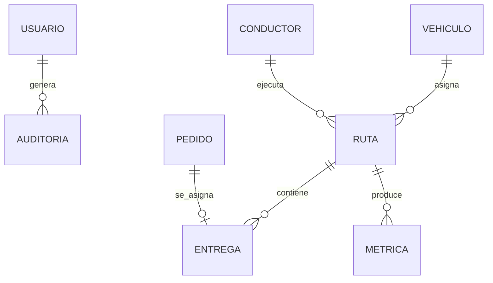

# 11. Diseño e ingeniería de base de datos

[← Volver al README Principal](../../README.md)

## 1. Modelo conceptual



## 2. Modelo lógico en 3FN

Entidades principales: `usuarios(usuario_id, email, rol, estado)`, `conductores(conductor_id, usuario_id, licencia_estado)`, `vehiculos(vehiculo_id, placa, capacidad_kg, combustible, autonomia_km)`, `pedidos(pedido_id, direccion, latitud, longitud, peso_kg, ventana_inicio, ventana_fin, estado)`, `rutas(ruta_id, vehiculo_id, conductor_id, fecha, estado)`, `entregas(entrega_id, ruta_id, pedido_id, secuencia, hora_estimada, hora_real, estado)`, `metricas(metrica_id, ruta_id, distancia_km, duracion_min, co2_kg)` y `auditoria(auditoria_id, usuario_id, accion, entidad, creado_en)`. Cada atributo depende de su clave y no se duplican grupos repetitivos.

## 3. Modelo físico inicial

```sql
CREATE EXTENSION IF NOT EXISTS postgis;
CREATE TABLE pedidos (
  pedido_id UUID PRIMARY KEY DEFAULT gen_random_uuid(),
  direccion VARCHAR(300) NOT NULL,
  ubicacion GEOGRAPHY(POINT, 4326),
  peso_kg NUMERIC(10,2) NOT NULL CHECK (peso_kg > 0),
  ventana_inicio TIMESTAMPTZ NOT NULL,
  ventana_fin TIMESTAMPTZ NOT NULL,
  estado VARCHAR(20) NOT NULL DEFAULT 'PENDIENTE',
  CHECK (ventana_fin > ventana_inicio)
);
CREATE INDEX idx_pedidos_ubicacion ON pedidos USING GIST (ubicacion);
CREATE INDEX idx_pedidos_estado_ventana ON pedidos (estado, ventana_inicio);
```

Las demás tablas siguen la misma política de claves UUID, restricciones, índices por estado/fecha y auditoría.
