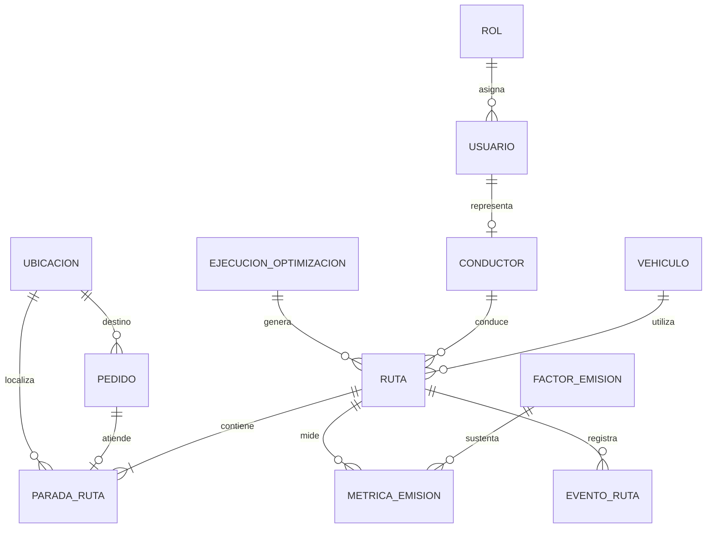

# Base de datos

## 1. Metadatos

| Campo | Valor |
|---|---|
| Proyecto | EcoLogística Huancayo – Optimizador de Rutas Sostenibles |
| Código | PFA-TP2-ECOLOG-2026 |
| Documento | Diseño conceptual, lógico y físico de base de datos |
| Responsable | Anco Porras Jhean, Pier Julio – Arquitectura / Backend |
| Fecha | 04 de septiembre de 2026 |
| Versión | 1.0.0 |
| Estado | Propuesta para revisión |

## 2. Propósito y alcance

Este documento define la persistencia del PMV para gestionar usuarios, flota, conductores, pedidos, ejecuciones de optimización, rutas, paradas y emisiones. Se adopta PostgreSQL con PostGIS, identificadores UUID, fechas con zona horaria y el sistema geodésico WGS 84 (SRID 4326). La geometría oficial es un punto `POINT` y no se duplican latitud y longitud.

Los datos de validación serán sintéticos con georreferenciación real. No se almacenarán DNI, teléfonos ni domicilios privados reales sin base legal, consentimiento y necesidad demostrada.

## 3. Principios de diseño

- **Integridad:** claves foráneas, dominios, `CHECK`, unicidad e invariantes de capacidad/tiempo.
- **Trazabilidad:** cada optimización conserva parámetros, algoritmo, semilla, estado y métricas.
- **Auditabilidad ambiental:** todo resultado de CO₂ referencia un factor de emisión versionado.
- **Privacidad por diseño:** pseudónimo operativo del conductor y datos mínimos del destinatario.
- **Reproducibilidad:** una ruta publicada no se sobrescribe; una reoptimización crea una nueva versión.
- **Rendimiento:** índices parciales y geoespaciales según consultas del PMV.

## 4. Modelo conceptual



### 4.1. Cardinalidades relevantes

- Un usuario tiene un rol; un rol puede corresponder a muchos usuarios.
- Un usuario puede representar como máximo a un conductor.
- Una ejecución genera cero o más rutas y cada ruta pertenece a una sola ejecución.
- Una ruta tiene una o más paradas; una parada puede atender un pedido o representar depósito/descanso.
- Un pedido puede quedar sin asignar o aparecer una sola vez dentro de una versión publicada de planificación.
- Una ruta puede registrar varias métricas (planificada, real o línea base), cada una con un factor versionado.

## 5. Modelo lógico normalizado a 3FN

| Relación | Clave primaria | Claves foráneas | Atributos no clave principales |
|---|---|---|---|
| `roles` | `id` | — | código, nombre, descripción |
| `usuarios` | `id` | `rol_id` | correo, hash, nombre, estado, fechas de acceso |
| `ubicaciones` | `id` | — | etiqueta, dirección referencial, distrito, punto, precisión, fuente |
| `vehiculos` | `id` | — | placa, tipo, capacidad, combustible, consumo, factor, año, estado |
| `conductores` | `id` | `usuario_id` | código, licencia cifrada/mascarada, categoría, turno, estado |
| `pedidos` | `id` | `ubicacion_id` | código, demanda, servicio, ventana, prioridad, estado |
| `ejecuciones_optimizacion` | `id` | `creada_por` | algoritmo, semilla, parámetros, estados, duración, resumen |
| `rutas` | `id` | ejecución, vehículo, conductor | fecha, versión, estado, salida/llegada y totales previstos/reales |
| `paradas_ruta` | `id` | ruta, pedido, ubicación | secuencia, tipo, tiempos, distancia, estado |
| `factores_emision` | `id` | — | combustible, valor, unidad, fuente, vigencia |
| `metricas_emision` | `id` | ruta, factor | escenario, actividad, consumo, CO₂e, método y fecha |
| `eventos_ruta` | `id` | ruta, actor | tipo, fecha, ubicación y detalle |

### 5.1. Evidencia de 3FN

1. Los atributos son atómicos: ventanas, puntos, estados y cantidades no contienen listas.
2. Todas las tablas usan una clave primaria simple; por ello no hay dependencias parciales.
3. Rol, ubicación, factor de emisión y ejecución se separan para evitar dependencias transitivas y repetición.
4. Los totales planificados/reales de ruta son instantáneas deliberadas para auditoría y desempeño; su cálculo se valida contra paradas y métricas, y no reemplaza la fuente detallada.
5. Los parámetros variables del optimizador se almacenan como `jsonb` porque no son hechos maestros ni participan en dependencias funcionales del dominio.

## 6. Diccionario de datos

### 6.1. Identidad y acceso

| Campo | Tipo | Nulo | Regla |
|---|---|:---:|---|
| `roles.codigo` | `varchar(30)` | No | Único: `ADMIN`, `PLANIFICADOR`, `CONDUCTOR`, `GERENTE`, `AUDITOR` |
| `usuarios.correo` | `citext` | No | Único, normalizado sin distinguir mayúsculas |
| `usuarios.clave_hash` | `text` | No | Solo hash robusto; nunca contraseña reversible |
| `usuarios.estado` | dominio | No | `ACTIVO`, `BLOQUEADO`, `INACTIVO` |
| `conductores.codigo` | `varchar(30)` | No | Identificador interno, único |
| `conductores.licencia_ref` | `text` | Sí | Valor cifrado o últimos cuatro caracteres; no documento en claro |
| `conductores.turno_inicio/fin` | `time` | No | Inicio distinto de fin; las pausas se validan en negocio |

### 6.2. Operación

| Campo | Tipo | Nulo | Regla |
|---|---|:---:|---|
| `ubicaciones.punto` | `geometry(Point,4326)` | No | Dentro de límites geográficos válidos; índice GiST |
| `ubicaciones.precision_m` | `numeric(8,2)` | Sí | Mayor o igual que cero |
| `vehiculos.placa` | `varchar(10)` | No | Única, mayúsculas |
| `vehiculos.capacidad_kg/m3` | `numeric` | No | Mayor que cero |
| `vehiculos.consumo_base` | `numeric(10,4)` | No | Consumo por 100 km, mayor que cero |
| `pedidos.codigo` | `varchar(40)` | No | Único e idempotente para importaciones |
| `pedidos.demanda_kg/m3` | `numeric` | No | No negativa; al menos una demanda mayor que cero |
| `pedidos.ventana_inicio/fin` | `timestamptz` | No | Fin posterior a inicio |
| `pedidos.prioridad` | `smallint` | No | 1 baja, 2 normal, 3 alta, 4 urgente |

### 6.3. Optimización, rutas y sostenibilidad

| Campo | Tipo | Nulo | Regla |
|---|---|:---:|---|
| `ejecuciones_optimizacion.algoritmo` | `varchar(50)` | No | Por ejemplo `OR_TOOLS_VRPTW`; no implica garantía de optimalidad |
| `ejecuciones_optimizacion.semilla` | `bigint` | Sí | Permite repetir pruebas |
| `ejecuciones_optimizacion.parametros` | `jsonb` | No | Pesos, límites y restricciones de la corrida |
| `rutas.version` | `integer` | No | Positiva; única por vehículo y fecha operativa |
| `rutas.distancia_plan_km` | `numeric(12,3)` | Sí | No negativa |
| `paradas_ruta.secuencia` | `integer` | No | Única dentro de la ruta, empieza en 1 |
| `paradas_ruta.llegada_plan/salida_plan` | `timestamptz` | Sí | Salida no anterior a llegada |
| `factores_emision.valor_kgco2e_unidad` | `numeric(14,6)` | No | Positivo y acompañado de unidad/fuente/vigencia |
| `metricas_emision.escenario` | dominio | No | `LINEA_BASE`, `PLANIFICADO`, `REAL` |
| `metricas_emision.co2e_kg` | `numeric(14,4)` | No | No negativo; resultado reproducible |

## 7. DDL PostgreSQL/PostGIS

> El script es autocontenido para una base nueva. La API debe ejecutar las operaciones de publicación dentro de transacciones y validar reglas que cruzan filas (capacidad, solapamiento de asignaciones y jornada).

```sql
BEGIN;

CREATE EXTENSION IF NOT EXISTS postgis;
CREATE EXTENSION IF NOT EXISTS pgcrypto;
CREATE EXTENSION IF NOT EXISTS citext;

CREATE TYPE estado_usuario AS ENUM ('ACTIVO','BLOQUEADO','INACTIVO');
CREATE TYPE estado_recurso AS ENUM ('DISPONIBLE','ASIGNADO','MANTENIMIENTO','INACTIVO');
CREATE TYPE estado_pedido AS ENUM ('PENDIENTE','VALIDADO','ASIGNADO','EN_RUTA','ENTREGADO','FALLIDO','CANCELADO');
CREATE TYPE estado_ejecucion AS ENUM ('PENDIENTE','EJECUTANDO','COMPLETADA','FALLIDA','CANCELADA');
CREATE TYPE estado_ruta AS ENUM ('BORRADOR','PUBLICADA','EN_CURSO','COMPLETADA','CANCELADA');
CREATE TYPE tipo_parada AS ENUM ('DEPOSITO_INICIO','ENTREGA','DESCANSO','DEPOSITO_FIN');
CREATE TYPE estado_parada AS ENUM ('PENDIENTE','EN_SITIO','ATENDIDA','OMITIDA','FALLIDA');
CREATE TYPE escenario_emision AS ENUM ('LINEA_BASE','PLANIFICADO','REAL');

CREATE TABLE roles (
  id uuid PRIMARY KEY DEFAULT gen_random_uuid(),
  codigo varchar(30) NOT NULL UNIQUE,
  nombre varchar(80) NOT NULL,
  descripcion text,
  creado_en timestamptz NOT NULL DEFAULT now()
);

CREATE TABLE usuarios (
  id uuid PRIMARY KEY DEFAULT gen_random_uuid(),
  rol_id uuid NOT NULL REFERENCES roles(id),
  correo citext NOT NULL UNIQUE,
  clave_hash text NOT NULL,
  nombre_mostrado varchar(120) NOT NULL,
  estado estado_usuario NOT NULL DEFAULT 'ACTIVO',
  ultimo_acceso_en timestamptz,
  creado_en timestamptz NOT NULL DEFAULT now(),
  actualizado_en timestamptz NOT NULL DEFAULT now(),
  CHECK (correo ~* '^[^@[:space:]]+@[^@[:space:]]+[.][^@[:space:]]+$')
);

CREATE TABLE ubicaciones (
  id uuid PRIMARY KEY DEFAULT gen_random_uuid(),
  etiqueta varchar(150) NOT NULL,
  direccion_referencial varchar(250),
  distrito varchar(80) NOT NULL,
  punto geometry(Point,4326) NOT NULL,
  precision_m numeric(8,2),
  fuente varchar(80) NOT NULL DEFAULT 'MANUAL',
  es_deposito boolean NOT NULL DEFAULT false,
  creado_en timestamptz NOT NULL DEFAULT now(),
  CHECK (precision_m IS NULL OR precision_m >= 0),
  CHECK (ST_X(punto) BETWEEN -180 AND 180 AND ST_Y(punto) BETWEEN -90 AND 90)
);

CREATE TABLE vehiculos (
  id uuid PRIMARY KEY DEFAULT gen_random_uuid(),
  placa varchar(10) NOT NULL UNIQUE,
  tipo varchar(40) NOT NULL,
  capacidad_kg numeric(10,2) NOT NULL CHECK (capacidad_kg > 0),
  capacidad_m3 numeric(10,3) NOT NULL CHECK (capacidad_m3 > 0),
  combustible varchar(20) NOT NULL CHECK (combustible IN ('DIESEL','GASOLINA','GNV','ELECTRICO','HIBRIDO')),
  consumo_base_por_100km numeric(10,4) NOT NULL CHECK (consumo_base_por_100km > 0),
  factor_carga_max numeric(5,4) NOT NULL DEFAULT 1 CHECK (factor_carga_max > 0 AND factor_carga_max <= 1),
  anio smallint CHECK (anio BETWEEN 1990 AND 2100),
  estado estado_recurso NOT NULL DEFAULT 'DISPONIBLE',
  creado_en timestamptz NOT NULL DEFAULT now()
);

CREATE TABLE conductores (
  id uuid PRIMARY KEY DEFAULT gen_random_uuid(),
  usuario_id uuid UNIQUE REFERENCES usuarios(id),
  codigo varchar(30) NOT NULL UNIQUE,
  licencia_ref text,
  categoria_licencia varchar(20),
  turno_inicio time NOT NULL,
  turno_fin time NOT NULL,
  estado estado_recurso NOT NULL DEFAULT 'DISPONIBLE',
  creado_en timestamptz NOT NULL DEFAULT now(),
  CHECK (turno_inicio <> turno_fin)
);

CREATE TABLE pedidos (
  id uuid PRIMARY KEY DEFAULT gen_random_uuid(),
  codigo varchar(40) NOT NULL UNIQUE,
  ubicacion_id uuid NOT NULL REFERENCES ubicaciones(id),
  destinatario_alias varchar(120),
  demanda_kg numeric(10,2) NOT NULL DEFAULT 0 CHECK (demanda_kg >= 0),
  demanda_m3 numeric(10,3) NOT NULL DEFAULT 0 CHECK (demanda_m3 >= 0),
  tiempo_servicio_min smallint NOT NULL DEFAULT 10 CHECK (tiempo_servicio_min > 0),
  ventana_inicio timestamptz NOT NULL,
  ventana_fin timestamptz NOT NULL,
  prioridad smallint NOT NULL DEFAULT 2 CHECK (prioridad BETWEEN 1 AND 4),
  estado estado_pedido NOT NULL DEFAULT 'PENDIENTE',
  observacion_operativa varchar(500),
  creado_en timestamptz NOT NULL DEFAULT now(),
  actualizado_en timestamptz NOT NULL DEFAULT now(),
  CHECK (demanda_kg > 0 OR demanda_m3 > 0),
  CHECK (ventana_fin > ventana_inicio)
);

CREATE TABLE ejecuciones_optimizacion (
  id uuid PRIMARY KEY DEFAULT gen_random_uuid(),
  creada_por uuid NOT NULL REFERENCES usuarios(id),
  algoritmo varchar(50) NOT NULL,
  version_motor varchar(30) NOT NULL,
  semilla bigint,
  parametros jsonb NOT NULL DEFAULT '{}'::jsonb,
  estado estado_ejecucion NOT NULL DEFAULT 'PENDIENTE',
  iniciada_en timestamptz,
  finalizada_en timestamptz,
  duracion_ms integer CHECK (duracion_ms IS NULL OR duracion_ms >= 0),
  resumen jsonb NOT NULL DEFAULT '{}'::jsonb,
  error_controlado text,
  creado_en timestamptz NOT NULL DEFAULT now(),
  CHECK (finalizada_en IS NULL OR iniciada_en IS NULL OR finalizada_en >= iniciada_en),
  CHECK (jsonb_typeof(parametros) = 'object' AND jsonb_typeof(resumen) = 'object')
);

CREATE TABLE rutas (
  id uuid PRIMARY KEY DEFAULT gen_random_uuid(),
  ejecucion_id uuid NOT NULL REFERENCES ejecuciones_optimizacion(id),
  vehiculo_id uuid NOT NULL REFERENCES vehiculos(id),
  conductor_id uuid NOT NULL REFERENCES conductores(id),
  fecha_operativa date NOT NULL,
  version integer NOT NULL DEFAULT 1 CHECK (version > 0),
  estado estado_ruta NOT NULL DEFAULT 'BORRADOR',
  salida_plan timestamptz,
  llegada_plan timestamptz,
  salida_real timestamptz,
  llegada_real timestamptz,
  distancia_plan_km numeric(12,3) CHECK (distancia_plan_km IS NULL OR distancia_plan_km >= 0),
  distancia_real_km numeric(12,3) CHECK (distancia_real_km IS NULL OR distancia_real_km >= 0),
  duracion_plan_min integer CHECK (duracion_plan_min IS NULL OR duracion_plan_min >= 0),
  costo_plan_pen numeric(12,2) CHECK (costo_plan_pen IS NULL OR costo_plan_pen >= 0),
  publicada_en timestamptz,
  creado_en timestamptz NOT NULL DEFAULT now(),
  UNIQUE (vehiculo_id, fecha_operativa, version),
  CHECK (llegada_plan IS NULL OR salida_plan IS NULL OR llegada_plan >= salida_plan),
  CHECK (llegada_real IS NULL OR salida_real IS NULL OR llegada_real >= salida_real)
);

CREATE TABLE paradas_ruta (
  id uuid PRIMARY KEY DEFAULT gen_random_uuid(),
  ruta_id uuid NOT NULL REFERENCES rutas(id) ON DELETE CASCADE,
  pedido_id uuid REFERENCES pedidos(id),
  ubicacion_id uuid NOT NULL REFERENCES ubicaciones(id),
  secuencia integer NOT NULL CHECK (secuencia > 0),
  tipo tipo_parada NOT NULL,
  llegada_plan timestamptz,
  salida_plan timestamptz,
  llegada_real timestamptz,
  salida_real timestamptz,
  distancia_desde_anterior_km numeric(10,3) CHECK (distancia_desde_anterior_km IS NULL OR distancia_desde_anterior_km >= 0),
  estado estado_parada NOT NULL DEFAULT 'PENDIENTE',
  motivo_excepcion varchar(300),
  UNIQUE (ruta_id, secuencia),
  CHECK ((tipo = 'ENTREGA' AND pedido_id IS NOT NULL) OR (tipo <> 'ENTREGA' AND pedido_id IS NULL)),
  CHECK (salida_plan IS NULL OR llegada_plan IS NULL OR salida_plan >= llegada_plan),
  CHECK (salida_real IS NULL OR llegada_real IS NULL OR salida_real >= llegada_real)
);

CREATE TABLE factores_emision (
  id uuid PRIMARY KEY DEFAULT gen_random_uuid(),
  combustible varchar(20) NOT NULL,
  valor_kgco2e_unidad numeric(14,6) NOT NULL CHECK (valor_kgco2e_unidad > 0),
  unidad_actividad varchar(30) NOT NULL,
  fuente varchar(250) NOT NULL,
  version_metodo varchar(40) NOT NULL,
  vigente_desde date NOT NULL,
  vigente_hasta date,
  creado_en timestamptz NOT NULL DEFAULT now(),
  UNIQUE (combustible, version_metodo, vigente_desde),
  CHECK (vigente_hasta IS NULL OR vigente_hasta >= vigente_desde)
);

CREATE TABLE metricas_emision (
  id uuid PRIMARY KEY DEFAULT gen_random_uuid(),
  ruta_id uuid NOT NULL REFERENCES rutas(id) ON DELETE CASCADE,
  factor_emision_id uuid NOT NULL REFERENCES factores_emision(id),
  escenario escenario_emision NOT NULL,
  actividad numeric(14,4) NOT NULL CHECK (actividad >= 0),
  consumo_equivalente numeric(14,4) CHECK (consumo_equivalente IS NULL OR consumo_equivalente >= 0),
  co2e_kg numeric(14,4) NOT NULL CHECK (co2e_kg >= 0),
  incertidumbre_pct numeric(5,2) CHECK (incertidumbre_pct IS NULL OR incertidumbre_pct BETWEEN 0 AND 100),
  metodologia varchar(80) NOT NULL DEFAULT 'ISO 14083',
  calculada_en timestamptz NOT NULL DEFAULT now(),
  UNIQUE (ruta_id, escenario, factor_emision_id)
);

CREATE TABLE eventos_ruta (
  id uuid PRIMARY KEY DEFAULT gen_random_uuid(),
  ruta_id uuid NOT NULL REFERENCES rutas(id) ON DELETE CASCADE,
  actor_usuario_id uuid REFERENCES usuarios(id),
  tipo varchar(50) NOT NULL,
  ocurrido_en timestamptz NOT NULL DEFAULT now(),
  punto geometry(Point,4326),
  detalle jsonb NOT NULL DEFAULT '{}'::jsonb,
  CHECK (jsonb_typeof(detalle) = 'object')
);

CREATE INDEX ix_ubicaciones_punto ON ubicaciones USING gist (punto);
CREATE INDEX ix_pedidos_ventana_estado ON pedidos (ventana_inicio, ventana_fin, estado);
CREATE INDEX ix_pedidos_ubicacion ON pedidos (ubicacion_id);
CREATE INDEX ix_rutas_fecha_estado ON rutas (fecha_operativa, estado);
CREATE INDEX ix_rutas_ejecucion ON rutas (ejecucion_id);
CREATE INDEX ix_paradas_ruta_orden ON paradas_ruta (ruta_id, secuencia);
CREATE UNIQUE INDEX ux_parada_pedido_ruta ON paradas_ruta (ruta_id, pedido_id) WHERE pedido_id IS NOT NULL;
CREATE INDEX ix_metricas_ruta_escenario ON metricas_emision (ruta_id, escenario);
CREATE INDEX ix_eventos_ruta_fecha ON eventos_ruta (ruta_id, ocurrido_en DESC);
CREATE INDEX ix_eventos_punto ON eventos_ruta USING gist (punto) WHERE punto IS NOT NULL;

INSERT INTO roles (codigo, nombre) VALUES
 ('ADMIN','Administrador'), ('PLANIFICADOR','Planificador'), ('CONDUCTOR','Conductor'),
 ('GERENTE','Gerente'), ('AUDITOR','Auditor')
ON CONFLICT (codigo) DO NOTHING;

COMMIT;
```

## 8. Reglas transaccionales que implementará la API

| ID | Regla | Control |
|---|---|---|
| BD-01 | La suma de demanda de pedidos de una ruta no excede capacidad efectiva del vehículo. | Validación serializable antes de publicar; prueba de concurrencia. |
| BD-02 | Conductor y vehículo no pueden tener rutas activas solapadas. | Validación de intervalo dentro de transacción; futura restricción de exclusión si se materializa el intervalo. |
| BD-03 | Cada pedido publicado está asignado una sola vez en una ejecución. | Validación al publicar y bloqueo de pedidos seleccionados. |
| BD-04 | Una reoptimización crea nueva ejecución y versión; no altera evidencia histórica. | Servicio de versionado y permisos. |
| BD-05 | Solo una ruta `PUBLICADA` o `EN_CURSO` por vehículo/fecha puede considerarse vigente. | Índice parcial en migración al cerrar la política de reoptimización. |
| BD-06 | Los factores se eligen por combustible y vigencia de la fecha operativa. | Consulta determinista y prueba de frontera temporal. |
| BD-07 | La eliminación de maestros con historia se rechaza; se inactivan. | API y FK restrictivas. |

## 9. Consultas críticas e índices

| Caso | Patrón | Índice |
|---|---|---|
| Pedidos pendientes de una jornada | estado + ventana | `ix_pedidos_ventana_estado` |
| Vecinos/geocercas | distancia/intersección PostGIS | `ix_ubicaciones_punto` |
| Despacho diario | fecha + estado de ruta | `ix_rutas_fecha_estado` |
| Navegación del conductor | ruta + secuencia | `ix_paradas_ruta_orden` |
| Auditoría ambiental | ruta + escenario | `ix_metricas_ruta_escenario` |
| Línea de tiempo | ruta + fecha descendente | `ix_eventos_ruta_fecha` |

Antes de añadir índices se validará `EXPLAIN (ANALYZE, BUFFERS)` con conjuntos de 50, 150, 250 y 400 pedidos. Los índices no usados se retirarán para reducir escrituras y consumo.

## 10. Seguridad, respaldo y conservación

- Conexiones TLS; cuenta de aplicación sin privilegios DDL; secretos fuera del repositorio.
- Cifrado de respaldo y, si se almacena una referencia de licencia, cifrado por columna.
- Registro de eventos sin credenciales, tokens ni datos sensibles.
- Respaldo diario; objetivo inicial RPO ≤ 24 h y RTO ≤ 4 h para el PMV, sujeto a prueba de restauración.
- Datos sintéticos: conservación durante el curso y depuración al cierre. Datos reales futuros: plazo definido por finalidad y consentimiento.
- La baja de usuarios, conductores y vehículos es lógica para preservar trazabilidad.

## 11. Validación y criterios de aceptación

- El DDL se ejecuta desde cero y una segunda ejecución controlada de extensiones/roles no falla.
- Todas las FK huérfanas, ventanas inválidas, demandas negativas y geometrías fuera de rango son rechazadas.
- El ER, el diccionario y el DDL contienen las mismas entidades y cardinalidades.
- Una ruta de 150 pedidos se consulta ordenada sin escaneo secuencial evitable.
- Un reporte de CO₂ identifica ruta, escenario, factor, fuente, versión y fecha de cálculo.
- Una restauración del respaldo de prueba cumple RPO/RTO definidos.

## 12. Trazabilidad

| Elemento | Cobertura en datos |
|---|---|
| RF-01 Flota | `vehiculos` |
| RF-02 Pedidos | `pedidos`, `ubicaciones` |
| RF-03 Optimización | `ejecuciones_optimizacion`, `rutas`, `paradas_ruta` |
| RF-04 Restricciones | parámetros de ejecución + reglas BD-01–06 |
| RF-05 Dashboard | rutas, paradas y métricas agregables |
| RF-06 CO₂/TCO | `factores_emision`, `metricas_emision`, totales de ruta |
| RF-07 Reoptimización | versión de ruta, ejecución y `eventos_ruta` |
| RF-08 Modo conductor | paradas y eventos, sin ubicación continua obligatoria |
| RES-08 Privacidad | minimización, pseudónimos, cifrado y acceso por rol |
| RES-12 Tipo de vía | parámetro/capa vial externa; futura entidad de arcos si se internaliza el grafo |

## 13. Decisiones pendientes

1. Validar factores de emisión y unidades con una fuente aplicable a ISO 14083 antes de cargar datos semilla.
2. Definir si el grafo vial se mantiene en un proveedor de ruteo o se persiste en PostGIS; el PMV no duplica OSM sin necesidad.
3. Confirmar RPO/RTO con Operaciones y el proveedor de despliegue.
4. Formalizar el algoritmo de anonimización si se usan datos de campo.

## 14. Control de versiones

| Versión | Fecha | Descripción |
|---|---|---|
| 1.0.0 | 04/09/2026 | Modelo conceptual, lógico 3FN, diccionario, DDL y controles iniciales. |
