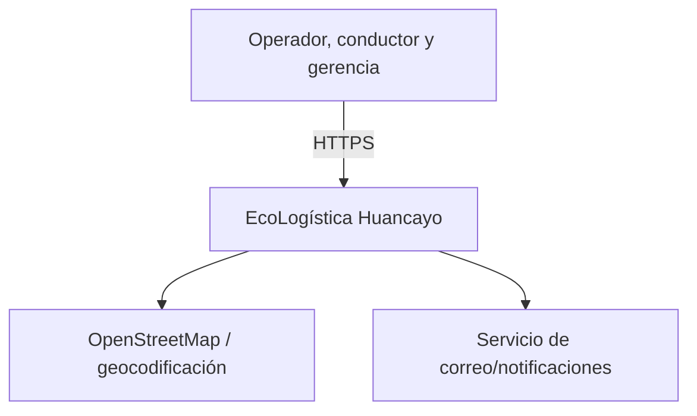
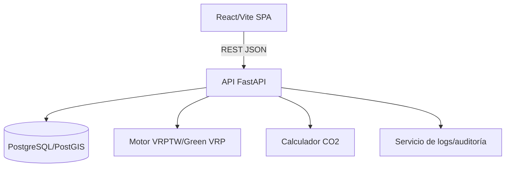
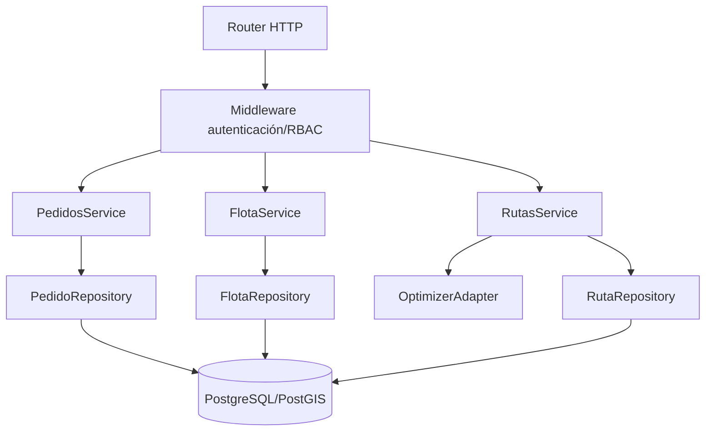

# 12. Arquitectura de software — Modelo C4

[← Volver al README Principal](../../README.md)

## Nivel 1 — Contexto

## Nivel 2 — Contenedores

## Nivel 3 — Componentes de API

Las interfaces entre componentes se validan mediante contratos OpenAPI y pruebas de integración.
