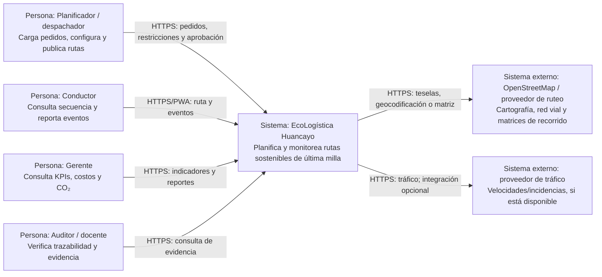
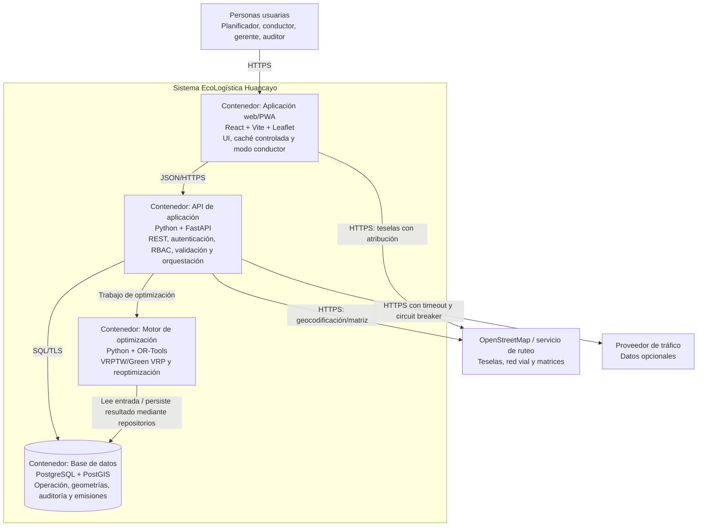
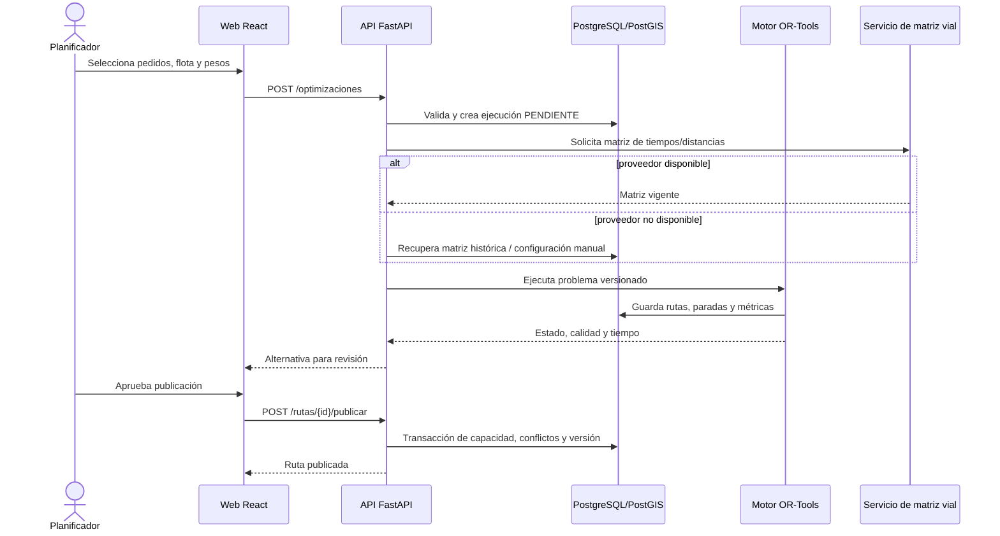
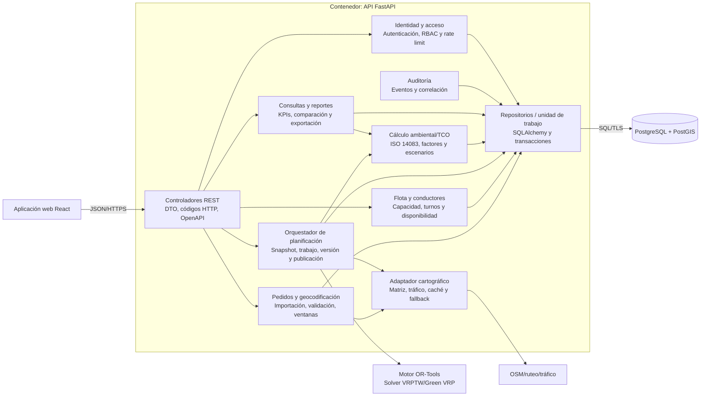
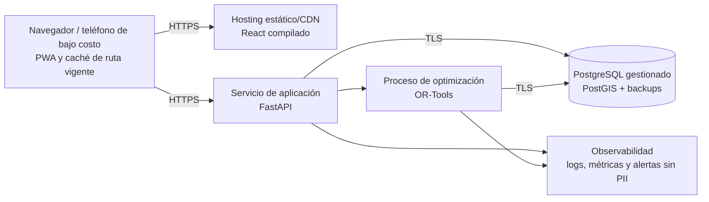

# Modelo C4

## 1. Metadatos

| Campo | Valor |
|---|---|
| Proyecto | EcoLogística Huancayo – Optimizador de Rutas Sostenibles |
| Código | PFA-TP2-ECOLOG-2026 |
| Documento | Arquitectura C4: contexto, contenedores y componentes |
| Responsable | Anco Porras Jhean, Pier Julio – Arquitectura / Backend |
| Fecha | 04 de septiembre de 2026 |
| Versión | 1.0.0 |
| Estado | Propuesta para revisión |

## 2. Alcance y convenciones

La arquitectura del PMV separa presentación, API, optimización y persistencia. Los diagramas usan sintaxis Mermaid estándar para que puedan renderizarse en GitHub. Cada caja indica un elemento C4 y su tecnología; las flechas indican dependencia y protocolo lógico.

Decisiones base:

- React + Vite entrega una PWA web responsive, incluido el modo conductor.
- FastAPI expone una API REST y aplica autenticación, autorización y reglas transaccionales.
- OR-Tools ejecuta VRPTW/Green VRP como módulo desacoplado del ciclo HTTP; puede operar como proceso de trabajo.
- PostgreSQL + PostGIS es la fuente de verdad transaccional y geoespacial.
- Leaflet visualiza; OpenStreetMap aporta cartografía conforme a sus políticas de atribución y consumo.
- La integración de tráfico es opcional y degradable a reportes manuales/datos históricos.

## 3. Nivel 1 — Contexto del sistema

### Responsabilidad del sistema

EcoLogística apoya la decisión humana: valida pedidos y recursos, genera alternativas factibles, permite revisión, publica rutas, registra ejecución y calcula indicadores. No garantiza un óptimo matemático ni sustituye decisiones de seguridad del conductor.

## 4. Nivel 2 — Contenedores

### 4.1. Catálogo de contenedores

| Contenedor | Responsabilidad | Datos | Escalado / disponibilidad |
|---|---|---|---|
| Web/PWA | Flujos de pedidos, planificación, mapa, dashboard y conductor | Token de sesión seguro y caché mínima no sensible | Archivos estáticos en CDN; respaldo local de la ruta vigente |
| API FastAPI | Contratos, validación, RBAC, casos de uso y auditoría | No mantiene estado de sesión en memoria | Réplicas horizontales; health checks |
| Motor OR-Tools | Construir solución factible, ponderar distancia/tiempo/costo/CO₂ | Entrada versionada y resultados | Proceso aislado, límite 45 s; semilla y fallback heurístico |
| PostgreSQL/PostGIS | Consistencia, consultas geográficas y evidencia | Datos operativos y factores versionados | Respaldo, restauración probada y conexión con privilegio mínimo |

### 4.2. Flujo crítico de optimización

## 5. Nivel 3 — Componentes de la API

### 5.1. Responsabilidades y contratos internos

| Componente | Entrada | Salida | Fallos controlados |
|---|---|---|---|
| Controladores REST | DTO versionado | JSON y OpenAPI | 400 validación, 401/403 acceso, 409 conflicto, 422 semántica |
| Identidad y acceso | credenciales/token + recurso | identidad y permisos | bloqueo, expiración, exceso de intentos |
| Pedidos | carga manual/CSV | pedidos validados y errores por fila | duplicado idempotente, ventana o punto inválido |
| Flota | vehículo/conductor/turno | recursos disponibles | capacidad, licencia o solapamiento inválido |
| Orquestador | snapshot + pesos | ejecución y rutas versionadas | timeout, problema infactible, cancelación |
| Adaptador cartográfico | puntos y momento | matriz con procedencia/vigencia | timeout, cuota, precisión insuficiente; usa fallback |
| Carbono/TCO | actividad, vehículo, factor | kg CO₂e, costo, método e incertidumbre | factor ausente o vencido: no inventa resultado |
| Analítica | periodo/filtros | KPIs y exportación | rango excesivo o datos incompletos |
| Auditoría | actor, acción, correlación | evento inmutable | datos sensibles se redactan |
| Repositorios | entidades y unidad de trabajo | persistencia consistente | rollback y error de concurrencia |

## 6. Despliegue lógico del PMV

El proveedor concreto queda abierto. El diseño prioriza servicios de bajo costo y software abierto; el consumo cloud se controla contra el supuesto de USD 500/mes.

## 7. Decisiones arquitectónicas

| ADR | Decisión | Razón | Consecuencia / compensación |
|---|---|---|---|
| ADR-01 | Monolito modular FastAPI para el PMV | Equipo de cinco y 14 semanas | Menor complejidad operativa; límites internos estrictos para extraer módulos después |
| ADR-02 | Motor como proceso de trabajo desacoplado | El cálculo puede durar hasta 45 s | Requiere estado de ejecución, timeout e idempotencia |
| ADR-03 | PostgreSQL + PostGIS | Consistencia y geometría en una fuente | Operación de extensión y conocimientos SQL/geoespaciales |
| ADR-04 | OR-Tools como solver inicial | Soporte directo a restricciones VRPTW y prototipado rápido | Se registra versión/semilla y no se promete óptimo global |
| ADR-05 | Leaflet + OSM | Código abierto y alineación RES-06 | Deben respetarse atribución, uso de teselas y límites; producción puede requerir proveedor propio |
| ADR-06 | Integraciones mediante adaptadores | Tráfico y geocodificación tienen cuota/precisión variable | Permite fallback histórico/manual y pruebas dobles |
| ADR-07 | PWA responsive, no app nativa | Alcance del acta y conectividad 2G/3G | Caché limitada; funciones offline se restringen a ruta vigente y eventos pendientes |
| ADR-08 | Cálculo ambiental versionado | Trazabilidad ISO 14083 | Mayor disciplina de datos; ausencia de factor bloquea el indicador |

## 8. Atributos de calidad y tácticas

| Atributo | Meta | Tácticas / componentes |
|---|---|---|
| Rendimiento | ≤45 s optimización 150/15; ≤30 s reoptimización | worker aislado, límite temporal, semilla constructiva, índices y perfiles |
| Disponibilidad | ≥99.5 % entre 05:00–22:00 | health checks, PWA con ruta vigente, fallback de proveedor, restauración probada |
| Seguridad | 0 vulnerabilidades críticas OWASP | RBAC, TLS, hash robusto, mínimo privilegio, validación, SAST/DAST |
| Accesibilidad | ≥90 % criterios WCAG 2.1 AA aplicables | componentes accesibles, contraste, teclado, texto alternativo y pruebas axe/manuales |
| Auditabilidad | reproducir ruta y CO₂ | snapshot de parámetros, versión del motor, semilla, factor y eventos |
| Eficiencia | operar en 2G/3G y equipos modestos | compresión, paginación, carga diferida del mapa y payloads reducidos |

## 9. Límites de confianza y seguridad

- Internet → Web/API: TLS, encabezados seguros, CSP y rate limiting.
- Web → API: tokens de corta duración en mecanismo resistente a XSS; ninguna credencial en almacenamiento inseguro.
- API → BD: usuario de mínimo privilegio y consultas parametrizadas.
- API → proveedores: timeouts, validación de respuesta, circuit breaker y sin transferir PII innecesaria.
- Planificador → publicación: autorización explícita y validación transaccional.
- Auditoría: eventos con correlación, sin tokens, contraseñas ni ubicación continua del conductor.

## 10. Trazabilidad

| Requisito / restricción | Elementos arquitectónicos |
|---|---|
| RF-01, RF-02 | Flota, Pedidos, repositorios y PostGIS |
| RF-03, RF-04 | Orquestador, adaptador cartográfico y OR-Tools |
| RF-05, RF-06 | Analítica y cálculo ambiental/TCO |
| RF-07 | ejecución asíncrona, versionado y publicación |
| RF-08 | Web/PWA y caché controlada |
| RNF-01 | worker y presupuesto temporal |
| RNF-02 / RES-08 | límite de confianza, RBAC y auditoría |
| RNF-03 / RES-07 | aplicación web accesible y modo conductor |
| RNF-06 / RES-09 | PWA, fallback y adaptadores |
| RES-06 / RES-19 | React, FastAPI, PostgreSQL/PostGIS, Leaflet/OSM y separación por contenedores |
| RES-21 | tácticas OWASP, WCAG, Green Software e ISO 14083 |

## 11. Verificación arquitectónica

1. Prueba de contrato OpenAPI entre React y FastAPI.
2. Prueba de integración con PostGIS y restauración de respaldo.
3. Benchmark reproducible de 50/100/150 pedidos y 15 vehículos.
4. Simulación de caída/cuota del proveedor y uso de fallback.
5. Revisión de autorización por rol y OWASP ASVS aplicable.
6. Prueba PWA en perfil 3G y dispositivo de gama baja.
7. Reconciliación de un reporte de CO₂ contra datos, factor y versión.

## 12. Control de versiones

| Versión | Fecha | Descripción |
|---|---|---|
| 1.0.0 | 04/09/2026 | Modelo C4 niveles 1–3, despliegue, decisiones y trazabilidad inicial. |
