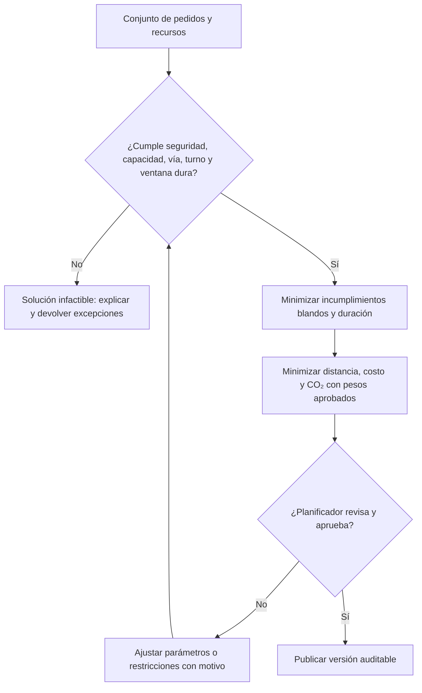

# Restricciones del producto y del proyecto

## 1. Metadatos

| Campo | Valor |
|---|---|
| Proyecto | EcoLogística Huancayo – Optimizador de Rutas Sostenibles |
| Código | PFA-TP2-ECOLOG-2026 |
| Documento | Matriz multidimensional de restricciones |
| Responsable | Director del Proyecto con responsables técnicos |
| Fecha | 04 de septiembre de 2026 |
| Versión | 1.0.0 |
| Estado | Propuesta para revisión |

## 2. Propósito y criterio

Este documento operacionaliza las restricciones ya identificadas en el acta, la visión y el registro de supuestos/restricciones. No sustituye ese registro: convierte cada condición en una decisión verificable con impacto, mitigación, responsable, evidencia e indicador.

Escalas:

- **Severidad crítica:** incumplir impide la aceptación, vulnera una obligación o expone a daño grave.
- **Alta:** compromete un objetivo principal o la adopción.
- **Media:** reduce valor o eficiencia, pero admite solución temporal.
- **Flexibilidad nula:** no se negocia dentro del equipo; un cambio exige patrocinador/docente o autoridad competente.

## 3. Matriz multidimensional consolidada

| ID | Dimensión | Restricción / límite verificable | Impacto si se incumple | Tratamiento y mitigación | Responsable | Evidencia de cumplimiento | Indicador / umbral | Severidad |
|---|---|---|---|---|---|---|---|---|
| RST-SST-01 | Salud y seguridad vial | Ninguna ruta puede violar capacidad, ventana operativa, compatibilidad vehicular ni vías prohibidas; una recomendación no prevalece sobre señalización o decisión segura del conductor. | Accidente, daño a carga/personas y responsabilidad. | Restricciones duras en solver; validación antes de publicar; alerta clara y cancelación segura. | Optimización + Backend | Casos infactibles, acta de validación y logs de publicación. | 0 rutas publicadas con restricción dura violada. | Crítica |
| RST-SST-02 | Fatiga / jornada | Turnos, pausas y límites aplicables se modelan como datos configurables; no se asigna trabajo fuera del turno aprobado. | Fatiga, accidente y rechazo laboral. | Bloqueo de solapamiento; parada de descanso; revisión normativa antes del piloto. | PM + Operaciones + Backend | Matriz normativa vigente y pruebas de frontera. | 100 % rutas dentro del turno configurado. | Crítica |
| RST-SST-03 | Riesgo territorial y clima | Sectores o periodos de riesgo se penalizan o excluyen con fuente, vigencia y nivel de confianza; neblina 06:00–08:00 se trata como parámetro estacional, no hecho permanente. | Exposición a siniestro/delito o falsa seguridad. | Catálogo configurable; revisión humana; fecha y fuente visibles; fallback conservador. | Planificador + Optimización | Dataset versionado y simulaciones por escenario. | 100 % restricciones activas con fuente y vigencia. | Alta |
| RST-SST-04 | Privacidad de ubicación | No se hará seguimiento continuo del conductor en el PMV; los eventos puntuales solo capturan ubicación necesaria y consentida. | Vigilancia indebida y exposición de datos. | Minimización, consentimiento, RBAC y retención limitada. | Backend + QA | Inventario de datos, prueba de permisos y aviso de privacidad. | 0 campos de geolocalización no justificados. | Crítica |
| RST-LCC-01 | Costo de desarrollo | El PMV no excede S/ 500,000, incluida reserva definida en el acta. | Incumplimiento de línea base. | Control por iteración, valor ganado simplificado y escalamiento de variaciones. | Director del Proyecto | Presupuesto y reporte de variación. | Costo final ≤ S/ 500,000. | Crítica |
| RST-LCC-02 | Operación anual | El diseño debe ser sostenible dentro de S/ 120,000/año de soporte, cloud y mantenimiento; cloud de desarrollo se vigila contra ≈ USD 500/mes. | Producto inviable tras el curso. | Alertas de costo, servicios dimensionados, software abierto y apagado de ambientes ociosos. | DevOps + PM | Estimador cloud, facturas simuladas/reales y alertas. | Proyección anual ≤ S/ 120,000; cloud mensual dentro del supuesto o cambio aprobado. | Alta |
| RST-LCC-03 | TCO de flota | El análisis incluye adquisición/conversión, combustible, mantenimiento, seguros, depreciación y personal; precios son parámetros con fecha/fuente. | Decisión sesgada y ROI falso. | Modelo de escenarios; análisis de sensibilidad ±10 %; no fijar precios en código. | PM + Analítica | Hoja de parámetros, reporte y prueba de sensibilidad. | 100 % componentes TCO presentes; fuente/fecha para cada precio. | Alta |
| RST-LCC-04 | ROI de transición | La conversión GNV (referencia S/ 5,000/unidad) se evalúa a tres años; no se ejecuta compra/conversión física. | Expansión de alcance y recomendación engañosa. | Separar escenario de inversión de ejecución; VAN/payback con supuestos explícitos. | Gerencia + Analítica | Reporte de escenarios firmado para revisión. | Horizonte = 36 meses; 0 compras imputadas al PMV. | Media |
| RST-CAR-01 | Medición de carbono | CO₂e se calcula con factor versionado, unidad, fuente, vigencia, actividad e incertidumbre conforme al método adoptado de ISO 14083. | Declaraciones no reproducibles o greenwashing. | Catálogo de factores; bloqueo de cálculo sin factor; revisión independiente. | Optimización + Auditor | Registro `metricas_emision` y conciliación manual. | 100 % métricas reproducibles; diferencia de conciliación ≤1 %. | Crítica |
| RST-CAR-02 | Reducción del PMV | La meta es reducir emisiones proyectadas al menos 18 % desde 3.5 t/mes a ≤2.87 t/mes; la línea base es del caso y debe rotularse como tal hasta validación. | Sobrepromesa o comparación inválida. | Mismo perímetro y actividad para línea base/alternativa; intervalo e incertidumbre. | PM + Optimización | Reporte comparativo versionado. | CO₂e proyectado ≤2.87 t/mes en escenario aceptado; etiqueta de dato sintético. | Alta |
| RST-CAR-03 | Neutralidad | Cero neto a tres años requiere jerarquía: evitar/reducir, transición tecnológica y solo después compensar emisiones residuales verificadas. | Compensación usada como sustituto de reducción. | Hoja de ruta anual; separar emisiones brutas, evitadas y compensadas. | Sponsor + PM | Plan de carbono y revisión anual. | 3 magnitudes reportadas por separado; cobertura 100 % al año 3 solo con evidencia. | Crítica |
| RST-CAR-04 | Equivalencias de árboles | El factor referencial de 22 kg CO₂/árbol-año no se publicará como resultado definitivo hasta validar especie, supervivencia, adicionalidad y periodo. | Afirmación ambiental engañosa. | Parámetro configurable; mostrar rango y advertencia; validación con entidad ambiental. | Optimización + STK-12 | Fuente aprobada y ficha metodológica. | 100 % equivalencias con fuente, versión y advertencia. | Alta |
| RST-CAR-05 | Eficiencia del software | La solución minimiza transferencia, cómputo ocioso e iteraciones del solver sin empeorar factibilidad. | Mayor costo/energía y bajo desempeño en 2G/3G. | Presupuesto temporal, caché, compresión, paginación y medición por benchmark. | Arquitectura + DevOps | Perfil de ejecución y red por versión. | Ruta 150/15 ≤45 s; payload crítico definido por prueba 3G. | Alta |
| RST-CUL-01 | Lengua y alfabetización | Interfaz en español peruano claro, sin tecnicismos indispensables; modo conductor utilizable por personas con formación básica. | Error operativo, exclusión y rechazo. | Co-diseño, iconos con texto, instrucciones breves y pruebas con ≥5 usuarios de perfil. | UX | Guion, grabaciones/actas anonimizadas y resultados. | Éxito en tareas críticas ≥85 %; CSAT ≥4/5. | Alta |
| RST-CUL-02 | Significado visual | El color no será el único portador de estado; símbolos y términos se validan localmente. | Interpretación errónea, especialmente con baja visión. | Etiqueta + icono + color; glosario; pruebas de comprensión. | UX + QA | Checklist WCAG y prueba de comprensión. | ≥90 % criterios WCAG 2.1 AA aplicables; ≥85 % comprensión. | Alta |
| RST-SOC-01 | Participación y autonomía | La ruta debe ser revisable por el planificador y permitir al conductor reportar una condición segura que obligue a desviarse. | Automatización opaca y pérdida de confianza. | Explicación de restricciones, aprobación humana y motivo de cambio auditable. | Product Owner + UX | Demo de flujo y eventos de auditoría. | 100 % rutas publicadas con actor aprobador; 100 % cambios con motivo. | Alta |
| RST-SOC-02 | No discriminación territorial | Penalizaciones por zona solo pueden basarse en seguridad/vialidad documentada y temporal, nunca en condición socioeconómica o prejuicio. | Exclusión de clientes y sesgo. | Revisión de variables proxy; auditoría de cobertura por distrito; mecanismo de excepción. | PM + Auditor | Informe de cobertura Huancayo, El Tambo, Chilca, Pilcomayo y San Agustín. | Diferencias explicadas por restricciones legítimas; 0 reglas basadas en atributos protegidos. | Crítica |
| RST-SOC-03 | Condiciones laborales | KPIs no se usarán para sanción automática; demoras deben distinguir tráfico, clima, cliente y operación. | Presión insegura e injusticia laboral. | Motivos de excepción; revisión humana; acceso del conductor a su registro. | Operaciones + PM | Política de uso y muestra de incidentes. | 0 sanciones automáticas generadas por el sistema. | Alta |
| RST-ECO-01 | Conectividad y dispositivo | Flujo crítico del conductor funciona en navegador moderno de bajo costo y conexión 2G/3G; debe conservar la última ruta autorizada ante corte. | Conductores sin acceso durante reparto. | PWA, caché mínima cifrada/expirable, reintentos e indicador offline. | Frontend + DevOps | Prueba bajo perfil 3G, corte y recuperación. | Consulta de ruta vigente y registro pendiente exitosos en prueba; 0 pérdida de eventos. | Crítica |
| RST-ECO-02 | Acceso sin licencias propietarias | Stack principal abierto: Python/FastAPI, React, PostgreSQL/PostGIS y Leaflet/OSM. | Dependencia y costo no previstos. | Inventario SBOM/licencias y revisión de compatibilidad. | Arquitectura + QA | SBOM y matriz de licencias. | 100 % dependencias inventariadas; 0 licencias incompatibles. | Alta |
| RST-ECO-03 | Asequibilidad del servicio | Las funciones esenciales no dependen de una API comercial sin fallback ni de una cuota no presupuestada. | Interrupción o costo regresivo. | Adaptadores, caché, datos históricos y reporte manual de tráfico. | Arquitectura + DevOps | Prueba de caída/cuota y cálculo de costo. | 100 % integraciones críticas con fallback probado. | Alta |
| RST-DAT-01 | Calidad geoespacial | Cada coordenada registra fuente y precisión; pedidos fuera del ámbito o con precisión insuficiente requieren revisión. | Ruta equivocada o riesgosa. | Validación PostGIS, vista previa en mapa y cola de excepciones. | Backend + Planificador | Reporte de calidad de carga. | 100 % pedidos con punto válido; 0 imprecisos publicados sin aprobación. | Crítica |
| RST-LEG-01 | Datos personales | Cumplimiento de Ley N.° 29733 y reglamentación aplicable: finalidad, proporcionalidad, seguridad y derechos. | Vulneración de derechos y sanción. | Base legal/consentimiento, minimización, cifrado, control por rol y procedimiento de atención. | PM + Backend + QA | Evaluación de privacidad y pruebas RBAC. | 0 datos sensibles en repositorio/logs; 100 % roles probados. | Crítica |
| RST-ACA-01 | Tiempo y alcance | 14 semanas + cierre; ≥70 % de RF y 100 % de RF-01 a RF-07. | No aceptación académica. | Backlog MoSCoW; congelar núcleo; diferir RF-09/RF-10 si se aprueba sin afectar mínimos. | PM | Backlog, burndown y actas. | RF-01–07 aceptados; total implementado ≥70 %. | Crítica |
| RST-ACA-02 | Evidencia y nomenclatura | Markdown bajo `docs/`, nombres exactos `V_1_0_0.md`, Git Flow/PR y SemVer. | Artefacto inválido o sin trazabilidad. | Checklist de entrega y revisión por pares. | PM + QA | Árbol del repositorio, PR y tag. | 100 % nombres/rutas válidos; tag `v1.0.0`. | Crítica |

## 4. Análisis de impactos cruzados

| Decisión | Beneficio | Tensión | Regla de resolución |
|---|---|---|---|
| Ruta más corta | Reduce costo y CO₂ | Puede usar vía insegura o incumplir ventana | Seguridad y factibilidad son duras; costo/CO₂ se optimizan después. |
| Reoptimización rápida | Responde a incidentes | Puede confundir al conductor o borrar evidencia | Nueva versión, confirmación explícita y conservación de ruta anterior. |
| Seguimiento | Mejora estimaciones | Afecta privacidad y relación laboral | Solo eventos necesarios, consentimiento y sin sanción automática. |
| Caché offline | Sostiene operación | Riesgo de datos obsoletos en dispositivo | Solo ruta vigente, expiración, cifrado y estado de sincronización visible. |
| API comercial | Mejora tráfico/geocodificación | Costo, cuota y dependencia | Adaptador y fallback obligatorio; ninguna función crítica depende de una única API. |
| Penalización por riesgo | Protege al conductor | Puede excluir sectores | Fuente objetiva, vigencia, auditoría distrital y revisión humana. |
| Compensación | Atiende emisión residual | Puede ocultar falta de reducción | Reportar bruto, evitado y compensado por separado. |

## 5. Jerarquía de decisión del optimizador

## 6. Plan de cumplimiento y responsables

| Hito | Verificación | Responsable primario | Aprobación |
|---|---|---|---|
| Diseño | Revisión de privacidad, ER/DDL, C4 y matriz de restricciones | Arquitectura / Backend | PM + docente |
| Iteración 2 | Casos infactibles, capacidad, turnos, licencias y benchmark 50 pedidos | Optimización + QA | Product Owner |
| Iteración 3 | Cálculo CO₂/TCO, accesibilidad, perfil 3G y caída de proveedor | UX + DevOps + Optimización | PM |
| Iteración 4 | Benchmark 150/15, OWASP, restauración, auditoría de sesgo y aceptación | QA / DevOps | Sponsor + docente |
| Cierre | Presupuesto, evidencia documental, video, tag y lecciones aprendidas | PM | Docente |

## 7. Evidencias mínimas por dimensión

- **Salud y seguridad:** catálogo de restricciones duras, casos infactibles y aprobación humana.
- **LCC:** presupuesto ejecutado, proyección anual, parámetros de TCO y sensibilidad.
- **Carbono:** factor versionado, fuente, actividad, incertidumbre y conciliación.
- **Cultural:** resultados de prueba, glosario y decisiones de iconografía.
- **Social:** cobertura por distrito, motivos de excepción y política de no sanción automática.
- **Económica/digital:** perfil 3G, compatibilidad de dispositivo, fallback y costo de APIs.
- **Legal:** inventario de datos, base de tratamiento, RBAC y evidencia de borrado/retención.

## 8. Criterios de aceptación de este documento

1. Cada restricción tiene dimensión, impacto, mitigación, responsable, evidencia, indicador y severidad.
2. Las restricciones críticas están reflejadas en requisitos, arquitectura, modelo de datos o Definition of Done.
3. Ningún KPI ambiental presenta datos del caso como medición empresarial real.
4. Las restricciones locales se validan con fuente y vigencia antes del piloto.
5. Las tensiones se resuelven con la jerarquía: seguridad/legalidad → factibilidad → servicio → costo/carbono.

## 9. Supuestos y asuntos por validar

| ID | Asunto | Acción antes de cerrar línea base |
|---|---|---|
| AV-01 | Normativa exacta de jornada, descanso, circulación por placa y vehículos de carga | Verificación jurídica/documental con fuente oficial vigente; no codificar números no confirmados. |
| AV-02 | Calidad y cobertura de tráfico en Huancayo | Prueba de proveedor y fallback; documentar precisión/cuota. |
| AV-03 | Dispositivos y datos móviles de conductores | Encuesta; si disponibilidad <80 %, ampliar alternativa operativa. |
| AV-04 | Factores ISO 14083 y equivalencia de árboles | Validación de método, especie, periodo y entidad ambiental. |
| AV-05 | Línea base de 250 pedidos, 15 unidades, 3.5 t CO₂/mes y 22 % tardías | Mantener rótulo “caso académico” hasta contraste; cambio >10 % activa control de cambio. |

## 10. Control de cambios

Toda restricción crítica modificada requiere: solicitud, motivo, análisis de impacto en RF/RNF/C4/BD, responsable de decisión, fecha, evidencia y nueva versión. Una condición normativa nueva prevalece sobre la configuración existente y puede suspender la publicación de rutas hasta su validación.

## 11. Trazabilidad con documentos previos

| Grupo | Origen principal | Cobertura aquí |
|---|---|---|
| Seguridad vial, clima, vía | RES-03, RES-04, RES-10, RES-11, RES-12 | RST-SST-01–03, RST-DAT-01 |
| Costo | RES-01, RES-05; SUP-09, SUP-10 | RST-LCC-01–04 |
| Carbono | RES-02; SUP-05, SUP-15; OQ-02 | RST-CAR-01–05 |
| Cultura, social y acceso | RES-07; SUP-06, SUP-07 | RST-CUL-01–02, RST-SOC-01–03, RST-ECO-01 |
| Tecnología y datos | RES-06, RES-09, RES-19 | RST-ECO-02–03, RST-DAT-01 |
| Privacidad/calidad | RES-08, RES-21; SUP-14 | RST-LEG-01 y evidencias transversales |
| Académico | RES-13–22 | RST-ACA-01–02 y plan de cumplimiento |

## 12. Control de versiones

| Versión | Fecha | Descripción |
|---|---|---|
| 1.0.0 | 04/09/2026 | Matriz multidimensional, impactos cruzados, indicadores, evidencias y validaciones pendientes. |
