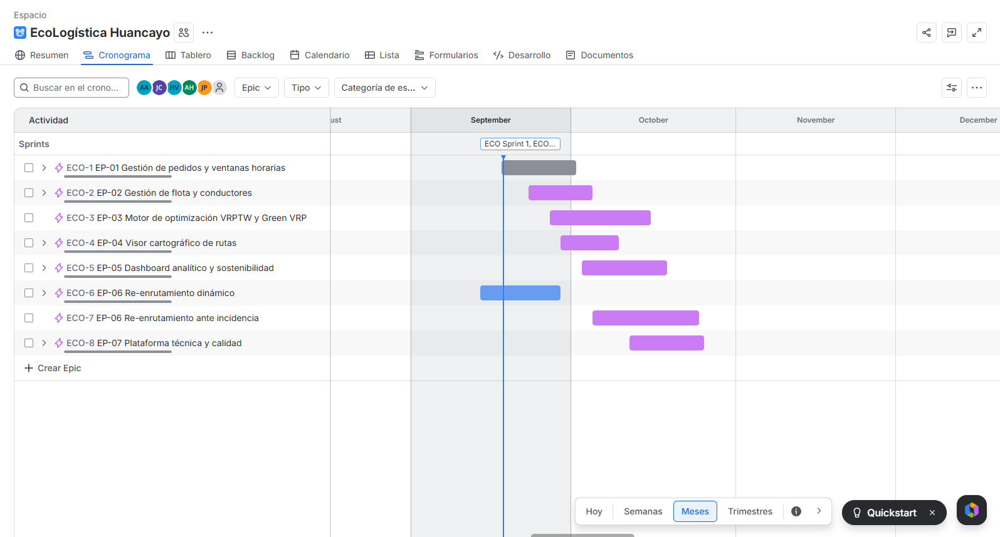
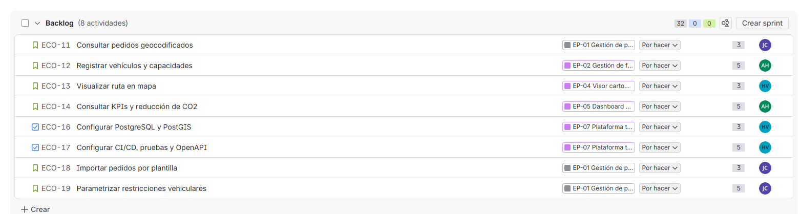
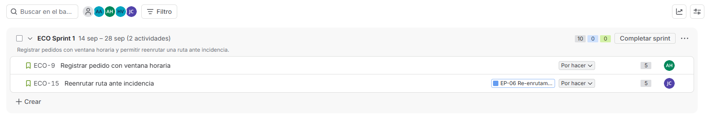
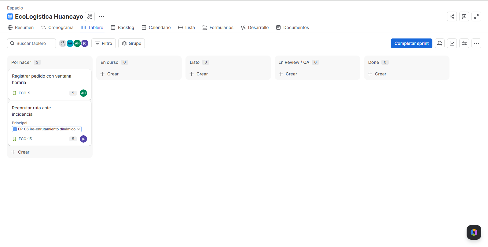

# 02. Artefactos Jira

[← Volver al README Principal](../../README.md)

## Metadatos

| Campo | Valor |
|---|---|
| Proyecto | EcoLogística Huancayo |
| Herramienta | Atlassian Jira Software — Scrum |
| Versión del entregable | 1.0.0-MVP |
| Fecha | 11 de septiembre de 2026 |
| Responsable de configuración | Isidro Casio, Jose Luis |
| Clave del proyecto en Jira | `ECO` |
| Estado | Proyecto Scrum `ECO` creado y en configuración activa; 8 épicas y 10 historias/tareas creadas, verificado en el proyecto real el 18 de septiembre de 2026 (`ECO-18` y `ECO-19` — antes duplicados de `ECO-11`/`ECO-12` — se renombraron a HU-008 y HU-009). El Sprint 1 seguía sin iniciar |

## 1. Configuración objetivo

| Elemento | Configuración |
|---|---|
| Tipo de proyecto | Scrum administrado por el equipo |
| Jerarquía | Epic → Story / Task → Sub-task; Bug para incidencias |
| Flujo | To Do → In Progress → In Review / QA → Done |
| Release | `v1.0.0-MVP` (pendiente de crear en Jira) |
| Sprint | ECO Sprint 1, 14 sep – 28 sep 2026 (2 semanas, **activo**, recreado e iniciado el 18 de septiembre) |
| Sprint Goal (real, tomado de Jira) | "Registrar pedidos con ventana horaria y permitir reenrutar una ruta ante incidencia." |

## 2. Épicas y backlog priorizado

> Las claves `ECO-#` son las reales verificadas en el proyecto Jira del equipo el 11 de septiembre de 2026. La columna "En Jira" indica si el ítem ya existe como tarjeta creada o si todavía está solo en esta especificación.

| Prioridad | Tipo | ID interno | Clave Jira | Resumen | Story Points | En Jira |
|---:|---|---|---|---|---:|:---:|
| 1 | Epic | EP-01 | ECO-1 | Gestión de pedidos y ventanas horarias | — | ✅ |
| 2 | Story | HU-001 | ECO-9 | Registrar pedido con ventana horaria | 5 | ✅ |
| 3 | Story | HU-002 | ECO-11 | Consultar pedidos geocodificados | 3 | ✅ |
| 4 | Story | HU-008 | ECO-18 | Importar pedidos por plantilla | 3 | ✅ |
| 5 | Epic | EP-02 | ECO-2 | Gestión de flota y conductores | — | ✅ |
| 6 | Story | HU-003 | ECO-12 | Registrar vehículos y capacidades | 5 | ✅ |
| 7 | Story | HU-009 | ECO-19 | Parametrizar restricciones vehiculares | 5 | ✅ |
| 8 | Epic | EP-03 | ECO-3 | Motor de optimización VRPTW y Green VRP | — | ✅ |
| 9 | Story | HU-004 | — | Generar ruta VRPTW/Green VRP | 8 | ⬜ |
| 10 | Task | EN-001 | — | Benchmark del motor ≤45 s | 5 | ⬜ |
| 11 | Epic | EP-04 | ECO-4 | Visor cartográfico de rutas | — | ✅ |
| 12 | Story | HU-005 | ECO-13 | Visualizar ruta en mapa | 3 | ✅ |
| 13 | Story | HU-010 | — | Reportar y consultar estados de entrega | 5 | ⬜ |
| 14 | Epic | EP-05 | ECO-5 | Dashboard analítico y sostenibilidad | — | ✅ |
| 15 | Story | HU-007 | ECO-14 | Consultar KPIs y reducción de CO₂ | 5 | ✅ |
| 16 | Story | HU-011 | — | Comparar ruta optimizada contra línea base manual | 5 | ⬜ |
| 17 | Task | EN-003 | — | Protección de datos y auditoría | 3 | ⬜ |
| 18 | Task | EN-004 | — | Hardening OWASP Top 10 | 8 | ⬜ |
| 19 | Epic | EP-06 | ECO-6 | Re-enrutamiento dinámico | — | ✅ |
| 20 | Story | HU-006 | ECO-15 | Reenrutar ruta ante incidencia | 5 | ✅ |
| 21 | Task | EN-002 | — | Disponibilidad y recuperación del servicio | 5 | ⬜ |
| 22 | Epic | EP-07 | ECO-8 | Plataforma técnica y calidad | — | ✅ |
| 23 | Task | EN-005 | ECO-16 | Configurar PostgreSQL y PostGIS | 5 | ✅ |
| 24 | Task | EN-006 | ECO-17 | Configurar CI/CD, pruebas y documentación OpenAPI | 8 | ✅ |

Los puntos usan Fibonacci (1, 2, 3, 5, 8, 13); los de los ítems marcados ✅ son los reales tomados de Jira, los de los ítems ⬜ son la estimación propuesta en esta especificación, pendiente de validar por el equipo al crearlos. La prioridad combina valor de negocio, dependencia y riesgo técnico; el detalle completo y los criterios BDD están en [01 Transformando a ágil](01%20Transformando%20a%20%C3%A1gil%20V_1_0_0.md).

> **Resuelto el 18 de septiembre de 2026:** `ECO-18` y `ECO-19` habían sido creados como duplicados literales de `ECO-11` y `ECO-12` (mismo título y misma épica EP-01). Se renombraron en Jira a HU-008 "Importar pedidos por plantilla" y HU-009 "Parametrizar restricciones vehiculares" respectivamente, completando así los 8 épicas + 10 historias/tareas reales del backlog.
>
> **Pendiente de corrección:** `ECO-19` (HU-009, restricciones vehiculares) quedó asignado a la épica `EP-01 Gestión de pedidos`; por su contenido debería estar en `EP-02 Gestión de flota y conductores`, igual que `ECO-12`. Falta reasignar la épica en Jira.

## 3. Roadmap y Sprint 1

| Periodo | Entrega | Épicas |
|---|---|---|
| Sprint 1 — 14 sep a 28 sep 2026 | Registrar pedido y re-enrutar ante incidencia (ECO-9, ECO-15 ya cargados en el sprint) | EP-01, EP-06 |
| Sprint 2 — semanas 3–4 | Flota, geocodificación y motor de optimización | EP-02, EP-03 |
| Sprint 3 — semanas 5–6 | Visor cartográfico y disponibilidad del servicio | EP-04 |
| Sprint 4 — semanas 7–8 | Dashboard, auditoría y hardening de seguridad | EP-05 |
| Sprint 5 — semana adicional de cierre | Persistencia geoespacial, CI/CD y documentación técnica | EP-07 |
| Release v1.0.0-MVP | Integración y aceptación | EP-01 a EP-07 |

> El Sprint 1 real en Jira tiene 2 historias cargadas (10 puntos) y su Sprint Goal ya coincide exactamente con ese alcance; generar rutas optimizadas y visualizar resultados (HU-004, HU-005) queda para un sprint posterior, como corresponde según el roadmap.

## 4. Evidencias del proyecto Jira `ECO`

Recortes exclusivos del panel de Jira (sin escritorio, navegador ni barra lateral), tomados en vivo el 18 de septiembre de 2026.

**Evidencia 1 — Roadmap:** las 8 épicas ubicadas en la línea de tiempo, con "ECO Sprint 1" marcado en septiembre.

**Evidencia 2 — Backlog:** ítems pendientes con Story Points y épica asignada.

**Evidencia 3 — Sprint Planning:** Sprint 1 activo (14–28 sep), con su Sprint Goal real y las 2 historias cargadas (ECO-9, ECO-15 = 10 puntos).

**Evidencia 4 — Tablero Scrum:** tarjetas del Sprint 1 en la columna "Por hacer".

**Evidencia 5 — Release:** ⬜ **pendiente.** La función "Releases" no está habilitada en el proyecto y esta cuenta no tiene permisos de administrador para activarla (`No tienes permisos para editar la configuración de este proyecto`, verificado el 18 sep). Se le pidió a un administrador del proyecto que la habilite y cree la versión `v1.0.0-MVP`; en cuanto esté disponible, se agrega aquí como `assets/jira/05-release.png`.

> **Pendiente, mismo motivo de permisos:** la columna extra "Listo" del tablero (5 columnas en vez de las 4 exigidas: To Do → In Progress → In Review/QA → Done) tampoco se pudo quitar — `/boards/2/settings` también devuelve error de permisos. Queda pedido al administrador junto con lo de Releases.

## 5. Checklist de configuración

- [x] Crear proyecto Scrum `ECO` (EcoLogística Huancayo).
- [x] Crear EP-01 a EP-05 en Jira (ECO-1 a ECO-5).
- [x] Crear EP-06 y EP-07, no previstas en la especificación original (ECO-6 y ECO-8).
- [x] Crear HU-008 (ECO-18) y HU-009 (ECO-19) — resuelto el 18 sep renombrando los duplicados de ECO-11/ECO-12.
- [ ] Crear el resto del backlog (HU-004, EN-001, HU-010, HU-011, EN-002, EN-003, EN-004) y asignarle puntos Fibonacci.
- [ ] Reasignar la épica de `ECO-19` (HU-009) de EP-01 a EP-02, donde corresponde por contenido.
- [x] Recrear Sprint 1 (14 sep – 28 sep, 2 semanas) con Sprint Goal ajustado a su alcance real (ECO-9, ECO-15) — hecho el 18 sep.
- [x] Iniciar el Sprint 1 — confirmado activo el 18 sep (tablero con "Completar sprint").
- [x] Capturar y embeber las evidencias 1 a 4 (Roadmap, Backlog, Sprint Planning, Tablero) — hecho el 18 sep.
- [ ] **Pendiente de un administrador del proyecto** (esta cuenta no tiene permisos, verificado el 18 sep): habilitar "Releases" y crear `v1.0.0-MVP`, y quitar la columna extra "Listo" del tablero. Ya se le avisó al administrador.
- [ ] Una vez habilitado Releases: capturar la Evidencia 5 e insertarla en `assets/jira/05-release.png`.
- [ ] Crear el resto del backlog (HU-004, EN-001, HU-010, HU-011, EN-002, EN-003, EN-004) y asignarle puntos Fibonacci.
- [ ] Reasignar la épica de `ECO-19` (HU-009) de EP-01 a EP-02, donde corresponde por contenido.
