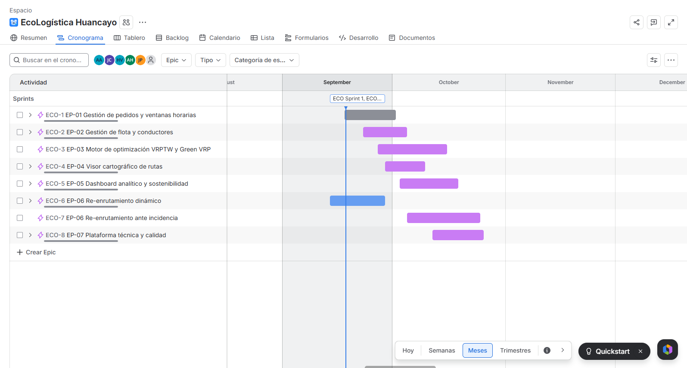
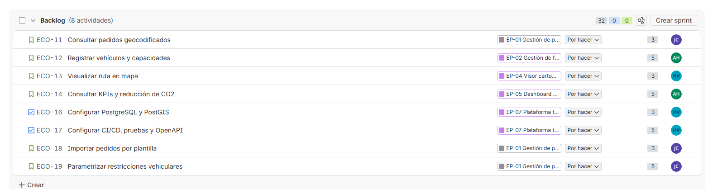
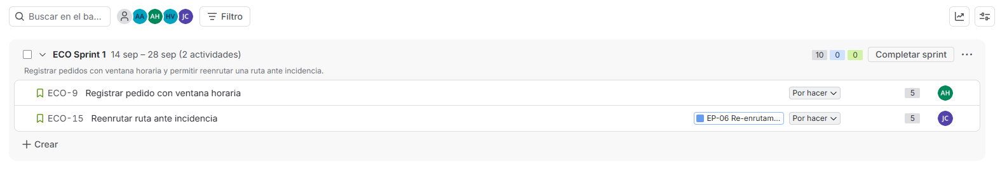
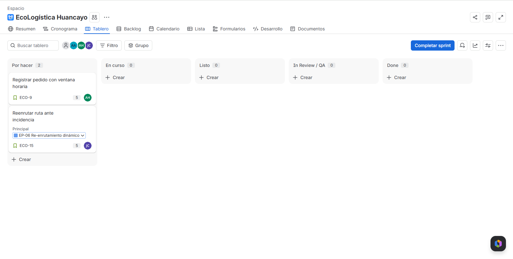
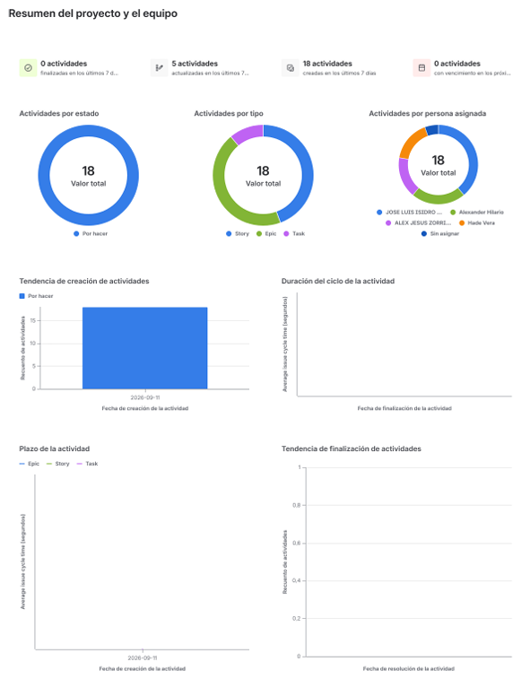

# 02. Artefactos Jira

[← Volver al README Principal](../../README.md)

## Metadatos

| Campo | Valor |
|---|---|
| Proyecto | EcoLogística Huancayo |
| Herramienta | Atlassian Jira Software — Scrum |
| Versión del entregable | 1.2.0 (sin versión de entrega creada en Jira al 09/10/2026) |
| Fecha de actualización | 09 de octubre de 2026 |
| Responsable de configuración | Isidro Casio, Jose Luis |
| Clave del proyecto en Jira | `ECO` |
| Estado observado | Jira contiene 8 épicas y 10 historias/tareas. El tablero `ECO board` (id. 2) tiene dos sprints con el nombre `ECO Sprint 1`, uno cerrado y otro activo con fecha de fin 28/09; no hay Sprint 2 ni versiones de entrega. |

## 1. Configuración observada en Jira al 09/10/2026

| Elemento | Configuración |
|---|---|
| Proyecto / tablero | `EcoLogística Huancayo` / `ECO board` (id. 2; tablero administrado por el equipo) |
| Jerarquía | Epic → Story / Task → Sub-task; Bug para incidencias |
| Columnas del tablero | 5: `Por hacer`, `En curso`, `Listo`, `In Review / QA`, `Done`. Jira mapea `Listo` al estado de categoría completada; `Done` apunta a `Finalizada`, cuya categoría figura como nueva. No coincide con el flujo definido en la planificación. |
| Versiones de entrega | Ninguna: la consulta de versiones de `ECO` devolvió 0 resultados el 09/10/2026. |
| Sprints | ECO Sprint 1 (id. 3, cerrado el 18/09 con una meta de alcance amplio) y ECO Sprint 1 (id. 36, aún activo, 14/09–28/09, con la meta de registrar pedidos y reenrutar). No existe un sprint llamado ECO Sprint 2. |
| Historias que Jira devuelve para el sprint id. 36 | ECO-9 y ECO-15; ambas figuran `Listo` al 09/10. El campo de Sprint conserva también el sprint cerrado id. 3. |
| Sprint 2 según la replanificación del repositorio | 29/09–12/10, meta de entregar HU-001 con autenticación MFA. Está documentado y desarrollado, pero no se creó en Jira. Ver [Informe de estado del Sprint 2](../03%20Implementaci%C3%B3n/Sprint%202/01%20Informe%20de%20estado%20del%20proyecto%20V_1_0_0.md). |

La consulta es una fotografía del sistema Jira; las etiquetas `Listo` no demuestran por sí solas que exista el incremento de software. La evidencia de código y pruebas está en el repositorio. En particular, ECO-15 aparece `Listo`, pero al 09/10 no hay implementación de reenrutamiento en `backend/` ni `frontend/`.

## 2. Épicas y backlog priorizado

> Las claves `ECO-#` son las reales verificadas en el proyecto Jira del equipo el 11 de septiembre de 2026. La columna "En Jira" indica si el ítem ya existe como tarjeta creada o si todavía está solo en esta especificación.

| Prioridad | Tipo | ID interno | Clave Jira | Resumen | Story Points | En Jira |
|---:|---|---|---|---|---:|:---:|
| 1 | Epic | EP-01 | ECO-1 | Gestión de pedidos y ventanas horarias | — | ✅ |
| 2 | Story | HU-001 | ECO-9 | Registrar pedido con ventana horaria | 5 | ✅ |
| 3 | Story | HU-002 | ECO-11 | Consultar pedidos geocodificados | 3 | ✅ |
| 4 | Story | HU-008 | ECO-18 | Importar pedidos por plantilla | 3 | ✅ |
| 5 | Epic | EP-02 | ECO-2 | Gestión de flota y conductores | — | ✅ |
| 6 | Story | HU-003 | ECO-12 | Registrar vehículos y capacidades | 5 | ✅ |
| 7 | Story | HU-009 | ECO-19 | Parametrizar restricciones vehiculares | 5 | ✅ |
| 8 | Epic | EP-03 | ECO-3 | Motor de optimización VRPTW y Green VRP | — | ✅ |
| 9 | Story | HU-004 | — | Generar ruta VRPTW/Green VRP | 8 | ⬜ |
| 10 | Task | EN-001 | — | Benchmark del motor ≤45 s | 5 | ⬜ |
| 11 | Epic | EP-04 | ECO-4 | Visor cartográfico de rutas | — | ✅ |
| 12 | Story | HU-005 | ECO-13 | Visualizar ruta en mapa | 3 | ✅ |
| 13 | Story | HU-010 | — | Reportar y consultar estados de entrega | 5 | ⬜ |
| 14 | Epic | EP-05 | ECO-5 | Dashboard analítico y sostenibilidad | — | ✅ |
| 15 | Story | HU-007 | ECO-14 | Consultar KPIs y reducción de CO₂ | 5 | ✅ |
| 16 | Story | HU-011 | — | Comparar ruta optimizada contra línea base manual | 5 | ⬜ |
| 17 | Task | EN-003 | — | Protección de datos y auditoría | 3 | ⬜ |
| 18 | Task | EN-004 | — | Hardening OWASP Top 10 | 8 | ⬜ |
| 19 | Epic | EP-06 | ECO-6 | Re-enrutamiento dinámico | — | ✅ |
| 20 | Story | HU-006 | ECO-15 | Reenrutar ruta ante incidencia | 5 | ✅ |
| 21 | Task | EN-002 | — | Disponibilidad y recuperación del servicio | 5 | ⬜ |
| 22 | Epic | EP-07 | ECO-8 | Plataforma técnica y calidad | — | ✅ |
| 23 | Task | EN-005 | ECO-16 | Configurar PostgreSQL y PostGIS | 3 | ✅ |
| 24 | Task | EN-006 | ECO-17 | Configurar CI/CD, pruebas y documentación OpenAPI | 5 | ✅ |

Jira devuelve ocho tarjetas de tipo Epic, pero `ECO-7` repite la épica de re-enrutamiento registrada como `ECO-6`. La línea base del proyecto contiene siete épicas lógicas (EP-01–EP-07); `ECO-7` no se cuenta como una épica adicional hasta que se aclare o corrija en Jira.

Los puntos de los ítems marcados ✅ corresponden a los valores consultados en Jira el 09/10/2026; para EN-005 y EN-006 son 3 y 5, respectivamente. Los ítems ⬜ no están creados en Jira; sus puntos son estimaciones de planificación, no compromisos del equipo. La prioridad combina valor de negocio, dependencia y riesgo técnico; los criterios BDD están en [01 Transformando a ágil](01%20Transformando%20a%20%C3%A1gil%20V_1_0_0.md).

> **Resuelto el 18 de septiembre de 2026:** `ECO-18` y `ECO-19` habían sido creados como duplicados literales de `ECO-11` y `ECO-12` (mismo título y misma épica EP-01). Se renombraron en Jira a HU-008 "Importar pedidos por plantilla" y HU-009 "Parametrizar restricciones vehiculares" respectivamente, completando así los 8 épicas + 10 historias/tareas reales del backlog.
>
> **Resuelto el 02/10/2026:** `ECO-19` (HU-009, restricciones vehiculares) está asignado a `EP-02 Gestión de flota y conductores`, como `ECO-12`. La relación actual se confirmó en Jira el 09/10/2026.

## 3. Roadmap y alcance real de los sprints 1 y 2

| Sprint / periodo | Compromiso o replanificación | Resultado / estado |
|---|---|---|
| Sprint 1 — 14/09 a 28/09/2026 | ECO-9 / HU-001 y ECO-15 / HU-006; 10 puntos. Meta registrada en Jira: registrar pedidos con ventana horaria y reenrutar ante incidencia. | Al cierre, 0 de 2 historias cumplieron la Definición de Hecho, según el informe del sprint. Jira ahora las muestra `Listo`, estado que no debe retrotraerse como evidencia de que se completaron dentro del Sprint 1. |
| Sprint 2 — 29/09 a 12/10/2026 | Replanificación documentada: HU-001 (5 puntos) y autenticación/autorización MFA como precondición para el primer incremento demostrable. | HU-001 y MFA están implementadas en `main`; backend: 100 pruebas aprobadas y 99 % de cobertura; frontend: 39 pruebas aprobadas al 09/10. Jira no contiene este sprint ni una tarjeta para MFA. El sprint sigue dentro de su periodo. |
| Sprint 3 — plan de trabajo | Persistencia PostgreSQL/PostGIS, gestión de flota, prototipo y benchmark de optimización, y CI. | Planificado en la retrospectiva del Sprint 2; requiere estimar y formalizar las tarjetas faltantes en Jira. |
| Sprints 4–5 / cierre | Visor cartográfico, dashboard, seguridad, disponibilidad, integración y aceptación, conforme al roadmap funcional y a EP-01–EP-07. | Alcance futuro; no se presenta como compromiso de sprint ni como trabajo realizado mientras no se apruebe un plan detallado. |
| Release `v1.0.0-MVP` | Integración y aceptación del PMV. | No existe una versión de Jira con este nombre al 09/10/2026. |

La planificación de Sprint 2 anterior a la retrospectiva del Sprint 1 asignaba flota y optimización. Esa línea base se replanificó para entregar HU-001 y MFA primero; flota y motor pasan al plan de Sprint 3. Este documento distingue la planificación actualizada del contenido que todavía permanece configurado en Jira.

## 4. Evidencias del proyecto Jira `ECO`

Las imágenes 01–04 son capturas históricas del 18/09/2026 y describen el estado de Jira en esa fecha. No sustituyen la consulta directa del 09/10/2026, cuyos resultados se resumen en las secciones 1 y 3.

**Evidencia 1 — Roadmap:** las 8 épicas ubicadas en la línea de tiempo, con "ECO Sprint 1" marcado en septiembre.

**Evidencia 2 — Backlog:** ítems pendientes con Story Points y épica asignada.

**Evidencia 3 — Sprint Planning:** Sprint 1 activo (14–28 sep), con su Sprint Goal real y las 2 historias cargadas (ECO-9, ECO-15 = 10 puntos).

**Evidencia 4 — Tablero Scrum:** tarjetas del Sprint 1 en la columna "Por hacer".

**Evidencia 5 — Versiones:** no hay versión configurada en Jira al 09/10/2026 (`getJiraProjectVersions` devolvió cero resultados). La imagen que originalmente se guardó como `05-releases.png` contiene un resumen analítico del proyecto, no la pantalla de Versiones; por ello no se presenta como evidencia de un release.

La configuración leída del tablero todavía muestra cinco columnas y un mapeo inconsistente: `Listo` está asociado a categoría completada, mientras `Done` está asociado a un estado cuya categoría Jira informa como nueva. La consulta de solo lectura no permite determinar si la cuenta tiene permisos para corregirlo.

## 5. Checklist de configuración

- [x] Proyecto ECO, ocho épicas y diez historias/tareas existentes consultados el 09/10/2026.
- [ ] Aclarar o corregir `ECO-7`, que duplica la tarjeta de épica `ECO-6`; conservar siete épicas lógicas EP-01–EP-07.
- [x] HU-009 / ECO-19 asociada a EP-02 y HU-003 / ECO-12 asociada a EP-02.
- [ ] Resolver la duplicidad de sprints y el Sprint 1 que Jira mantiene activo pese a haber terminado el 28/09.
- [ ] Crear y cargar el Sprint 2 de acuerdo con la replanificación aprobada en la documentación; registrar en Jira la historia técnica de autenticación/MFA.
- [ ] Revisar ECO-15: figura `Listo` en Jira, pero la revisión del repositorio no encuentra la implementación de re-enrutamiento.
- [ ] Completar las historias y tareas ausentes: HU-004, HU-010, HU-011 y EN-001 a EN-004; confirmar prioridades y puntos con el equipo.
- [ ] Corregir el flujo de cinco columnas y validar las categorías de los estados `Listo` y `Done`.
- [ ] Crear y documentar la versión `v1.0.0-MVP` cuando el alcance de aceptación esté acordado.
- [ ] Sustituir las capturas históricas por evidencias actuales del roadmap, backlog, sprints, tablero y versión.

## 6. Historial de cambios

| Versión | Fecha | Cambio |
|---|---|---|
| 1.0.0 | 11/09/2026 | Primera emisión del backlog y configuración de Jira. |
| 1.0.1 | 18/09/2026 | Verificación en el proyecto real, resolución de duplicados `ECO-18`/`ECO-19`, recreación del Sprint 1 y evidencias 1–4. |
| 1.1.0 | 02/10/2026 | Registro del cierre del Sprint 1 (28/09) y de las correcciones comunicadas ese día para `ECO-19` y la configuración de Jira. |
| 1.2.0 | 09/10/2026 | Auditoría de solo lectura del tablero, sprints, estados, puntos, versiones y descripciones; se registra que Jira carece de Sprint 2 y mantiene discrepancias con el código y la replanificación. |
