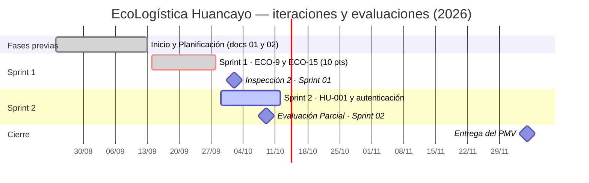
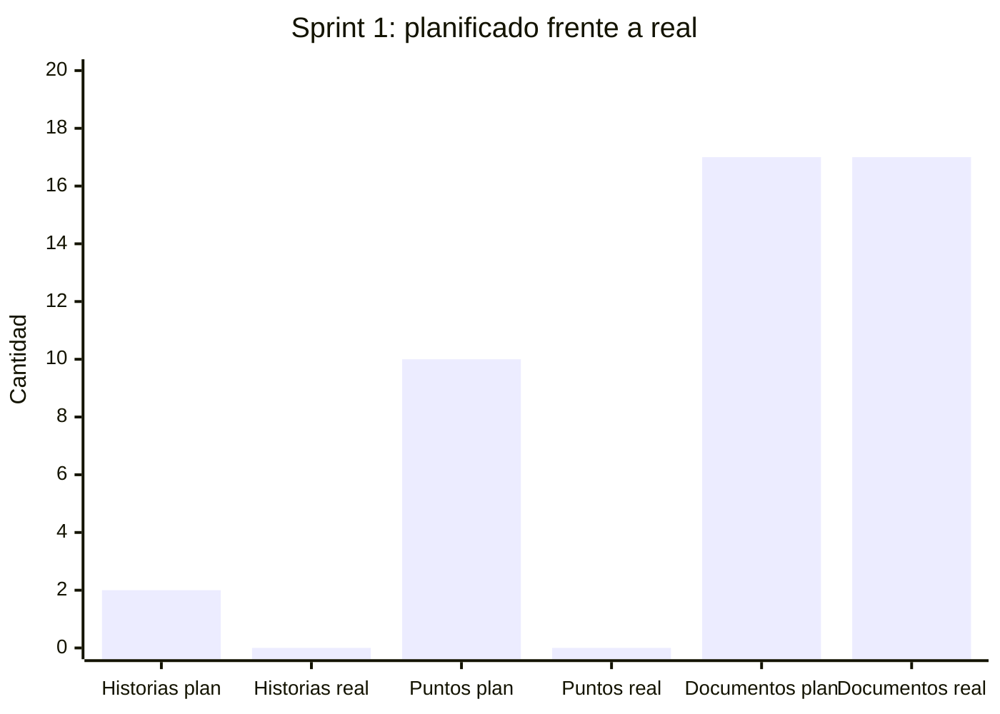
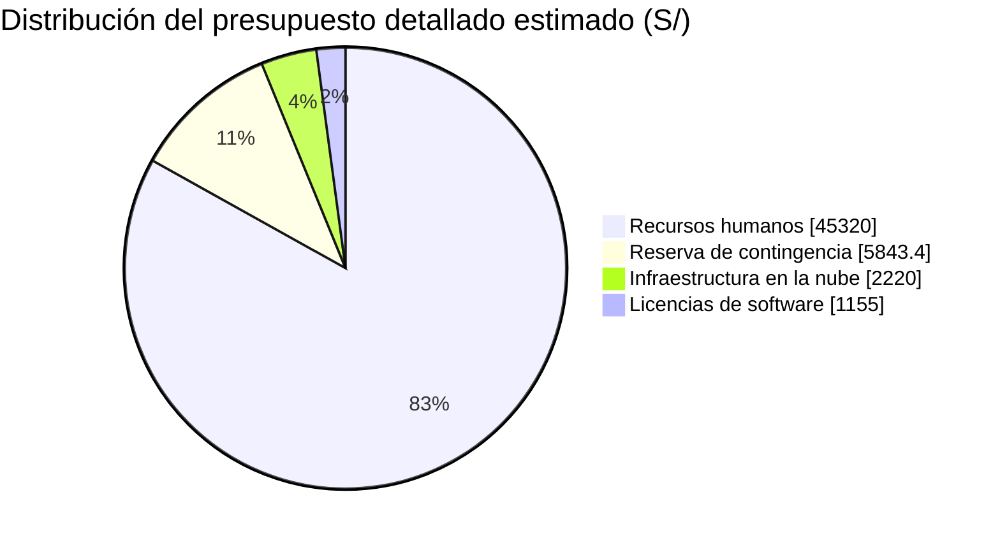
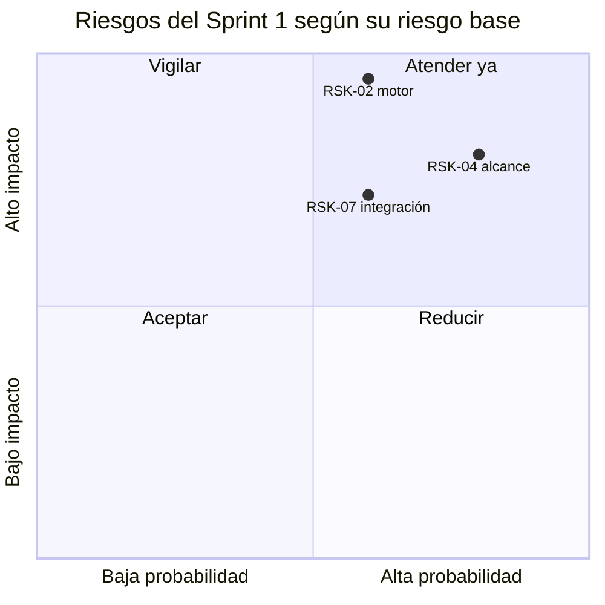

# Informe de estado del proyecto

[← Volver al README Principal](../../README.md)

**Nombre del Proyecto:** EcoLogística Huancayo — Plataforma de Optimización de Rutas Sostenibles de Última Milla

**Líder del Proyecto:** Alex Jesus Zorrilla Apumayta

**Fecha:** 2 de octubre de 2026

**Periodo del Informe:** 14/09/2026 – 28/09/2026 (Sprint 1, 2 semanas)

## Metadatos del documento

| Campo | Valor |
|---|---|
| Código del proyecto | PFA-TP2-ECOLOG-2026 |
| Versión | 1.1.6 |
| Iteración reportada | ECO Sprint 1 |
| Sprint Goal | "Registrar pedidos con ventana horaria y permitir reenrutar una ruta ante incidencia." |
| Fuentes | Jira `ECO` (evidencias 1–4 en [02 Artefactos Jira](../02%20Planificaci%C3%B3n/02%20Artefactos%20Jira%20V_1_0_0.md)), historial Git, [Registro de riesgos](../02%20Planificaci%C3%B3n/03%20Registro%20de%20riesgos%20V_1_0_0.md), [Presupuesto](../02%20Planificaci%C3%B3n/04%20Presupuesto%20del%20proyecto%20V_1_0_0.md) |
| Documentos hermanos | [02 Registro de Impedimentos](02%20Registro%20de%20Impedimentos%20V_1_0_0.md) · [03 Revisión del Sprint](03%20Revisi%C3%B3n%20del%20Sprint%20V_1_0_0.md) · [04 Retrospectiva del Sprint](04%20Retrospectiva%20del%20Sprint%20V_1_0_0.md) |

> **Actualización operativa (09/10/2026):** la fecha planificada de cierre fue el 28/09; Jira mantuvo activo el sprint id. 36 hasta las 07:42 del 09/10. El informe del Sprint 1 registra 0 de 2 al corte planificado. El historial de ECO-9 muestra que pasó a `Listo` el 02/10, volvió a `Por hacer` al cerrarse el Sprint 1 y volvió a `Listo` a las 07:43 al añadirse también al Sprint 2; por eso la métrica dinámica actual del Sprint 1 muestra 1 de 2. El conector no expone un reporte histórico del sprint al 28/09; no se presenta esa métrica actual como velocidad histórica. ECO-15 permanece `Por hacer`.

> **Vigencia del flujo de trabajo (09/10/2026):** las referencias a integrar en develop en este informe son propuestas del corte del Sprint 1. El flujo vigente usa ramas breves feature/* desde main y PR hacia main; develop no es obligatoria. Ver la [auditoría de coherencia](05%20Auditor%C3%ADa%20de%20coherencia%20al%2009-10-2026.md).

> **Rebase funcional posterior (09/10/2026):** el producto conserva como Sprint 1 el incremento hoy implementado: acceso MFA/roles, gestión y consulta de pedidos y persistencia PostgreSQL/PostGIS. Esta clasificación es una línea base funcional acordada después del periodo reportado; el resultado histórico de 0/2 al corte del 28/09 y la falta de código durante esa iteración no cambian. Jira conserva ECO-15 como pendiente del compromiso original; ECO-16 y ECO-20 están completadas en el backlog con descripciones alineadas a la línea base Sprint 1, porque no se pueden agregar al sprint cerrado. ECO-20 lleva además la etiqueta `sprint1`.

## Historial de cambios

| Versión | Fecha | Autor | Cambio |
|---|---|---|---|
| 1.0.0 | 02/10/2026 | Alex Zorrilla | Primera emisión del informe de estado del Sprint 1. |
| 1.1.0 | 02/10/2026 | Alex Zorrilla | Se agregan diagramas Mermaid y tablas de análisis con los mismos datos; el contenido no cambia. |
| 1.1.1 | 02/10/2026 | Alex Zorrilla | Se agregan las secciones de la plantilla de la consigna (historias completadas, demostración y pendientes). |
| 1.1.2 | 09/10/2026 | Anco Porras, Jhean Pier Julio | Se aclara el corte planificado del Sprint 1 frente a la métrica dinámica actual de Jira y su cierre administrativo tardío. |
| 1.1.3 | 09/10/2026 | Anco Porras, Jhean Pier Julio | Se detallan los cambios de estado de ECO-9 registrados por Jira entre el 02/10 y el cierre administrativo del Sprint 1. |
| 1.1.4 | 09/10/2026 | Anco Porras, Jhean Pier Julio | Se identifica develop como propuesta histórica del Sprint 1 y se enlaza al flujo vigente documentado. |
| 1.1.5 | 09/10/2026 | Anco Porras, Jhean Pier Julio | Se reemplaza la mención genérica a partes interesadas por su equivalente en español. |
| 1.1.6 | 09/10/2026 | Anco Porras, Jhean Pier Julio | Se corrige la concordancia de género en la referencia a las partes interesadas. |
| 1.1.7 | 09/10/2026 | Anco Porras, Jhean Pier Julio | Se separa la línea base funcional vigente de los resultados históricos del periodo de Sprint 1. |
| 1.2.0 | 09/10/2026 | Anco Porras, Jhean Pier Julio | Se documenta la alineación Jira posterior a la rebase y se distingue el Sprint 2 activo de 2/2 incidencias de flota del corte histórico del Sprint 1. |

## Resumen ejecutivo

El Sprint 1 cerró el 28/09/2026 **sin entregar incremento funcional de software**: ninguna de las dos historias comprometidas (ECO-9 / HU-001 y ECO-15 / HU-006, 10 puntos) alcanzó la Definición de Hecho. El esfuerzo del periodo se concentró en la gobernanza y la base técnica del proyecto: backlog y tablero Scrum en Jira, estructura de repositorio, decisión de arquitectura (React + Vite + FastAPI + motor de optimización Python + PostgreSQL/PostGIS, Alternativa A del documento de stack, ratificada por el líder el 02/10/2026), inicialización de OpenSpec y consolidación de los 17 entregables documentales de las fases de Inicio y Planificación.

El análisis del sprint reveló además un defecto de planificación: **HU-006 (reenrutar ante incidencia) depende del motor de optimización (HU-004), que según el roadmap pertenece al Sprint 2**, por lo que no era alcanzable en el Sprint 1. Ambas historias se re-planifican (ver *Próximos avances*).

### Línea de tiempo del proyecto

El Sprint 1 ocupó las semanas 4 y 5 de un proyecto de 15 semanas (del 24/08 al 05/12/2026).

## Historias de Usuario completadas en este Sprint

Ninguna de las dos historias comprometidas cumplió la Definición de Hecho:

| Historia | Clave Jira | Puntos | Estado | Causa |
|---|---|---:|---|---|
| HU-001 Registrar pedido con ventana horaria | ECO-9 | 5 | No completada | Sin base de código ([IMP-007](02%20Registro%20de%20Impedimentos%20V_1_0_0.md)) |
| HU-006 Reenrutar ruta ante incidencia | ECO-15 | 5 | No completada | Depende del motor HU-004 ([IMP-006](02%20Registro%20de%20Impedimentos%20V_1_0_0.md)) |

## Demostración del trabajo completado

Demostración a las partes interesadas de las funcionalidades implementadas: al no haber software, en la Inspección 2 (02/10/2026) se presentan las seis evidencias del trabajo base — Jira, estructura del repositorio, arquitectura, flujo OpenSpec, criterios de aceptación y registro de impedimentos —. El detalle está en la [Revisión del Sprint](03%20Revisi%C3%B3n%20del%20Sprint%20V_1_0_0.md).

## Pendientes

HU-001 pasa al Sprint 2 como primera prioridad; HU-006 se reprograma detrás del motor (HU-004 y EN-001); además quedan la base de código, CI (EN-006), PostgreSQL con PostGIS (EN-005) y las 7 tarjetas faltantes en Jira. La lista completa, con responsables, está en la [Revisión del Sprint](03%20Revisi%C3%B3n%20del%20Sprint%20V_1_0_0.md#pendientes).

## Estado del proyecto

| Variables de control | Descripción del estado |
| --- | --- |
| **Alcance** | 🔴 **0 de 2 historias comprometidas completadas (0 de 10 puntos de historia).** Velocidad del Sprint 1 = 0. Sí se completaron 17 de 17 entregables documentales de Inicio y Planificación (13 + 4) y la estructura base del repositorio. Alcance total del PMV: 0 de 11 historias de usuario del backlog terminadas (0 %). |
| **Cronograma** | 🔴 **Atrasados respecto de lo planificado en entrega de software.** Al 28/09 habían transcurrido 5 de 15 semanas del proyecto (≈ 33 % del tiempo) y el avance funcional es 0 %. El avance de documentación y gobierno es ≈ 100 % de lo previsto para las fases 01 y 02. Recuperación: reordenar el backlog por dependencias y priorizar HU-001 al inicio del Sprint 2 (ver *Próximos avances*). |
| **Costos** | 🟢 **Sin sobrecosto.** El Acta autoriza un techo máximo de S/ 500,000; el presupuesto detallado estima S/ 54,538.40 (S/ 48,695 más una reserva estimada de S/ 5,843.40, calculada al 12 %). Infraestructura cloud contratada y facturada: **S/ 0**. El único licenciamiento activo es Jira; el esfuerzo corresponde a horas académicas no facturadas. No se ha utilizado la reserva estimada. |
| **Calidad** | 🟡 **0 defectos registrados** (no existe código ejecutable que probar; un valor de cero no indica ausencia de riesgo). Actividades de calidad realizadas: revisión de entregables vía *Pull Request* (PR #1 `developer` → `main`), plantillas de PR e incidencias en `.github/`, convención *Conventional Commits* aplicada en el historial, `.gitignore` y `.env.example` definidos para evitar versionar secretos y dependencias, criterios de aceptación BDD (Gherkin) para HU-001 y HU-006, y configuración de OpenSpec (`openspec/config.yaml`) con reglas de idioma y trazabilidad RF/RNF/RN. Pendiente: pruebas unitarias, CI/CD (EN-006 / ECO-17) y base PostGIS (EN-005 / ECO-16). |

Leyenda: 🟢 en control · 🟡 atención · 🔴 fuera de lo planificado.

### Indicadores del Sprint

| Indicador | Planificado | Real |
|---|---:|---:|
| Historias comprometidas | 2 | 2 |
| Historias completadas (Definición de Hecho) | 2 | 0 |
| Puntos de historia | 10 | 0 |
| Defectos abiertos | — | 0 |
| Entregables documentales de fases 01–02 | 17 | 17 |
| Impedimentos registrados (ver [Registro](02%20Registro%20de%20Impedimentos%20V_1_0_0.md)) | — | 8 (5 cerrados, 3 abiertos/en espera) |

### Planificado frente a real

| Indicador | Planificado | Real | Cumplimiento |
|---|---:|---:|---:|
| Historias de usuario | 2 | 0 | 0 % |
| Puntos de historia | 10 | 0 | 0 % |
| Documentos de las fases 01 y 02 | 17 | 17 | 100 % |

Lo documental se cumplió al 100 %; el software, al 0 %.

### Presupuesto y ejecución

| Rubro | Presupuesto (S/) | Ejecutado al 28/09 | Comentario |
|---|---:|---:|---|
| Recursos humanos | 45,320.00 | Horas académicas | Esfuerzo del equipo, no facturado |
| Licencias de software | 1,155.00 | Jira activo | S/ 35 por usuario al mes |
| Infraestructura en la nube | 2,220.00 | 0.00 | Aún no se contrata: todo corre en local |
| **Subtotal** | **48,695.00** | | |
| Reserva de contingencia (12 %) | 5,843.40 | 0.00 | Intacta |
| **Total estimado** | **54,538.40** | | |

## Riesgos

Los riesgos del sprint se ubican según la probabilidad y el impacto de su riesgo base en el [Registro de riesgos](../02%20Planificaci%C3%B3n/03%20Registro%20de%20riesgos%20V_1_0_0.md) (escala de 1 a 5):

| Riesgo base | Probabilidad | Impacto | Exposición | Riesgos del sprint asociados |
|---|---:|---:|---:|---|
| RSK-04 Cambios de alcance y fechas | 4 | 4 | 16 (Alta) | R-S1-01, R-S1-04, R-S1-05, R-S1-06 |
| RSK-02 Rendimiento del motor | 3 | 5 | 15 (Alta) | R-S1-02 |
| RSK-07 Integración tardía | 3 | 4 | 12 (Media) | R-S1-03 |

| **Riesgo** | **Responsable** | **Mitigación** |
| -- | -- | -- |
| **R-S1-01 — Dependencia mal secuenciada:** HU-006 (reenrutar) requiere el motor de HU-004, planificado en el Sprint 2. Materializado en el Sprint 1. (RSK-04, cambios de alcance y fechas — exposición 16, Alta) | Alex Zorrilla | Reordenar el backlog con mapa de dependencias; HU-006 se programa tras HU-004 y EN-001; el Sprint Planning valida dependencias técnicas antes de comprometer historias. |
| **R-S1-02 — Rendimiento del motor:** no entregar solución en ≤ 45 s con 150 pedidos (RSK-02, exposición 15, Alta). | Alexander Hilario Talavera | Iniciar benchmark (EN-001) en el Sprint 2 con prototipo mínimo del solver y límites de tiempo por tamaño de instancia. |
| **R-S1-03 — Integración tardía frontend/backend:** al no existir código aún, los defectos de integración se postergan (RSK-07, exposición 12, Media). | Jose Luis Isidro Casio | Definir contrato OpenAPI desde el primer cambio OpenSpec; levantar CI con lint y pruebas (EN-006) antes de mergear a `develop`. |
| **R-S1-04 — Inestabilidad de la decisión de stack:** el 18/09 se propuso en `main` Next.js + Nest.js (commit `3565685`), sin puntuarlo en la matriz del documento de stack; el 02/10 el líder ratificó la Alternativa A (React + FastAPI, 93 %) y se revirtieron los documentos. Retrasó el inicio de la construcción. | Alex Zorrilla | Stack congelado hasta el Sprint 3; cualquier cambio exige ADR y nueva matriz (sección 12 del documento de stack); plantilla de arranque (scaffold) compartida. |
| **R-S1-05 — Dependencia de administrador de Jira** para habilitar Releases y ajustar el tablero (RSK-04). | Jose Luis Isidro Casio | Solicitud formal al administrador; evidencia 5 pendiente en [Artefactos Jira](../02%20Planificaci%C3%B3n/02%20Artefactos%20Jira%20V_1_0_0.md); no bloquea el desarrollo. |
| **R-S1-06 — Disponibilidad parcial del equipo** (5 integrantes a tiempo parcial) limita la velocidad. | Alex Zorrilla | Estimar con capacidad real (puntos por persona), tareas ≤ 8 h y revisión de carga en cada Daily. |

## Próximos avances

1. **Sprint 2:** entregar HU-001 (registrar pedido con ventana horaria, 5 pts) como primer incremento demostrable con API FastAPI, validación RN-001/RF-02.2 y formulario React, siguiendo el ciclo OpenSpec `propose → apply → verify → sync → archive` en una rama `feature/*`.
2. Provisionar el esqueleto de `backend/` (FastAPI) y `frontend/` (React + Vite) con *scripts* de ejecución y pruebas, más pipeline mínimo de CI (EN-006).
3. Iniciar el motor de optimización: prototipo Python aislado y benchmark EN-001 (RSK-02), prerrequisito de HU-004 y, después, de HU-006.
4. Configurar PostgreSQL + PostGIS en entorno local con migraciones versionadas (EN-005).
5. Completar el backlog restante en Jira (HU-004, HU-010, HU-011, EN-001, EN-002, EN-003, EN-004) con puntos Fibonacci estimados por el equipo.
6. Habilitar Releases y crear `v1.0.0-MVP` (administrador de Jira) y capturar la evidencia 5.

## Notas

- Este informe refleja el estado real verificado en el repositorio y en Jira; no se declara como completado ningún trabajo que no esté respaldado por una evidencia revisable.
- El detalle de lo completado y lo pendiente por historia está en [03 Revisión del Sprint](03%20Revisi%C3%B3n%20del%20Sprint%20V_1_0_0.md); los obstáculos, en [02 Registro de Impedimentos](02%20Registro%20de%20Impedimentos%20V_1_0_0.md); las lecciones y acciones, en [04 Retrospectiva del Sprint](04%20Retrospectiva%20del%20Sprint%20V_1_0_0.md).
- Para la trazabilidad con el alcance, ver [06 Requisitos funcionales](../01%20Inicio/06.%20Requisitos%20funcionales%20V_1_0_0.md) y [09 Reglas de negocio](../01%20Inicio/09.%20Reglas%20de%20negocio%20V_1_0_0.md).
- Nomenclatura de versionado: *Semantic Versioning* `MAYOR.MENOR.PARCHE`, escrita en el nombre del archivo como `V_M_m_p`.
