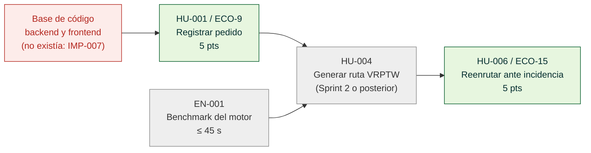
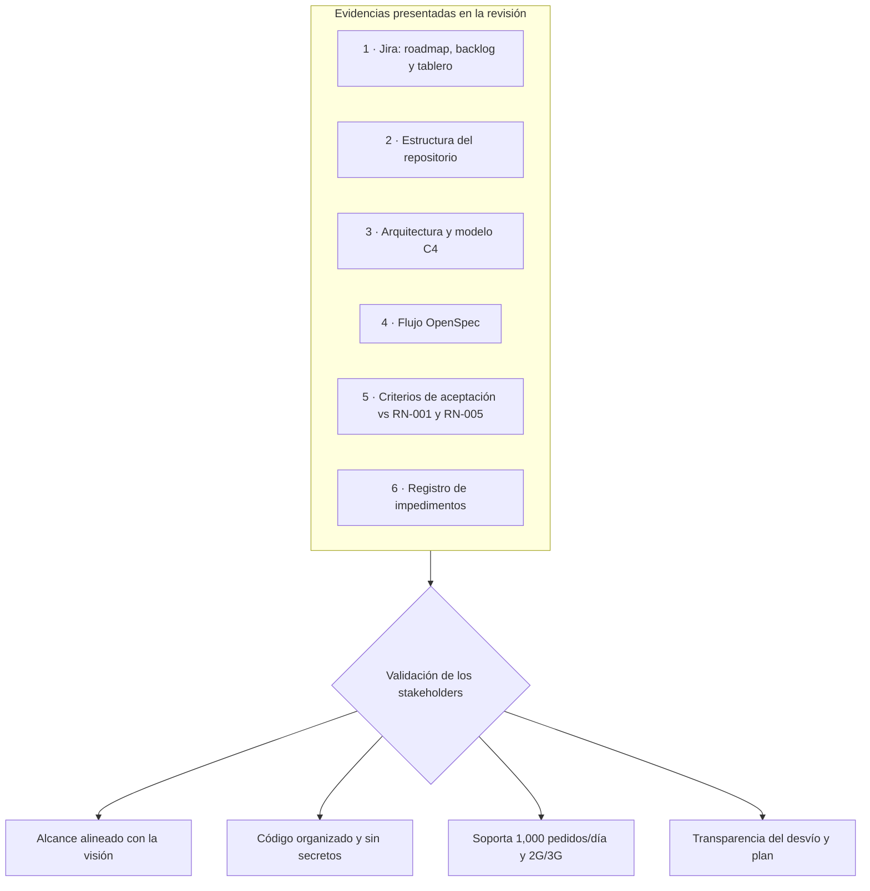
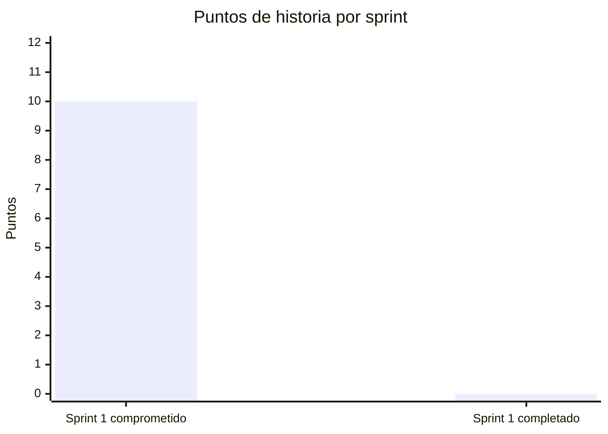
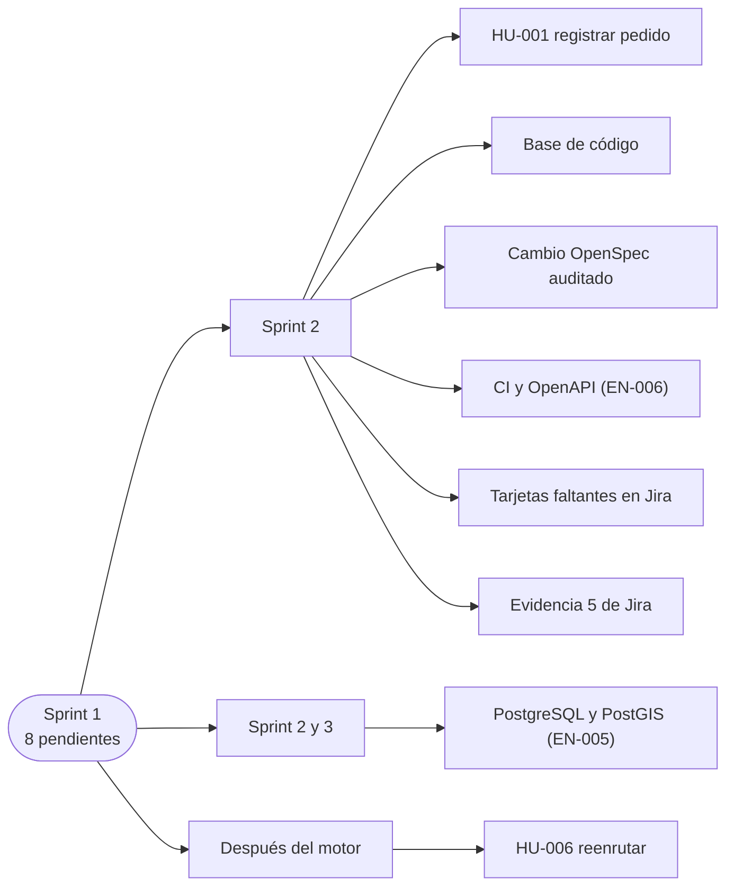

# Revisión del sprint

[← Volver al README Principal](../../README.md)

**Nombre del Proyecto:** EcoLogística Huancayo — Plataforma de Optimización de Rutas Sostenibles de Última Milla

**Líder del Proyecto:** Alex Jesus Zorrilla Apumayta

## Metadatos del documento

| Campo | Valor |
|---|---|
| Versión | 1.2.0 |
| Sprint | ECO Sprint 1 (14/09/2026 – 28/09/2026) |
| Sprint Goal | "Registrar pedidos con ventana horaria y permitir reenrutar una ruta ante incidencia." |
| Reunión de revisión | Inspección 2 — Sprint 01, 02/10/2026, 17:40–18:00 |
| Asistentes | Equipo Scrum: Alex Zorrilla (líder / PM), Anco Porras, Jhean Pier Julio (backend), Alexander Daniel Hilario Talavera (optimización), Jhoanna Hade Vera Zea (frontend/UX), Jose Luis Isidro Casio (QA/DevOps). Docente asesor y *Product Owner* académico: Ing. Job Daniel Gamarra Moreno |
| Documentos hermanos | [01 Informe de estado](01%20Informe%20de%20estado%20del%20proyecto%20V_1_0_0.md) · [02 Registro de Impedimentos](02%20Registro%20de%20Impedimentos%20V_1_0_0.md) · [04 Retrospectiva](04%20Retrospectiva%20del%20Sprint%20V_1_0_0.md) |

> **Vigencia del repositorio y del flujo (09/10/2026):** la estructura con database/ y Git Flow con main/developer descritos en la evidencia de esta revisión pertenecen al corte presentado el 02/10. En el árbol actual no existe database/, la persistencia PostgreSQL/PostGIS sigue pendiente y el flujo vigente usa ramas breves feature/* desde main con PR hacia main. Ver la [auditoría de coherencia](05%20Auditor%C3%ADa%20de%20coherencia%20al%2009-10-2026.md).

## Historial de cambios

| Versión | Fecha | Autor | Cambio |
|---|---|---|---|
| 1.0.0 | 02/10/2026 | Alex Zorrilla | Primera emisión de la revisión del Sprint 1. |
| 1.1.0 | 02/10/2026 | Alex Zorrilla | Se agregan diagramas Mermaid y tablas de análisis con los mismos datos; el contenido no cambia. |
| 1.2.0 | 09/10/2026 | Anco Porras, Jhean Pier Julio | Se distingue la estructura y el flujo históricos de Sprint 1 de la configuración vigente del repositorio. |

## Historias de Usuario completadas en este Sprint

**Resultado: 0 de 2 historias comprometidas cumplieron la Definición de Hecho (0 de 10 puntos).** Se declara de este modo para que el documento sea coherente con lo que puede demostrarse: el repositorio no contiene código ejecutable de las historias.

| Historia | Clave Jira | Puntos | Estado al cierre | Estado frente a criterios de aceptación | Motivo |
|---|---|---:|---|---|---|
| HU-001 Registrar pedido con ventana horaria | ECO-9 | 5 | **No completada** (pasa al Sprint 2, primera prioridad) | Escenario "Registrar pedido válido": no verificable. Escenario "Rechazar ventana inválida": no verificable. | Sin *scaffold* de backend/frontend; decisión de stack inestable hasta el 02/10 (propuesta Next.js + Nest.js revertida a React + FastAPI) ([IMP-007](02%20Registro%20de%20Impedimentos%20V_1_0_0.md)). |
| HU-006 Reenrutar ruta ante incidencia | ECO-15 | 5 | **No completada** (se reprograma tras HU-004 y EN-001) | Escenarios "Reoptimizar pedido urgente" y "Cancelar propuesta riesgosa": no verificables. | Depende del motor de optimización (HU-004), planificado para el Sprint 2 ([IMP-006](02%20Registro%20de%20Impedimentos%20V_1_0_0.md)). |

### Por qué no se completaron: cadena de dependencias

Las dos historias comprometidas (en verde) dependían de elementos que no existían (en rojo) o que estaban planificados para después (en gris). Ver [IMP-006 e IMP-007](02%20Registro%20de%20Impedimentos%20V_1_0_0.md).

### Verificación de la Definición de Hecho

| Condición de la Definición de Hecho | HU-001 Registrar pedido | HU-006 Reenrutar |
|---|---|---|
| Código integrado en el repositorio | No | No |
| Pruebas automatizadas pasando | No | No |
| Criterios de aceptación verificados | No | No |
| Demostración ejecutable | No | No |
| **Resultado** | **No completada** | **No completada** |

### Trabajo base completado (habilitadores y artefactos, no cuentan como historias de usuario)

Aunque no son historias de valor para el usuario final, son prerrequisitos verificables del incremento:

| Artefacto | Evidencia verificable | Resultado |
|---|---|---|
| Backlog priorizado: 8 épicas, 11 historias y 6 tareas habilitadoras, con criterios BDD | [01 Transformando a ágil](../02%20Planificaci%C3%B3n/01%20Transformando%20a%20%C3%A1gil%20V_1_0_0.md) | Completo |
| Proyecto Scrum `ECO` en Jira con roadmap, backlog, planificación y tablero | Evidencias 1–4 en [02 Artefactos Jira](../02%20Planificaci%C3%B3n/02%20Artefactos%20Jira%20V_1_0_0.md) (`assets/jira/01…04`) | Completo |
| Decisión de arquitectura: React + Vite + TypeScript, FastAPI, motor de optimización Python, PostgreSQL + PostGIS, modelo físico de BD | [10 Stack tecnológico](../01%20Inicio/10.%20Stack%20tecnol%C3%B3gico%20V_1_0_0.md), [11 Base de datos](../01%20Inicio/11.%20Base%20de%20datos%20V_1_0_0.md), [12 Modelo C4](../01%20Inicio/12.%20Modelo%20C4%20V_1_0_0.md) | Completo |
| Estructura del repositorio por capas (`frontend/`, `backend/`, `database/`, `docs/`, `assets/`), `.gitignore`, `.env.example`, plantillas de PR e issues, Git Flow con ramas `main`/`developer` | Repositorio `alexito-dev/EcoLogistica` | Completo |
| Inicialización de OpenSpec (`openspec/config.yaml`, comandos `opsx` para Claude Code) con contexto del proyecto en español y trazabilidad RF/RNF/RN | `openspec/`, `.claude/` | Completo (sin cambios archivados aún) |
| Documentación de Inicio y Planificación (17 entregables) | `docs/01 Inicio`, `docs/02 Planificación` | Completo |

## Demostración del trabajo completado

Demostración a los *stakeholders* de las funcionalidades implementadas: **no existe una funcionalidad de software que demostrar en el Sprint 1**. En la Inspección 2 se presenta y se explica, en este orden, la evidencia real del sprint:

| # | Elemento demostrado | Qué se muestra | Qué valida el *stakeholder* |
|---:|---|---|---|
| 1 | Roadmap, backlog y tablero Scrum de Jira (`ECO`) | Épicas EP-01…EP-07, historias con puntos, Sprint 1 con su objetivo y las 2 historias cargadas | Que el alcance del sprint y la priorización responden a la visión del producto |
| 2 | Estructura del repositorio y convenciones | Árbol de carpetas, `.gitignore`, ramas, *Conventional Commits*, plantillas de PR/issue | Que el código futuro se organizará de forma modular y sin versionar secretos ni dependencias |
| 3 | Arquitectura objetivo | Diagrama de componentes y modelo C4; decisión React / FastAPI / Python / PostGIS | Que la arquitectura soporta 1,000 pedidos/día, 50 vehículos y redes 2G/3G |
| 4 | Flujo OpenSpec | `openspec/config.yaml`, comandos `/opsx:propose → /opsx:apply → /opsx:verify → /opsx:archive` y el criterio de revisar `proposal/spec/design/tasks` antes de implementar | Que el desarrollo siguiente será guiado por especificaciones trazables a RF/RNF/RN |
| 5 | Criterios de aceptación de HU-001 y HU-006 | Escenarios Gherkin ya redactados; se contrastan con las reglas RN-001 (ventana con inicio anterior al fin) y RN-005 (pedido urgente dispara reoptimización) | Que los criterios son no ambiguos y verificables |
| 6 | Registro de impedimentos y análisis del desvío | Dependencia HU-006 → HU-004 y ausencia de código base | Transparencia sobre el desvío y el plan de recuperación |

### Retroalimentación esperada de los stakeholders

Los puntos de validación del demo se registran en la reunión y se trasladan al backlog en Jira. Cualquier comentario del docente asesor sobre alcance o prioridad se refleja en la siguiente versión de este documento (1.0.1 o superior).

## Pendientes

| # | Pendiente | Tipo | Origen | Responsable | Destino |
|---:|---|---|---|---|---|
| 1 | Implementar HU-001 (ECO-9): registro de pedido con dirección, peso, volumen y ventana horaria; validación de coherencia de ventana (RN-001, RF-02.2) y estado inicial `registrado` (RN-004) | Historia | Sprint 1 | Anco Porras (API) · Vera Zea (formulario) | Sprint 2 — primera prioridad |
| 2 | Reprogramar HU-006 (ECO-15) detrás de HU-004 y EN-001; revisar sus criterios con RN-005 y RF-07.2 | Historia | Sprint 1 | Hilario Talavera · Alex Zorrilla | Sprint posterior a HU-004 |
| 3 | *Scaffold* del backend FastAPI y del frontend React + Vite con scripts `dev`, `build` y `test` | Habilitador | IMP-007 | Anco Porras · Vera Zea | Sprint 2 |
| 4 | Primer cambio OpenSpec `registro-pedidos` con ciclo completo y especificación auditada con el prompt "Auditor Senior de Arquitectura" | Proceso | Guía de laboratorio | Alex Zorrilla · Anco Porras | Sprint 2 |
| 5 | CI/CD mínimo (lint + pruebas) y documentación OpenAPI (EN-006 / ECO-17) | Habilitador | Backlog | Isidro Casio | Sprint 2 |
| 6 | PostgreSQL + PostGIS con migraciones versionadas (EN-005 / ECO-16) | Habilitador | Backlog | Anco Porras · Isidro Casio | Sprint 2–3 |
| 7 | Crear y estimar las 7 tarjetas faltantes del backlog en Jira (HU-004, HU-010, HU-011, EN-001…EN-004) | Gestión | [IMP-008](02%20Registro%20de%20Impedimentos%20V_1_0_0.md) | Isidro Casio · todo el equipo | Antes del Planning del Sprint 2 |
| 8 | Capturar la evidencia 5 de Jira (release `v1.0.0-MVP`) y actualizar el documento de artefactos | Documentación | [IMP-003](02%20Registro%20de%20Impedimentos%20V_1_0_0.md) | Isidro Casio | Sprint 2 |

### Velocidad y proyección

| Métrica | Valor |
|---|---|
| Puntos comprometidos | 10 |
| Puntos completados | 0 |
| Velocidad observada | 0 pts/sprint |
| Puntos pendientes que pasan al backlog | 10 |
| Proyección | Si el Sprint 2 recupera HU-001 (5 pts) y avanza HU-004/EN-001, la velocidad esperada se revisa con capacidad real en el Planning. Ver [01 Informe de estado](01%20Informe%20de%20estado%20del%20proyecto%20V_1_0_0.md) |

### Destino de los pendientes

