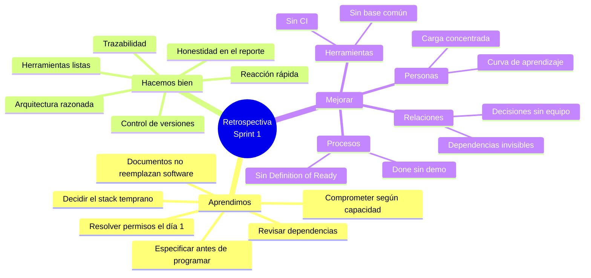
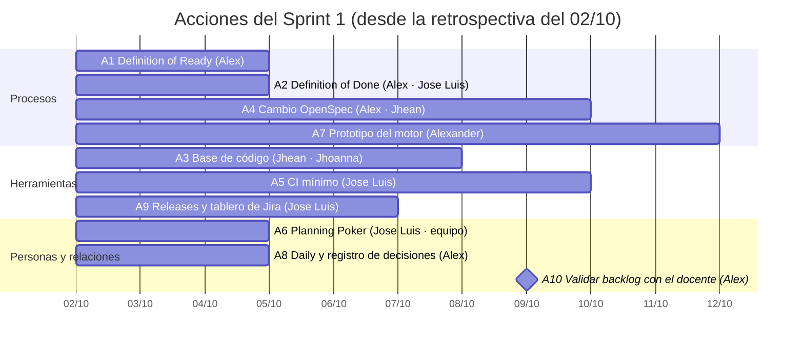
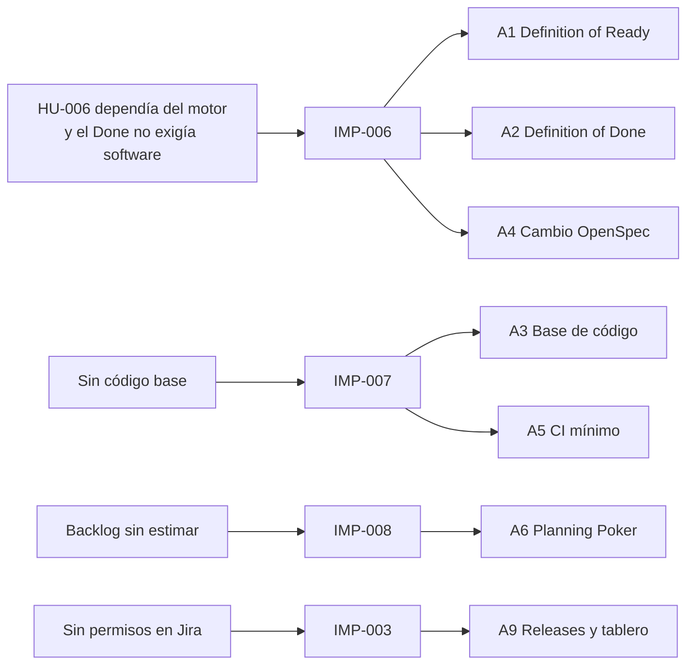

# Retrospectiva del sprint

[← Volver al README Principal](../../README.md)

**Nombre del Proyecto:** EcoLogística Huancayo — Plataforma de Optimización de Rutas Sostenibles de Última Milla

**Líder del Proyecto:** Alex Jesus Zorrilla Apumayta

## Metadatos del documento

| Campo | Valor |
|---|---|
| Versión | 1.1.0 |
| Sprint | ECO Sprint 1 (14/09/2026 – 28/09/2026) |
| Fecha de la retrospectiva | 02/10/2026 |
| Facilitador | Alex Zorrilla |
| Participantes | Alex Zorrilla, Jhean Pier Julio Anco Porras, Alexander Daniel Hilario Talavera, Jhoanna Hade Vera Zea, Jose Luis Isidro Casio |
| Entradas | [01 Informe de estado](01%20Informe%20de%20estado%20del%20proyecto%20V_1_0_0.md) · [02 Registro de Impedimentos](02%20Registro%20de%20Impedimentos%20V_1_0_0.md) · [03 Revisión del Sprint](03%20Revisi%C3%B3n%20del%20Sprint%20V_1_0_0.md) |

## Historial de cambios

| Versión | Fecha | Autor | Cambio |
|---|---|---|---|
| 1.0.0 | 02/10/2026 | Alex Zorrilla | Primera emisión de la retrospectiva del Sprint 1. |
| 1.1.0 | 02/10/2026 | Alex Zorrilla | Se agregan diagramas Mermaid y tablas de análisis con los mismos datos; el contenido no cambia. |

## Mapa de la retrospectiva

## ¿Qué aprendimos?

1. **Una historia no es "alcanzable" solo por tener criterios de aceptación.** HU-006 (reenrutar) estaba bien redactada, pero dependía del motor de HU-004, que está en el Sprint 2. Aprendimos que el Sprint Planning debe validar dependencias técnicas, no solo prioridad y puntos.
2. **El Sprint Goal debe medirse contra la capacidad real.** Comprometimos 10 puntos sin haber levantado todavía la base de código; la capacidad efectiva fue 0 porque la mitad del tiempo se invirtió en definir arquitectura y gobierno.
3. **Decidir el stack tarde es caro.** El 18/09 se modificaron los documentos hacia Next.js + Nest.js sin pasar por la matriz ponderada del documento de stack (donde React + FastAPI obtuvo 93 %); el 02/10 el líder ratificó la Alternativa A y hubo que revertir. Aprendimos que un cambio de stack exige ADR y nueva matriz antes de tocar los documentos.
4. **El método spec-driven reduce ambigüedad.** El caso del "cobro fantasma por zona horaria" y la guía OpenSpec mostraron que "se lee claro en Word" falla en código. Para HU-001 esto significa especificar explícitamente zona horaria (America/Lima, UTC−5), formato de hora y qué es una ventana válida, antes de programar.
5. **Una métrica de cero con documentos completos no es éxito.** El 100 % de los entregables documentales no compensa un incremento de software de 0 %; el *Definition of Done* debe medir valor entregable.
6. **La dependencia de permisos externos bloquea configuraciones pequeñas** (Releases y columnas del tablero en Jira) y debe resolverse el primer día del sprint.

## ¿Qué estamos haciendo bien?

1. **Trazabilidad y documentación rigurosa:** 17 entregables de Inicio y Planificación con requisitos RF/RNF/RN, riesgos cuantificados (P × I), presupuesto y backlog con criterios BDD.
2. **Honestidad en el reporte:** el estado se informa tal como es (0 de 10 puntos), con causa raíz y plan; no se maquillan las historias como completadas.
3. **Disciplina de control de versiones:** *Conventional Commits*, PR #1 revisado entre `developer` y `main`, `.gitignore` que excluye secretos y dependencias, `.env.example`, plantillas de PR e incidencias.
4. **Reacción rápida a defectos de gestión:** los duplicados `ECO-18/19`, el sprint sin iniciar y la épica equivocada se detectaron y corrigieron en pocos días (IMP-001, IMP-002, IMP-004).
5. **Arquitectura bien razonada:** matriz ponderada de criterios para el stack, separación del optimizador en un servicio Python aislado y PostGIS para datos geoespaciales.
6. **Herramientas listas:** OpenSpec inicializado con contexto del proyecto y comandos `opsx` disponibles para el ciclo propose → apply → verify → archive.

## ¿Qué podemos hacer mejor?

### Personas

- **Carga y especialización concentradas.** Tareas de gestión, Jira y documentación recayeron mayormente en el líder y en QA/DevOps, mientras backend, frontend y optimización avanzaron poco en paralelo al inicio. Falta distribuir trabajo técnico desde el día 1.
- **Curva de aprendizaje de FastAPI, React y OpenSpec** no se planificó como tarea con tiempo asignado; el equipo es de tiempo parcial y esa nivelación competía con las entregas académicas.
- **Capacidad individual no medida.** No se estimó con horas disponibles por persona, por lo que el compromiso del sprint fue optimista.

### Relaciones

- **Comunicación asíncrona insuficiente:** la propuesta de cambio de stack del 18/09 se aplicó sin una sesión formal de todo el equipo ni un ADR previo; el líder tuvo que ratificar la decisión después.
- **Dependencias entre roles invisibles:** la relación entre optimización (Hilario) y backend (Anco) que condiciona HU-006 no se hizo explícita en el tablero.
- **Interacción con el *Product Owner* académico:** convenir criterios de aceptación y priorización con el docente antes del inicio del sprint, no después.

### Procesos

- **Planning sin *Definition of Ready*:** agregar al backlog el campo "depende de", estimación validada por el equipo y criterios de aceptación revisados antes de entrar al sprint.
- **Daily y tablero poco explotados:** el sprint se inició tarde (18/09) y la columna extra de Jira desordenó el flujo. Mantener cuatro columnas y actualizar el tablero a diario.
- **Definition of Done sin evidencia de software:** incorporar "código en `develop` + pruebas pasando + demo ejecutable" como condición para marcar una historia como Hecha.
- **Ciclo OpenSpec aún no aplicado:** pasar de la teoría al primer cambio completo (`registro-pedidos`) con auditoría de la especificación mediante el prompt "Auditor Senior de Arquitectura de Software".
- **Estimación de capacidad:** usar puntos por persona y un factor de foco (p. ej. 60 %) por ser tiempo parcial; comprometer solo lo alcanzable.

### Herramientas

- **Jira:** la falta de permisos de administrador retrasó Releases y la configuración del tablero. Solicitar al administrador permisos o configuración en el primer día de sprint.
- **Entorno de desarrollo:** falta un *scaffold* común (FastAPI, React + Vite, PostgreSQL/PostGIS) con `docker compose` y scripts `dev`/`test` para que todos arranquen igual.
- **CI/CD y calidad:** sin pipeline de lint y pruebas, los defectos de integración se descubrirán tarde (RSK-07). Priorizar EN-006.
- **OpenSpec/IA:** usar siempre el flujo `propose → revisión humana → apply → verify → archive`; no aceptar automáticamente lo generado, y que quien implementa no sea el único que revisa.

### Acciones a realizar

| # | Acción concreta | Eje | Responsable | Fecha límite | Indicador de éxito |
|---:|---|---|---|---|---|
| A1 | Agregar al Planning una checklist de *Definition of Ready* con campos "depende de", estimación acordada y criterios BDD revisados. | Procesos | Alex Zorrilla | 05/10/2026 (Planning Sprint 2) | 100 % de las historias del Sprint 2 con dependencias declaradas |
| A2 | Redefinir la *Definition of Done*: código en `develop`, pruebas pasando, criterios de aceptación verificados y demo ejecutable. | Procesos | Alex Zorrilla · Isidro Casio | 05/10/2026 | Ninguna historia en Done sin evidencia ejecutable |
| A3 | Crear el *scaffold* de `backend/` (FastAPI) y `frontend/` (React + Vite) con scripts de ejecución y prueba y `docker compose` para PostgreSQL/PostGIS. | Herramientas | Jhean Pier Julio Anco Porras · Jhoanna Vera Zea | 08/10/2026 | `uvicorn` y `pytest` en backend y `npm run dev` y `npm test` en frontend funcionan en el equipo completo |
| A4 | Ejecutar el primer cambio OpenSpec `registro-pedidos` (HU-001): propose, auditoría de la spec con el prompt de auditor, apply, verify, sync y archive. | Procesos | Alex Zorrilla · Jhean Pier Julio Anco Porras | 10/10/2026 | `openspec/changes/archive/` con el cambio archivado y spec principal actualizada |
| A5 | Configurar CI mínimo (lint + pruebas) para PRs hacia `develop` (EN-006). | Herramientas | Jose Luis Isidro Casio | 10/10/2026 | Pipeline verde obligatorio antes de merge |
| A6 | Sesión de *Planning Poker* con los cinco integrantes y creación de las 7 tarjetas faltantes en Jira, con capacidad por persona y factor de foco. | Personas | Jose Luis Isidro Casio · todo el equipo | 05/10/2026 | Backlog completo y estimado; compromiso del sprint ≤ capacidad medida |
| A7 | Prototipo del motor Python y benchmark inicial (EN-001), para desbloquear HU-004 y luego HU-006. | Procesos | Alexander Daniel Hilario Talavera | 12/10/2026 | Informe de tiempos con 50, 100 y 150 pedidos |
| A8 | Establecer 15 minutos diarios de Daily asincrónico en el canal del equipo y registro de decisiones técnicas (ADR breve) antes de cambios de stack. | Relaciones | Alex Zorrilla | 05/10/2026 | Decisiones técnicas registradas en `docs/otros` |
| A9 | Pedir al administrador de Jira habilitar Releases y mantener el tablero con 4 columnas; capturar la evidencia 5. | Herramientas | Jose Luis Isidro Casio | 07/10/2026 | `assets/jira/05-release.png` incluido en el documento de Jira |
| A10 | Revisar criterios de aceptación y prioridades con el docente (Product Owner) antes de cada Planning. | Relaciones | Alex Zorrilla | Cada Planning | Acta breve de validación del backlog |

### Calendario de acciones

| Eje | Acciones | Responsables |
|---|---|---|
| Procesos | A1, A2, A4, A7 | Alex, Jose Luis, Jhean, Alexander |
| Herramientas | A3, A5, A9 | Jhean, Jhoanna, Jose Luis |
| Personas | A6 | Jose Luis y todo el equipo |
| Relaciones | A8, A10 | Alex |

### De la causa a la acción

### Seguimiento de acuerdos

Los avances de las acciones se revisan en el Daily y se reportan en el [Informe de estado](01%20Informe%20de%20estado%20del%20proyecto%20V_1_0_0.md) del siguiente sprint; el cierre de cada acción se registra en el [Registro de Impedimentos](02%20Registro%20de%20Impedimentos%20V_1_0_0.md) cuando esté vinculada a un impedimento (A1, A2, A4 → IMP-006; A3, A5 → IMP-007; A6 → IMP-008; A9 → IMP-003).
